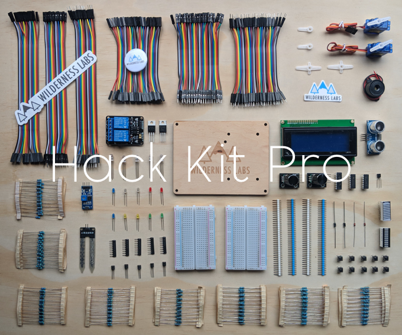

# Hack Kits

Got an awesome Wilderness Labs Hack Kit and want to know what to build with it? If you just can't wait, here are a couple of awesome projects you can build with either one right now:

 * [Getting Started w/ Meadow by Controlling the Onboard RGB LED](https://www.hackster.io/wilderness-labs/getting-started-w-meadow-by-controlling-the-onboard-rgb-led-ea6bc0)
 * [Control an LED w/ Digital Output or PWM Ports Using Meadow](https://www.hackster.io/wilderness-labs/control-an-led-w-digital-output-or-pwm-ports-using-meadow-11005a)
 * [Control an RGB LED w/ Digital Output or PWM ports in Meadow](https://www.hackster.io/wilderness-labs/control-an-rgb-led-w-digital-output-or-pwm-ports-in-meadow-7fd611)
 * [Build Your Own Simon Game with Meadow](https://www.hackster.io/wilderness-labs/build-your-own-simon-game-with-meadow-3701d5)
 * [Soil Moisture Sensor and LED Bar Graph Using Meadow](https://www.hackster.io/wilderness-labs/soil-moisture-sensor-and-led-bar-graph-using-meadow-88c2c3)

If you have a Hack Kit Pro, here are a couple of awesome projects to build:
 
 * x
 * y

And here are other Meadow projects that use some parts of the Hack Kits

* [Working with Graphics on a TFT SPI Display Using Meadow](https://www.hackster.io/wilderness-labs/working-with-graphics-on-a-tft-spi-display-using-meadow-e2295a)
* [Christmas Countdown Timer w/ an LCD Display, RTC and Meadow](https://www.hackster.io/wilderness-labs/christmas-countdown-timer-w-an-lcd-display-rtc-and-meadow-e4cf9c)
* [Build an FM Radio Player with Meadow](https://www.hackster.io/wilderness-labs/build-an-fm-radio-player-with-meadow-8c0a63)

First, check to make sure that everything is included. See the below content list for ingredients. If you're missing something, [let us know](need form).

## Contents

| Item                   | Pro | Lite | Description |
|------------------------|-----|------|-------------|
| Hack Kit Box           | 1 | 1 | Box that holds all the hack goodies. |
| Laser-etched Baseboard | 1 | 1 | Baseboard that holds a Meadow and a Half+ size breadboard for prototyping. |
| Half+ Breadboard       | 2 | 2 | Breadboard for quick, temporary, prototyping. |
| Wire Jumpers (M/M, M/F, F/F) | 1 | 1 | A set of flexible jumper wires for breadboard prototyping. |
| [Rotary Encoder w/Pushbutton](/docs/api/Meadow.Foundation/Meadow.Foundation.Sensors.Rotary.RotaryEncoderWithButton.html) + Knob | 2 | 1 | Continuous rotation digital input knob with integrated pushbutton. |
| [Micro Servo](/docs/api/Meadow.Foundation/Meadow.Foundation.Servos.Servo.html) | 2 | 1 | Motor with precision 180º rotation control. |
| [2-Channel Relay Board](/docs/api/Meadow.Foundation/Meadow.Foundation.Relays.Relay.html)  | 2 | 1 | Digitally controlled, isolated circuit switch for controlling external power, often used to switch household mains electricity (`110V/240V` AC). |
| [Red, Green, Blue (RGB) LED](/docs/api/Meadow.Foundation/Meadow.Foundation.Leds.RgbPwmLed.html) | ~10 | ~5 | 3-component Light-Emitting-Diode (LED) that can display nearly any color by varying the red, green, and blue input voltage. |
| [Various Color LEDs](/docs/api/Meadow.Foundation/Meadow.Foundation.Leds.Led.html) | ~25 | ~15 | 5 types of single-color LEDs. |
| [Piezo Speaker](/docs/api/Meadow.Foundation/Meadow.Foundation.Audio.PiezoSpeaker.html) | 1 | 1 | Simple, single-frequency sound emitting device for generating tones, beeps, and other simple sounds. |
| [Distance Sensor (HC-SR04)](/docs/api/Meadow.Foundation/Meadow.Foundation.Sensors.Distance.HCSR04.html) | 1 | 0 | Sonar-based distance sensor good for up to 1 meter. |
| [Push Button (Various Colors)](/docs/api/Meadow.Foundation/Meadow.Foundation.Sensors.Buttons.PushButton.html) | ~40 | ~10 | Simple tactile switches in a variety of colors. |
| Photoresistor | 2 | 1 | Sensor that can measure the amount of light it receives. Needs to be wired up as part of a voltage divider. See the [Resistive Sensor Lab](/Hardware/Tutorials/Electronics/Part5/Resistive_Sensor_Lab/) |
| [LM35DZ Analog Temperature Sensor](/docs/api/Meadow.Foundation/Meadow.Foundation.Sensors.Temperature.AnalogTemperature.html) | 2 | 1 | `0ºC - 100ºC` temperature sensor with analog output. |
| [Moisture Sensor](/docs/api/Meadow.Foundation/Meadow.Foundation.Sensors.Moisture.Capacitive.html) | 1 | 0 | Capacitive soil moisture sensor with digital output. |
| [74595 Shift Register](/docs/api/Meadow.Foundation/Meadow.Foundation.ICs.IOExpanders.x74595.html) | 2 | 1 | 8-port digital output expander chip. Adds 8 additional `DigitalOutputPort`s to a Meadow. Can be chained up to 8 for 64 total additional outputs. |
| MCP23008 IO Expander | 2 | 1 | 8-port digital IO expander chip that connects via SPI. Adds 8 additional digital ports that can be used as output or input with changed notification support. |
| [H-Bridge Motor Controller](/docs/api/Meadow.Foundation/Meadow.Foundation.Motors.HBridgeMotor.html) | 1 | 1 | SN754410. Provides digital control for two motors using an external power source, controlled via PWM. |
| [Rainbow LED Bargraph](/docs/api/Meadow.Foundation/Meadow.Foundation.Leds.LedBarGraph.html) | 1 | 0 | Green, yellow, red, LED array. |
| [Rainbow LED Battery Bargraph](/docs/api/Meadow.Foundation/Meadow.Foundation.Leds.LedBarGraph.html) | 1 | 1 | Green, yellow, red, LED array that has a battery shape. |
| [4x20 LCD Character Display](http://staging-developer.wildernesslabs.co/docs/api/Meadow.Foundation/Meadow.Foundation.Displays.Lcd.CharacterDisplay.html) | 1 | 1 | LCD character display that's 4 lines tall and 20 characters wide. Can be used with TextMenuDisplay to display text menus. |
| [Color LCD Display](http://staging-developer.wildernesslabs.co/docs/api/Meadow.Foundation/Meadow.Foundation.Displays.SSD1306.html) | 1 | 0 | 1.3", full-color, 240x240 pixel, graphic display. |
| Resistor Kit | 1 | 1 | ~300 resistors of varying resistance. |
| Resistor Network Kit | 1 | 1 | 5 different values of 8 resistors in a single  package. Typically used in conjunction with LED bargraphs. |
| Capacitor Kit | 1 | 1 | Various value capacitors for general digital circuit usage. |
| 1N4004 Diode | ~8 | ~4 | General purpose, `1A` power rectification diode. |
| Temt6000 Luminosity Sensor | 1 | 1 | `5V` light sensor used as an example of how to use a voltage divider to reduce a `5V` analog signal to `3.3V`. See the [Level-Shifting Lab](http://127.0.0.1:4002/Hardware/Tutorials/Electronics/Part5/Level_Shifting_Lab/). |
| USB Breakout | 1 | 1 | Used to expose the `5V` and `GND` pins of a USB adapter so that it can be used as an external power supply to drive motors, and such. |
| DC Motor | 2 | 1 | `6V` motor that can be used in conjunction with either the motor controller or BJTs and a `5V` power source. |
| `9V` Batter Adapter | 1 | 0 | Plugs into a `9V` battery and exposes the power and ground via wires. |
| 1N914 Diode | 8 | 4 | |
| 1N5817 Diode | 10 | 2 | |
| BS170 N-Channel MOSFET | 20 | 4 | |
| TIP120 Power Transistor | 2 | 1 | |
| 2N3904 NPN Transistor | 10 | 2 | | 
| 2N3906 PNP Transistor | 2 | 2 |  |
| SPDT Switch | 2 | 2 | |
| M2x8MM Hex Bolts | 4 | 4 | |
| Jumper Kit | 1 | 1 | |
| Photodiode | 1 | 1 | |
| M2 Nuts | 8 | 8 | |