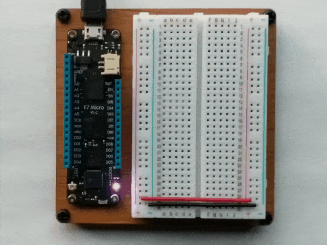
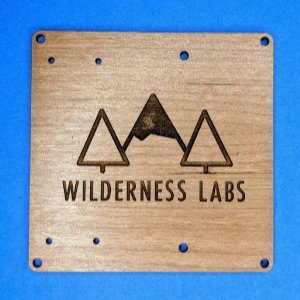
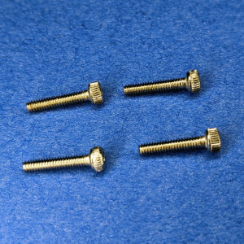
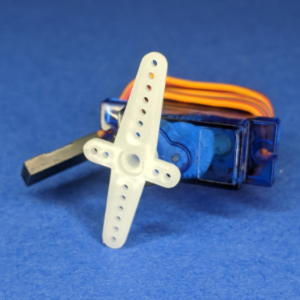
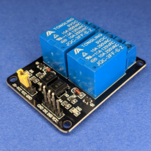
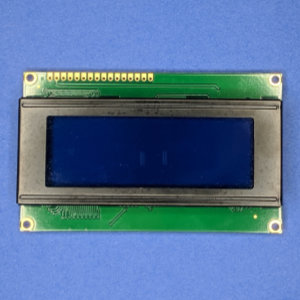
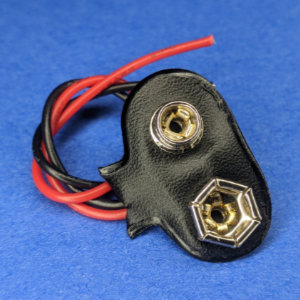
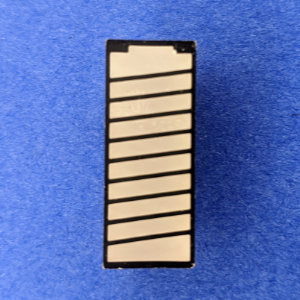
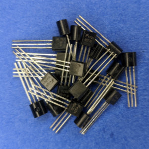

{:standalone}

Got a cool Wilderness Labs Hack Kit and want to build something awesome with it? You're at the right spot. This page has instructions and information for the Hack Kit Pro, for information on the discontinued Hack Kit Lite, check [here](HackKitLite/).

If you'd like to purchase one, check out the [Wilderness Labs Store](https://store.wildernesslabs.co/).

## Getting Started

If you haven't setup your development environment yet, and gone through Hello, LED, check out the [Meadow Getting Started guide](/Meadow/Getting_Started/) first.

## Hackster.io Project Inspiration

Here are some awesome projects you can build with a Hack Kit Pro:

| Project       | Image |
|---------------|-------|
| [Hello, LED: controlling the onboard RGB LED.](https://www.hackster.io/wilderness-labs/getting-started-w-meadow-by-controlling-the-onboard-rgb-led-ea6bc0) |  |
| [Simone, a simple Simon with lights and sound.](https://www.hackster.io/wilderness-labs/build-your-own-simon-game-with-meadow-3701d5) |  |
| [Soil Moisture Sensor display on an LED Bargraph.](https://www.hackster.io/wilderness-labs/soil-moisture-sensor-and-led-bar-graph-using-meadow-88c2c3) |  |
| [Add up to 64 IO Ports using a Shift Register.](https://www.hackster.io/wilderness-labs/expanding-io-ports-of-a-meadow-with-a-74hc595-dde681) |  |
| [Working with Graphics on a TFT SPI Display Using Meadow](https://www.hackster.io/wilderness-labs/working-with-graphics-on-a-tft-spi-display-using-meadow-e2295a) |  |
| [Control a servo with the push of a button using Servo.Core.](https://www.hackster.io/wilderness-labs/control-a-servo-with-a-push-button-using-meadow-c6c996) |  |
| [Temperature Room Monitor.](https://www.hackster.io/wilderness-labs/build-your-own-temperature-monitor-with-meadow-edc696) |  |
| [Electronic Dice with LEDs and a Button.](https://www.hackster.io/wilderness-labs/roll-an-led-dice-with-a-push-button-using-meadow-3beb46) |  |
| [Control the brightness of an LED using PWM.](https://www.hackster.io/wilderness-labs/control-an-led-w-digital-output-or-pwm-ports-using-meadow-11005a) |  |
| [Control the colors of an RGB LED using PWM.](https://www.hackster.io/wilderness-labs/control-an-rgb-led-w-digital-output-or-pwm-ports-in-meadow-7fd611) |  |

## Contents

### F7 Micro Dev Kit

| Item                   | QTY | Description | |
|------------------------|:---:|-------------|-|
| Laser-etched Baseboard | 1 | Baseboard that holds a Meadow and a Half+ size breadboard for prototyping. |  |
| Half+ Breadboard       | 2 | Breadboard for quick, temporary, prototyping. |  |
| M2x8MM Hex Bolts | 4 | |  |
| M2 Nuts | 8 | |  |

### Large Items

| Item                   | QTY | Description | |
|------------------------|:---:|-------------|-|
| Hack Kit Box           | 1 | Box that holds all the hack goodies. |
| Wire Jumpers (M/M, M/F, F/F) | 1 | A set of flexible jumper wires for breadboard prototyping. |
| Jumper Kit | 1 | Box of various length breadboard jumper wires. |
| [Micro Servo](/docs/api/Meadow.Foundation/Meadow.Foundation.Servos.Servo.html) | 1 | Motor with precision 180º rotation control. |  |
| [2-Channel Relay Board](/docs/api/Meadow.Foundation/Meadow.Foundation.Relays.Relay.html) | 1 | Digitally controlled, isolated circuit switch for controlling external power, often used to switch household mains electricity (`110V/240V` AC). |  |
| [Distance Sensor (HC-SR04)](/docs/api/Meadow.Foundation/Meadow.Foundation.Sensors.Distance.Hcsr04.html) | 1 | Sonar-based distance sensor good for up to 1 meter. |  |
| [Moisture Sensor](/docs/api/Meadow.Foundation/Meadow.Foundation.Sensors.Moisture.Capacitive.html) | 1 | Capacitive soil moisture sensor with digital output. |  |
| [4x20 LCD Character Display](/docs/api/Meadow.Foundation/Meadow.Foundation.Displays.Lcd.CharacterDisplay.html) | 1 | LCD character display that's 4 lines tall and 20 characters wide. Can be used with TextMenuDisplay to display text menus. |  |
| [ST7789 Color LCD Display](/docs/api/Meadow.Foundation/Meadow.Foundation.Displays.Tft.St7789.html) | 1 | 1.3", 16bbp color, 240x240 pixel, graphic display. |  |
| Resistor Kit | 1 | ~300 resistors of varying resistance. |  |
| Capacitor Kit | 1 | Various value capacitors for general digital circuit usage. |  |
| Single-row Breakaway Headers | 4 | |  |
| [Rotary Encoder w/Pushbutton](/docs/api/Meadow.Foundation/Meadow.Foundation.Sensors.Rotary.RotaryEncoderWithButton.html) + Knobs | 2 | Continuous rotation digital input knob with integrated pushbutton. |  |
| [Piezo Speaker](/docs/api/Meadow.Foundation/Meadow.Foundation.Audio.PiezoSpeaker.html) | 1 | Simple, single-frequency sound emitting device for generating tones, beeps, and other simple sounds. |  |
| `9V` Battery Adapter | 1 | Plugs into a `9V` battery and exposes the power and ground via wires. |  |
| DC Motor | 2 | `6V` motor that can be used in conjunction with either the motor controller or BJTs and a `5V` power source. |  |
| USB Breakout | 1 | Used to expose the `5V` and `GND` pins of a USB adapter so that it can be used as an external power supply to drive motors, and such. |  |
| SPDT Switch | 2 | Small two-position switch. |  |

### ICs

| Item                   | QTY | Description | |
|------------------------|:---:|-------------|-|
| [74595 Shift Register](/docs/api/Meadow.Foundation/Meadow.Foundation.ICs.IOExpanders.x74595.html) | 2 | 8-port digital output expander chip. Adds 8 additional `DigitalOutputPort`s to a Meadow. Can be chained up to 8 for 64 total additional outputs. |  |
| [MCP23008 IO Expander](/docs/api/Meadow.Foundation/Meadow.Foundation.ICs.IOExpanders.Mcp23x08.html) | 2 | 8-port digital IO expander chip that connects via SPI. Adds 8 additional digital ports that can be used as output or input with changed notification support. |  |
| [H-Bridge Motor Controller](/docs/api/Meadow.Foundation/Meadow.Foundation.Motors.HBridgeMotor.html) | 1 | SN754410. Provides digital control for two motors using an external power source, controlled via PWM. |  |

### LEDs

| Item                   | QTY | Description |
|------------------------|:---:|-------------|
| [Red, Green, Blue (RGB) LED](/docs/api/Meadow.Foundation/Meadow.Foundation.Leds.RgbPwmLed.html) | ~10 | 3-component Light-Emitting-Diode (LED) that can display nearly any color by varying the red, green, and blue input voltage. |  |
| [Various Color LEDs](/docs/api/Meadow.Foundation/Meadow.Foundation.Leds.Led.html) | ~25 | 5 types of single-color LEDs. |  |
| [Rainbow LED Bargraph](/docs/api/Meadow.Foundation/Meadow.Foundation.Leds.LedBarGraph.html) | 1 | Green, yellow, red, LED array. |  |
| [Rainbow LED Battery Bargraph](/docs/api/Meadow.Foundation/Meadow.Foundation.Leds.LedBarGraph.html) | 1 | Green, yellow, red, LED array that has a battery shape. |  |

### Transistors

| Item                   | QTY | Description | |
|------------------------|:---:|-------------|-|
| BS170 N-Channel MOSFET | 20 | Manufactured through DMOS technology, best suited for low voltage, low current applications like servo motor control, power MOSFET gate drivers and other switching application. | |
| TIP120 Power Transistor | 2 | Great for whenever you need to control medium to high-power electronics such as motors, solenoids, or 1W+ LEDs. |  |
| 2N3904 NPN Transistor | 10 | Well suited for TV and home appliance equipment. |  |
| 2N3906 PNP Transistor | 2 | Commonly used PNP bipolar junction transistor intended for general purpose low-power amplifying or switching applications. |  |

### Small Parts

| Item                   | QTY | Description |
|------------------------|:---:|-------------|
| [Push Button (Various Colors)](/docs/api/Meadow.Foundation/Meadow.Foundation.Sensors.Buttons.PushButton.html) | ~40 | Simple tactile switches in a variety of colors. |
| [LM35DZ Analog Temperature Sensor](/docs/api/Meadow.Foundation/Meadow.Foundation.Sensors.Temperature.AnalogTemperature.html) | 2 | `0ºC - 100ºC` temperature sensor with analog output. |
| Temt6000 Luminosity Sensor | 1 | `5V` light sensor used as an example of how to use a voltage divider to reduce a `5V` analog signal to `3.3V`. See the [Level-Shifting Lab](/Hardware/Tutorials/Electronics/Part5/Level_Shifting_Lab/). |
| Photodiode | 1 | |
| Photoresistor | 2 | Sensor that can measure the amount of light it receives. Needs to be wired up as part of a voltage divider. See the [Resistive Sensor Lab](/Hardware/Tutorials/Electronics/Part5/Resistive_Sensor_Lab/) |
| 1N4004 Diode | ~8 | General purpose, `1A` power rectification diode. |
| 1N914 Diode | 8 | |
| 1N5817 Diode | 10 |  |
| Resistor Network Kit | 1 | 5 different values of 8 resistors in a single package. Typically used in conjunction with LED bargraphs. |

