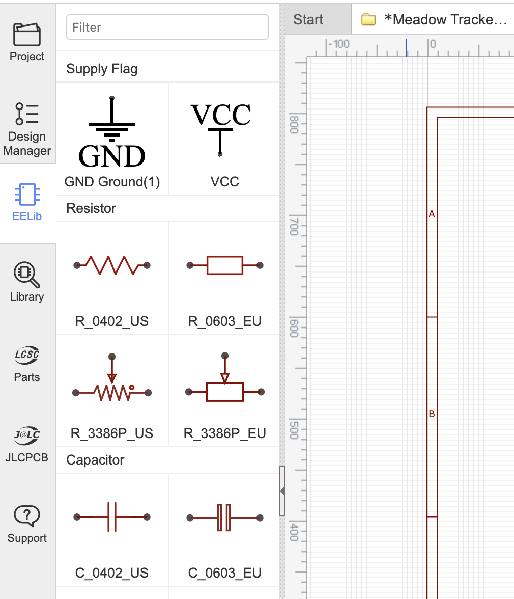
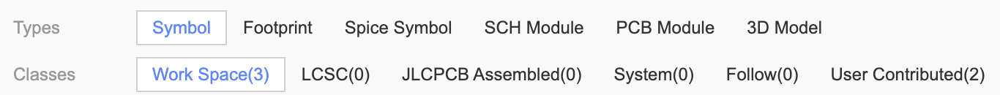
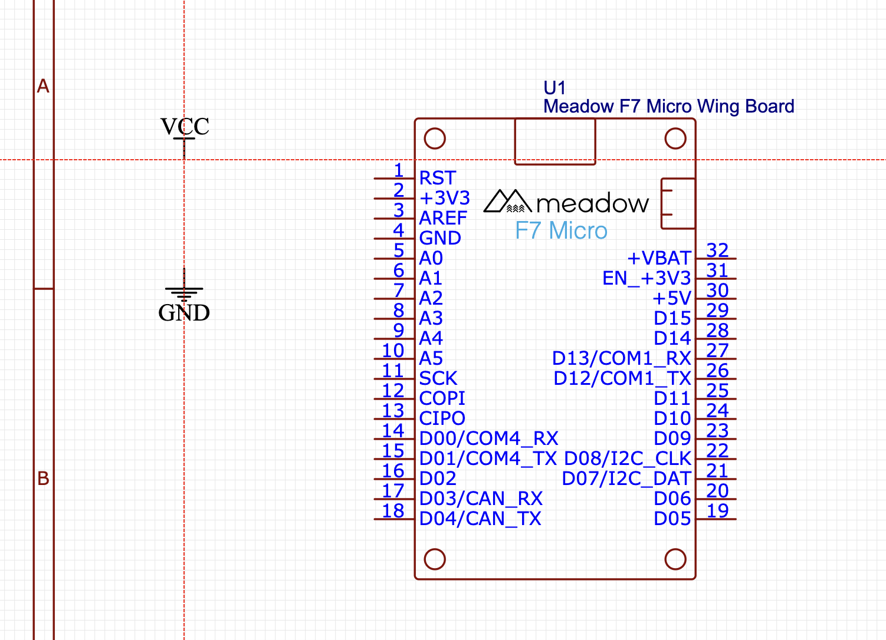
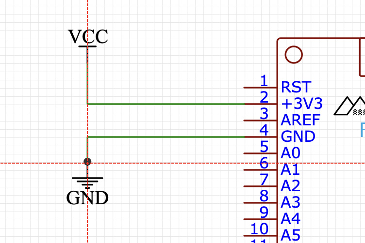
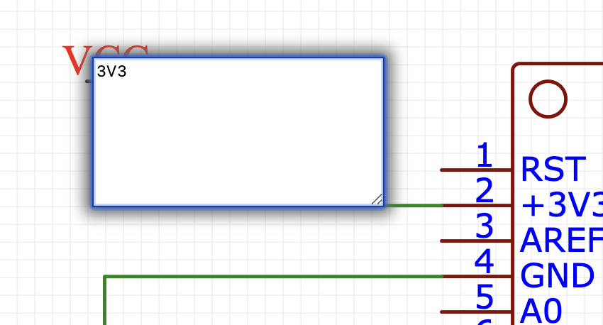

The first thing we need to do is add a Meadow to our design, which is a good time to talk about the parts libraries in EasyEDA.

## Introduction to the Parts Libraries

There are two part libraries in EasyEDA. 

### EELib

First, there is a built-in set of generic symbols and footprints for common parts like resistors and capacitors, power symbols, headers, etc., called the _EELib_:

### Public Parts Library

The EELib is useful, but what really makes EasyEDA powerful is their unique approach to their public parts library; whenever you create a symbol and/or footprint, it's automatically put into their cloud-based public library of parts that is accessible by anyone.

This means that there are hundreds of thousands of community-contributed parts that you can use in your designs without needing to find and install parts libraries, the way you do in other programs such as KiCAD. This has a slight drawback, however, in that there is always a chance that a publicly contributed part is incorrect, so you should always double check the symbol and footprint against the part datasheet.

You can access the parts library by clicking the **Library** button  on the left toolbar:

#### Deeper Look + LCSC Parts Search

You'll use this window a lot, so it's worth a deeper look at it:

#### LCSC Electronics Parts Search

First, there are two search engines, the EasyEDA one (above) and the LCSC Electronics search (below), which provide a very different UX and parts:

[LCSC Electronics](https://lcsc.com/) is the Chinese equivalent of DigiKey and they own EasyEDA and JLCPCB (a Chinese PCB fabrication company that is optionally integrated into EasyEDA).

The benefit of using LCSC components is that you can order your PCB to fab at JLCPCB and LCSC can provide affordable assembly at the same time.  

##### LCSC Drawbacks

This can be incredibly convenient, but today has two major drawbacks. First, we've found that in practical scenarios, no single supplier ever has all the components needed for a design, and LCSC, while incredibly large, is no different, preventing them from actually being able to assemble most IoT boards. Second, while useful, the LCSC search UX is no where near as good as websites such as [Octopart.com](https://octopart.com/) or [OEMSecrets](https://www.oemsecrets.com/), both of which provide a very powerful and easy to use component search that integrates all of the major worldwide component suppliers.

### Search Types and Classes

There are two other parts of the search worth noting, the **Search Types** and **Classes**:

#### Type :: Symbols

When doing schematic design, you'll almost always be searching for _Symbols_, which are the logical drawing representation of a part. We'll talk about _Footprints_ later, when we get to designing parts.

#### Classes

_Classes_ refers to the where the library comes from:

 * **Work Space** - This is where your own parts get put.
 * **LCSC** - The part was contributed by LCSC.
 * **JLCPCB Assembled** - This is largely a subset of the LCSC parts, since not all parts available in the LCSC catalog are available for use in assembly.
 * **System** - These are the built-in parts. They are curated and nearly guaranteed to have the correct pinout and footprint.
 * **User Contributed** - As the name implies, these are public parts contributed by users. This group consists of the largest library of parts, but you'll want to verify their footprint and pinout, as they are not guaranteed to be accurate.

## Adding the Meadow

Our design is based around Meadow, so search for Meadow, choose the one that has the board outline (since we're making a wing, it'll already have the correct board shape) in the footprint:

Then click the **Place** button to place it in your schematic:

## Power, Ground, and No-Connects

The first thing we're going to do is connect our _ground_ and _power_ rails. Select the **EELib** on the left toolbar and then click on the **GND** symbol:

Then, place it to the left of the Meadow, and do the same for the `VCC` symbol:

When you're done, hit `ESC` or right click to cancel out of the tool.

### _Nets_

Whenever you create an endpoint like this, it becomes a _net_, and anywhere else you drop an endpoint of the same name, they will be physically connected in the design, even if they don't appear connected in the drawing.

### Wiring

Next, either press the `w` button, or click the first icon in the **Wiring Tools** toolbar to switch to wiring mode:

Next, connect wire up `VCC` to `3V3` and `GND` to `GND`:

### Rename `VCC` -> `3V3`

It's good practice to be specific with your power rail naming. With Meadow projects, you'll often have at least two power rails, a `5V` one, and a `3.3V` one. To rename, double click on the `VCC` text and enter `3V3`:

### No-Connects

