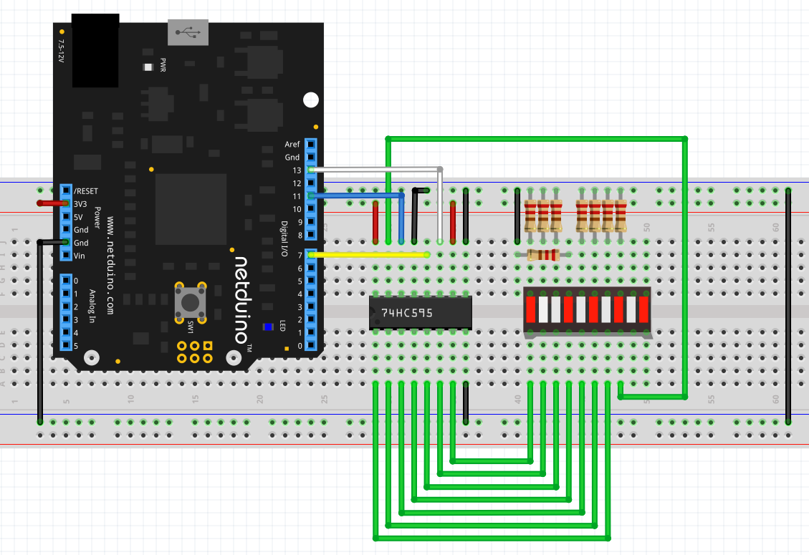

## Overview

74595 shift registers provide a mechanism to convert serial data into 8 parallel outputs.  These are useful in cases where additional output pins are required.  The shift register only uses three pins for the 8 outputs it can provide.

It is even possible to chain two or more 74595 shift requesters together gaining even more outputs.  It does not matter how many are chained together you still only require three pins on the Netduino.

A block diagram of the internals of the 74595 is as follows:

{:standalone}

Data is transmitted to the shift register on the data line.  Data is transferred to the shift register on the positive edge of the clock signal.  At this point the data exists only in the shift register.  The latches are still presenting the old data to the lines Q0 - Q7.

Data is transferred to the latches (sometimes called storage registers) on a pulse on the _Latch signal_ clock line.

It is important to note that the shift register has **two** clocks:

* Shift register clock
* Storage register / Latch clock

One (Shift Register clock) is used to allow data to be pushed into the shift register.  One clock pulse is required for each bit to be pushed into the register.

The second clock (Storage register / Latch clock) is used to decide when the data in the shift register is pushed into the storage register.

### Netduino.Foundation Support

[Netduino.Foundation](http://Netduino.Foundation) includes a [`74595`](http://netduino.foundation/Library/ICs/74595/) shift register class that greatly simplifies using a shift register. This low-level hardware guide is here for reference purposes, but we strongly recommend using Netduino.Foundation to integrate with them.

### Binary Counting

The operation of the shift register can be illustrated using binary counter.  Here a single shift register will be connected to 8 LEDs.  These LEDs will represent the 8 bits in a single byte.

The application uses [BitBanging](../../BitBanging/) to output the current byte as a series of bits and then display the value on the LEDs.

#### Hardware

A small number of components are required:

* 1 x LED block (10 LEDs, we will only be using 8)
* 8 x `220R` current limiting resistors (one for each LED).  Alternatively, use a resistor network containing 8 x `220R` resistors.
* 1 x 74HC595

These components, along with a Netduino, should be wired up as follows:

{:standalone}

A block of LEDs has been used here are these offer 10 LEDs in a small convenient package.  8 individual LEDs can also be used.

Note that the pins representing the outputs of the shift register are connected with bit 0 on the right and bit 7 on the left.

Translating this to breadboard gives something like the following:

{:standalone}

#### Software

Create a new project and enter the following code:

```csharp
using System;
using System.Threading;
using Microsoft.SPOT;
using Microsoft.SPOT.Hardware;
using SecretLabs.NETMF.Hardware.NetduinoPlus;

namespace ShiftRegister
{
    public class Program
    {
        private static void BitBang(OutputPort data, OutputPort clock, byte value)
        {
            for (byte mask = 0x80; mask > 0; mask >>= 1)
            {
                data.Write((value & mask) != 0);
                clock.Write(true);
                clock.Write(false);
            }
        }

        public static void Main()
        {
            OutputPort dataPin = new OutputPort(Pins.GPIO_PIN_D11, false);
            OutputPort clockPin = new OutputPort(Pins.GPIO_PIN_D13, false);
            OutputPort latchPin = new OutputPort(Pins.GPIO_PIN_D7, false);

            for (byte index = 0; index <= 255; index++)
            {
                BitBang(dataPin, clockPin, index);
                latchPin.Write(true);
                latchPin.Write(false);
                Thread.Sleep(200);
            }
        }
    }
}
```

##### `Main`

This method sets up three `OutputPort` objects, one for the data and two for the clock signals.

```csharp
OutputPort dataPin = new OutputPort(Pins.GPIO_PIN_D11, false);
OutputPort clockPin = new OutputPort(Pins.GPIO_PIN_D13, false);
OutputPort latchPin = new OutputPort(Pins.GPIO_PIN_D7, false);
```

The initial state of these pins is set to low.

Next the application loops through the number 0 to 255 (inclusive) and pushes the data into the shift register using the `BitBang` method.

Finally the data transfers the data from the shift register into the latches:

```csharp
latchPin.Write(true);
latchPin.Write(false);
```

A short pause and the loop moves on to the next number.

##### `BitBang`

The `BitBang` method pushes the data out to the shift register one bit at a time:


```csharp
private static void BitBang(OutputPort data, OutputPort clock, byte value)
{
    for (byte mask = 0x80; mask > 0; mask >>= 1)
    {
        data.Write((value & mask) != 0);
        clock.Write(true);
        clock.Write(false);
    }
}
```

An important point to note here is the order in which the bits are put on the data line, bit 7 (`mask = 0x80`) is sent to the shift register first (known as _Most Significant Bit first_).  Each bit is put onto the data line and then the clock signal is pulsed.  The mask is the rotated right to move on to the next bit.
