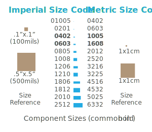

## Intro

Surface mount component standards are specified by the Joint Electron Device Engineering Council (JEDEC) Solid State Technology Association ([JEDEC.org](https://www.jedec.org/)).

## Common Passive Rectangular Components

Common passive rectangular components include things like resistors and capacitors. Their size is specified by a _size code_ which is their width x height.

For instance, the imperial size code of `0402` specifies that the component is `0.04"` x `0.02"`. The metric equivalent of `0402` is `1005`, which is `1.0mm` x `0.5mm`.

When purchasing components by their size code, it's important to know whether or not the size specified is in imperial or metric. This is especially important for codes such as `0402` and `0603`, which are found in both imperial and metric, but specify different sizes.

The following chart illustrates the actual size of components in relation to their size code:

{:standalone}

Note that sizes 1812 and 1206 imperial are specialized sizes, most commonly used for components that high heat dissipation requirements.

Also note that smaller components tend to be cheaper.

When choosing components that will be hand soldered, anything smaller than `0603` can be very difficult to handle. For this reason, `0603` components are the smallest recommended components for hand soldered board designs.

## Tantalum Capacitors (SMD)

| Package Size | Imperial Dimensions (EIA Standard) | Metric Dimensions (mm) |
|--------------|------------------------------------|-------------------------|
| Size A | EIA 3216-18 | 3.2 x 1.6 x 1.6 |
| Size B | EIA 3528-21 | 3.5 x 2.8 x 1.9 |
| Size C | EIA 6032-28 | 6.0 x 3.2 x 2.2 |
| Size D | EIA 7343-31 | 7.3 x 4.3 x 2.4 |
| Size E | EIA 7343-43 | 7.3 x 4.3 x 4.1 |

## Semiconductors

### Transistors & Diodes

Transistors and diodes are usually packaged the same way. Even though a diode only requires two leads, they are given three so they can be oriented properly.

Most popular:

 * **SOT-23 (Small Outline Transistor)** - (3 leads for diodes or transistors, but some ICs can come in this form factor too, and have more pins. 3 x 1.75 x 1.3mm.
 * **SOT-223 (Small Outline Transistor)** - (for high powered devices, 6.7 x 3.7 x 1.8Mmm. Usually 3 leads plus a large one that acts as a heat-sink/transfer pad)

## Integrated Circuit Packages

Complex circuits are usually built into chips known as _integrated circuits_ (ICs). ICs come in a number of form factors.

### Small Outline Integrated Circuit (SOIC)

### Small Outline Package (SOP)

 * **TSOP (Thin Small Outline Package)** - (0.5mm pin spacing, thinner than SOIC)
 * **SSOP (Shrink Small Outline Package)** - (0.635mm pin spacing)
 * **TSSOP (Thin Shrink Small Outline Package)** -
 * **QSOP (Quarter-size Small Outline Package)** - (0.635mm pin spacing)
 * **VSOP (Very Small Outline Package)** - (0.4, 0.5, or 0.65mm pin spacing and smaller than QSOP)

### Quad Flat Pack (QFP)

Quad flat packs are generic square, flat IC packages.

 * **LQFP (Low-profile Quad Flat Pack)** - (pins on all four sides, height is 1.4mm, pin spacing varies)
 * **PQFP (Plastic Quad Flat Pack)** - (pins on all four sides. Usually narrow spacing with 44 or more pins for [VLSI](https://www.wikiwand.com/en/Very-large-scale_integration) circuits such as CPUs.)
 * **CQFP (Ceramic Quad Flat Pack)** - Same as PQFP but ceramic construction.
 * **TQFP (Thin Quad Flat Pack)** - PQFP, but thinner.

### Ball Grid Array (BGA)

_Ball grid array_ (BGA) packages are specialized ICs that have an array of solder balls on the underside of the chip, instead of pins. BGAs typically have a 1.27mm ball spacing.

BGA packages are meant only for production PCBs, because they are very difficult to place accurately by hand, and even more difficult to solder. Their solder joints are also only verifiable with specialized x-ray equipment.

### Plastic Leaded Chip Carrier

_Plastic leaded chip carriers_ are specialized plastic trays that a IC packages with _j-lead_ pins sit in. They are designed to allow the IC to be removed, so it can be replaced or changed. Their leads typically have 1.27mm pin spacing.

## Further Reading

* [JEDEC.org](https://www.jedec.org/)
* [Surface Mount Technology article on Wikipedia](https://en.wikipedia.org/wiki/Surface-mount_technology)
* [Through-hole Technology article on Wikipedia](https://en.wikipedia.org/wiki/Through-hole_technology)
* [Topline IC footprint and size reference](http://www.topline.tv/SizeChart.html)
