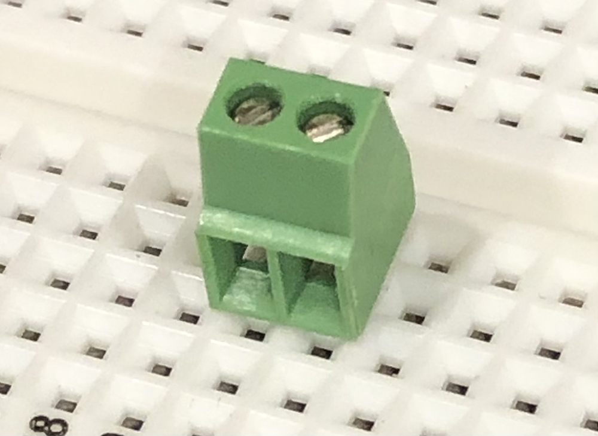

## Add External Power Input

Next, we're going to add a screw terminal for connecting an optional solar panel (or other `5V`-`12V` power) input:

## Searching for Components

First, we need to find an appropriate screw terminal. 

### Introducing [Octopart.com](https://octopart.com)

A search for [2.54mm 2 position screw terminal](https://octopart.com/search?q=2.54mm+2+position+screw+terminal) turns up the following results:

If your results view looks different than the one above, use the view switcher tab and switch to "Specs":

