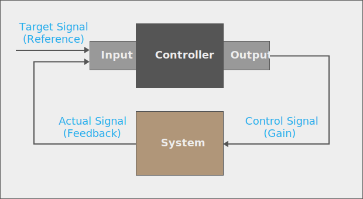

## Control Theory: _Closed Loop Gain Controllers_

PID (and other control algorithms) are part of a control system that is called a _closed loop gain_, because the control output is fed back into the system and the controller is then given the response to its previous control signal and can react appropriately to the change and further refine the output:

{:standalone}

In this context, [_gain_](https://en.wikipedia.org/wiki/Gain_(electronics)) is the output signal and can be either positive or negative.

### Inputs

The inputs include:

 * **Reference Signal** - Represents the ideal target state and is sometimes called the _set point_ (SP). For instance, `75ºC`; the desired temp of coffee.
 * **Actual Signal** - Represents the actual measured state (sometimes called the _process variable_ (PV)).  For instance, `25ºC`; the current temp of coffee.

### Output

The output is the _control signal_, or _control variable_ (CV), which is used to control the agent of change in the system, such as how much power to give the hot plate.

In the case of heating up a cup of coffee, the idea here is that when given the target temperature of the coffee, as well as the current actual temperature of the coffee, the algorithm calculates the amount of power to give the hotplate to the appropriate temperature, efficiently. The PID algorithm is then called repeatedly, usually in a loop, to provide continuous control adjustments based on the input.

# [Next - Ideal PID Control Algorithm](../Ideal_PID_Algorithm)
