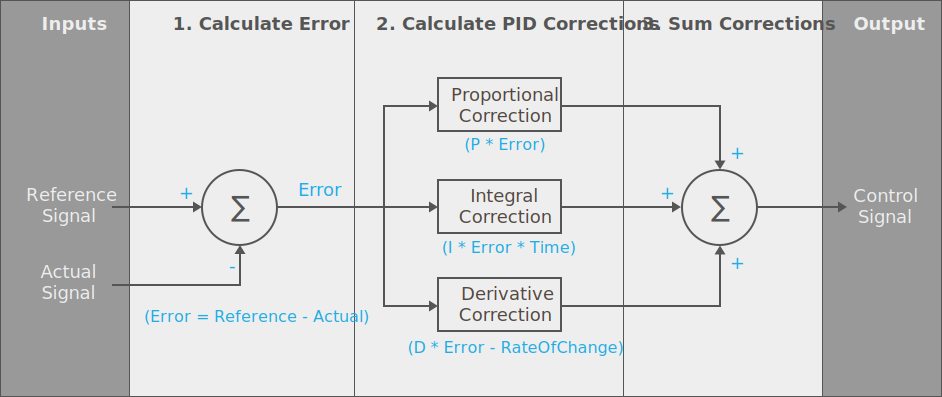
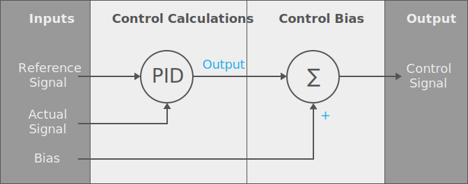
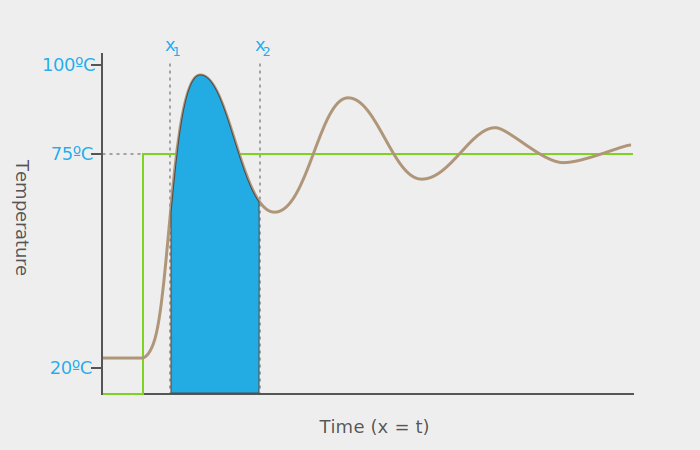
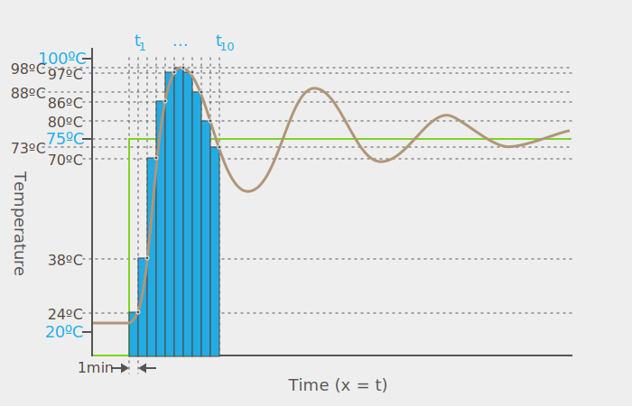

## Overview

The PID algorithm was created specifically as a tool to provide an automated control framework to efficiently effect change within a system to get it to reach a target state. In the example above, it was heating a cup of coffee, but it could also be keeping a boat straight on course while external factors such as wind and current tries to pull it off heading, or keeping a drone level while air turbulence tries to throw it off balance.

And while PID is referred to as a single algorithm, in fact, there are specialized variants that tackle various kinds of problems. Together these form a family of solutions that are all generally based on the same mathematic principles.

### Ideal vs. Standard

In this guide, we're going to examine the _ideal_ PID algorithm, and the more common _standard_ algorithm. The ideal algorithm is the canonical textbook algorithm and is the basis for nearly all PID controller algorithm derivatives, however, the standard algorithm is much more versatile, common, and perhaps intuitive.

### Terms

In nearly all cases, PID is based on three mathematical terms:

 * **Proportional** - Describes how far away from the target state the system is, and how much force to apply to change it.
 * **Integral** - Describes the cumulative error, which is how much the change being applied is actually changing the system.
 * **Derivative** - Describes the rate of change, and can be useful in predicting how the system will change in the future.

### Equation and Algorithm

The ideal PID algorithm can be described mathematically as the following:


It looks pretty complicated, but is actually quite simple, and is probably better understood visually, in the following block diagram:

{:standalone}

#### Calculation Steps

The actual algorithm has three steps to it:

 1. **Calculate the Error** - The current error is the difference between the desired target, _reference_ state and the current _actual_ state.
 2. **Calculate the PID Corrections** - The corrections needed to change the system state to the desired state are calculated by multiplying the current error by the _Proportional_, _Integral_, and _Derivative_ corrective action calculations. While they are based on calculus, each of these calculations are trivial and examined below.
 3. **Sum the Corrections** - Add together all three corrective actions into a single change quantity.

The output might then be a value such as `0.75`, which specifies that the hotplate needs to be set to `75%` power, in order to arrive at the desired temperature, based on the current conditions.

##### Other Output Values

If the controller were used in an system that kept a boat on a heading, or a car between lines, then the output might mean something else. For example, it might be between something like `-0.5` and `0.5`, in which a negative value meant a left heading, and a positive value meant a right heading.

### Individual Correction Gain Constants and Tuning

Each correction action is usually defined by a property on the controller and is specific to the particular system (more specifically, the system's response to change) and is called the _gain constant_. For instance, on the [Netduino.Foundation IPIDController](http://Netduino.Foundation/API/Controllers/PID/IPIDController/) the Proportional correction factor is exposed as the `ProportionalGain` property, and the Integral and Derivative correction factors are exposed as the `IntegralGain` and `DerivativeGain` properties.

This allows for the PID controller instance to be tuned to the particular system that it's used on. For instance, systems that require big control inputs to change, might have a high `ProportionalGain` value.

In order to understand how to use these factors, it's important to understand what each one is and what its effect is on the control output.

#### Error

The error is simply the difference between the target value value and the actual value. For instance, if the target value is `75ºC`, and the coffee is currently at `50ºC`, then the error is `25`.

#### Proportional Corrective Action

The proportional calculation is the simplest of all; it simply multiplies the error factor by a specified proportion multiplier. For instance, if the error is `25`, and the `ProportionGain` is set to `0.8`, then the output gain would be adjusted by `25 * 0.8`, or `20`.

##### Effect of the Proportional Correction

Changing the 	`ProportionalGain` generally affects how strongly the controller responds to error. A higher `ProportionalGain` means that the controller will send a larger power change in response to a system change away from target. Systems that are resistant to change and therefore need stronger inputs will require a higher value, but systems that change easily may require subtle changes and will do better with smaller values.

The following graph illustrates the reaction of a sample system to various `ProportionGain` (K). A higher gain means that the system gets to the target state faster, but has much more error. Whereas a lower gain means less error, but it takes longer to affect change:

[{:standalone}](https://commons.wikimedia.org/wiki/File%3APID_varyingP.jpg){:standalone}

When tuning the `ProportionalGain`, a good starting place for the value is `1`.


#### Bias & Offset Error

Using only proportional control has a major drawback; many system will continue to oscillate forever, and never stay at a zero error. This is because if the error is zero, then the proportional correction, and therefore the control output will be at zero. But in the case of heating the coffee; that means it will cool down, causing the error to increase, and therefore repeating the process of trying to achieve zero error.

For this reason, in primitive proportional only control systems, sometimes a _bias_ is added to the control output which can maintain system stability when the error is zero:

{:standalone}

For example, in the coffee example, when the coffee gets up to temp, in order to keep it at temp, we probably need to keep the hot plate on at some percent of maximum to maintain the coffee temp.

##### Offset Error

The problem with a bias, however, is that it only works with a fixed, specific, condition. For instance, a bias of say `25%` power might keep a coffee cup at `75ºC` if the ambient air temp is `22ºC`, but what would happen if the coffee cup warmer were to be run outside on a cool day, when the ambient air temp were `5ºC`?

In this case, the bias would actually produce a continuous oscillation error, since whenever the error got to zero, the bias would cause the temp to drop. In fact, if the proportional gain were not high enough, it's possible that the coffee would **never** reach ideal temp. For example, if it were so cold out that the hotplate needed to be run continuously at `80%` just to maintain a temperature of `75ºC`, but the proportional output + bias were only `75%`, it would never get to temp.

This error condition is known as _offset_. Offset happens when the specified proportional gain constant isn't enough to counteract whatever external force is being applied to the system.

To counteract this, the bias would have to be manually adjusted to suit these conditions. This manual adjustment is known as _manual reset_, and led to the inclusion of the _integral_ corrective action.

#### Integral Corrective Action

In calculus, the _integral_ is defined as the area under the graph of a function between two particular _x_ coordinates. For example, it could be the blue area in the following graph of our coffee :

{:standalone}

If we knew the exact definition of the brown curve, as a mathematical function, we could use some calculus to tell us exactly what the derivative was between any two given _x_ (time) coordinates.

However, in real life systems, we almost never know that, so we sample the actual value (_y_) of the thing we're trying to control (coffee temp) at regular intervals, and approximate the area by multiplying `y` by the time interval (`x`), which provides the bounds of a rectangle. For example, if we sampled our coffee temp every minute, the area graph might look like the following:

{:standalone}

If the readings were: `{ 24º, 38º, 70º, 86º, 97º, 98º, 97º, 88º, 80º, 73º }`, we would add each one, multiplied by the time interval (`1minute`) to get the signal integral:

```
Given T1 ... T10:
(24*1)+(38*1)+(70*1)+(86*1)+(97*1)+(98*1)+(97*1)+(88*1)+(80*1)+(73*1) = 751

Therefore:
∑(T1 ... T10) = 751
```

The resolution of the integral gets better as the number of data points increases, which is accomplished by reducing the interval time.

##### Effect of the Integral Correction

While the proportional action will attempt to correct based on any instantaneous error, by using an integral calculation, the PID controller can adjust for error _over time_. It tracks the accumulated error offset and attempts to either increase or decrease the rate of change.

This is important because the integral action will break out of the offset error via incremental steps beyond any proportional change limits. This means that in time it will even drive the error to zero on its, but it can be slow; which is why it's most effectively used in conjunction with the proportional action. The following graph illustrates a sample system response to an integral-only algorithm:

{:standalone}

#### Autoreset

The integral action is also known as _autoreset_, because it doesn't require a manual bias change to deal with the offset error.

The following diagram illustrates what can happen in a sample system at various integral gain constants when the proportional and derivative gains are constant:

[{:standalone}](https://commons.wikimedia.org/wiki/File%3AChange_with_Ki.png){:standalone}

Too much integral gain can cause oscillation via overcorrection, whereas too little integral gain will cause a slow approach to error.

#### Derivative Correction Action

The Derivative action calculates the _rate of change_, which is defined as the slope of the line and uses that to predict how quickly the system will change. This sounds fantastic in theory, but is actually only used in about a quarter or less of all PID controllers. One of the reasons is that because it relies on the slope of the line, any noise in the sensor reading will cause wild fluctuations. However, in systems where the sensor readings are very clean, the derivative corrective action can be very effective. One way to smooth out sensor noise is to [average or _oversample_](http://developer.wildernesslabs.co/Hardware/Tutorials/Electronics/Part5/Resistive_Sensor_Lab/#oversamplingaveraging-results) the results.

Derivative action is most often used in motor/servo control, and will often replace the usage of the integral action, since the exact characteristics of the bias of the system are known.

## [Next - Standard PID Algorithm](../Standard_PID_Algorithm)
