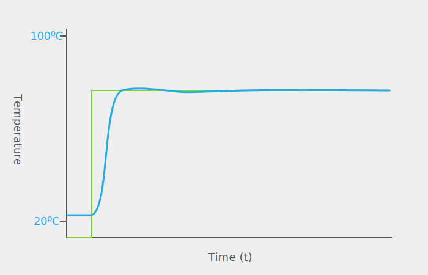
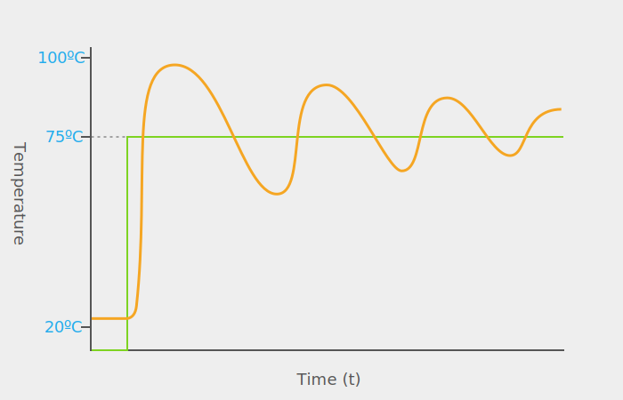

## Intro

Of all the various algorithms used in controlling systems; probably the most common, the most versatile, and most useful algorithm is the _Proportional_, _Integral_, _Derivative_ (PID) method. PID is a mathematical tool for efficiently affecting change in a system to get it to a particular target state, and keeping it there, harmoniously.

It's the algorithm that keeps drones balanced in the air, your car at the right speed when cruise control is on, and ships on the right heading with variable winds. It's also the algorithm that can efficiently heat a cup of coffee to the perfect temperature and keep it there.

Consider the following graph of heating a cup of coffee from room temp to 75ºC. The green line represents the ideal, that is, we decide that our coffee which sits at 22ºC (72ºF) is too cold to drink, and so we want it instantly heated to 75º. This "ideal value" is also known as the _reference_, _target_, or _setpoint_ (SP) signal. And the blue line represents an efficient realization of the reference signal in the real world; in which it takes time to heat the coffee to that temp:

{:standalone}

In this idealized example, the coffee is quickly brought up _just past_ the target temperature, and then stabilized.

The PID algorithm is a tool to heat the coffee just as illustrated above: _efficiently_.  That is, with only a small amount of error, defined as the area between the reference temperature and the actual temperature.

## PID Controllers in Netduino.Foundation

Netduino.Foundation has two [PID controllers](http://Netduino.Foundation/API/Controllers/PID/) integrated into the core library. Getting up and running with those controllers is fairly trivial, but this article provides a more in-depth discussion to provide a deeper understanding of how the algorithm works, so as to provide a better framework for tuning it, or implementing your own, custom controller.

## Simple Control

To understand why PID is so useful, we must examine what happens without it.

Probably the easiest and most intuitive way to heat up a cup of coffee sitting on a hotplate is to create a loop that continuously monitors the temp of the coffee, and if the temperature is too low, start another loop that turns on the hot plate, waits until the coffee reaches the desired temperature, and then turns the hot plate off. That loop then finishes and when the master loop detects that the coffee has gone below the target temperature, it starts the heat up loop again.

This is a very simple algorithm, but it leads to a lot of error. Consider the following graph, which is the likely outcome of that the aforementioned loop, in which the orange line represents the actual temperature:

{:standalone}

While the actual temperature of the coffee will eventually get close to the target temperature, most of the time there will be a lot of error, due to the _oscillation_ of the system. Each time a control signal is changed, for instance, when the hotplate is turned off, there is some lag as all of the components of the system recover from the inertia of the previous control signal.

This type of oscillation an inefficient control is the reason that sophisticated control algorithms like PID exist. 

## [Next - Closed Loop Gain Controllers](../Closed_Loop_Gain_Controllers)
