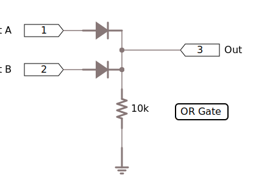

# Intro

Diodes are one way conductors and under normal circumstances will allow current to pass from the anode to the cathode.  The symbol for a diode is:

The arrow head (triangle) points towards the direction of current flow.

Placing a positive voltage on the cathode of a conductor will cause the diode to become an infinite resistance.  A diode will like this until the reverse breakdown voltage is reached.  At this point the diode will start to conduct.  It is extremely rare to use or place a diode in this situation.

## Uses

Diodes have a number of uses:

* Generating light (LEDs)
* Rectifying a signal
* Logic gates
* Lasers
* Radio
* Prevent battery discharge in battery chargers

### Light Emitting Diode (LED)

A Light Emitting Diode (LED) is a small compact device capable of generating light when a current flows though it.  LEDs are available in a number of different colours.  A fuller description of LEDs and their properties and used can be found [here](../LEDs).

### Bridge Rectifier

A bridge rectifier be used to take an [alternating current](https://en.wikipedia.org/wiki/AC_power) (AC) signal and convert this to a [direct current](https://simple.wikipedia.org/wiki/Direct_current) (DC) signal.  

The alternating voltage (on the left) is placed across the bridge.  The diodes will only allow the current to pass one way and this configuration produces a positive wave form that varies between 0V and the voltage applied.  The [capacitor](../Capacitors/) helps to smooth the voltage out into an approximation of a flat DC signal.

### Logic Gates

Diodes can be used to produce basic logic gates such as AND and OR gates.  A simple description of their operation is provided below.  A fuller description can be found in this [Wikipedia article on Diode Logic](https://en.wikipedia.org/wiki/Diode_logic)

#### OR Gate

In the circuit below, the `10K` resistor acts as a pull-down resistor.  If no voltage is present then the output (`Out`) will be at `0V`.

If a voltage of `5V` is applied to either of the inputs (`A` and `B`) then the diode will allow current to flow and the output will `5V`.

#### AND Gate

The AND gate circuit below uses the laziness property of electricity, it will always seek the path of lowest resistance to ground.

If the inputs (A and B) at at 0V then the current from the `5V` source will flow through the resistor to either `A` or `B`.  The result is that the output (`Out`) will be `0V`.

Placing a `5V` signal on `A` and `0V` on `B` will mean make the current flow through `B`.  The `5V` at `A` resists the current flow through the diode but the `0V` on `B` provides a path through the diode to ground.  Similarly, setting `A` to `0V` and `B` to `5V` will produce the same effect.

If both `A` and `B` are set to `5V` then the current cannot flow through either of the diodes.  This means that the current will flow though the output (`Out`).

## Further Reading

* [Diode description on Wikipedia](https://en.wikipedia.org/wiki/Diode)
* [Diode usage in modern circuits - Lifewire.com](https://www.lifewire.com/applications-of-diodes-818815)
* [Diode Applications - Sparkfun.com](https://learn.sparkfun.com/tutorials/diodes/diode-applications)