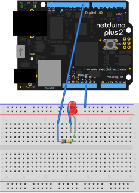

## Overview

To drive an LED with a resistor as the current limiting device in the circuit, we need to first compute the resistance needed.

### Calculating Necessary Resistance

[Kirchoff's Voltage Law](https://en.wikipedia.org/wiki/Kirchhoff%27s_circuit_laws#Kirchhoff.27s_voltage_law_.28KVL.29) states that the sum of the voltages in any circuit loop (source -> load -> return/common) must be zero. Which means that if the source is `5V`, then the total load must drop `5V` to `0V`. Let's examine a typical single resistor circuit:

{:standalone}

So to calculate the resistance needed in this circuit to power the LED, we use Ohm's law, solved for resistance, but remove the voltage drop specified as the forward voltage (`F`<sub>`v`</sub>) from the source voltage (`V`<sub>`s`</sub>) for the LED we're using:

```
R = (Vs - Fv) / I
```

### Example

For example, let's say that we have a red LED has a maximum current rating of `20mA`, and a `V`<sub>`f`</sub> of `1.8V`, that we're driving from a `5V` voltage source. Solving for `R`:

```
R = (5V - 1.8V) / 0.020A = 160Ω

```

The circuit would need at least a `160Ω` resistor to safely drive the LED. Note that when calculating the resistance, `20mA` was converted to `0.020A`.

### Online Calculator

To aid in LED resistance calculation, [here is a fantastic online LED resistance calculator](http://www.ohmslawcalculator.com/led-resistor-calculator).


### Sample Project

Prototyping this with a Netduino would look something like this:

{:standalone}

The following code can then be used to make that LED blink by repeatedly turning it on and off:

```csharp
using System;
using Microsoft.SPOT;
using Microsoft.SPOT.Hardware;
using SecretLabs.NETMF.Hardware.Netduino;
using System.Threading;

namespace Blinky
{
	public class Program
	{
		public static void Main()
		{
			// Create a new output port on Digital Pin 7
			OutputPort led = new OutputPort(Pins.GPIO_PIN_D7, false);
			while (true)
			{
				led.Write(true); // turn on the LED
				Thread.Sleep(250); // sleep for 250ms
				led.Write(false); // turn off the LED
				Thread.Sleep(250); // sleep for 250ms
			}
		}
	}
}
```

### Netduino.Foundation Support

Netduino.Foundation includes a number of classes that make driving LEDs with PWM signals easy. They include the ability to control the PWM by setting the brightness, and even have built-in animations.

When using a resistor with one of these classes, pass `TypicalForwardVoltage.ResistorLimited` or `0` to the `forwardVoltage` parameter in the constructor.

#### `PwmLed` Class

The [`PwmLed`](http://netduino.foundation/API/LEDs/PwmLed/) class represents an LED whose voltage (and brightness) is controlled by the duty-cycle of a PWM signal. Can be used both with LEDs that have been current limited with in-series resistors, or LEDs without resistors.

#### `RgbPwmLed` Class

The [`RgbPwmLed`](http://netduino.foundation/API/LEDs/RgbPwmLed/) class represents an RGB LED whose color is controlled by the duty-cycle of three PWM signals. Can be used both with LEDs that have been current limited with in-series resistors, or LEDs without resistors.
