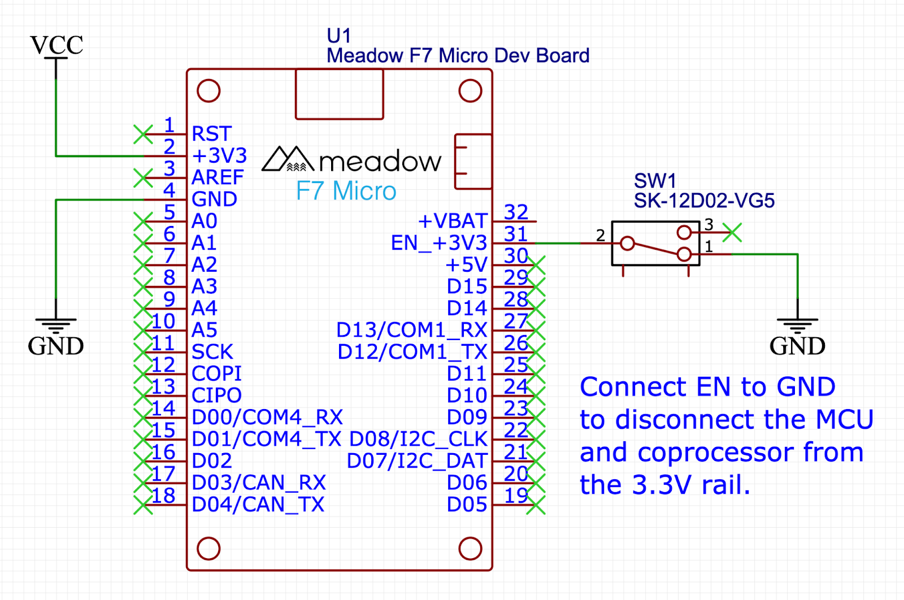
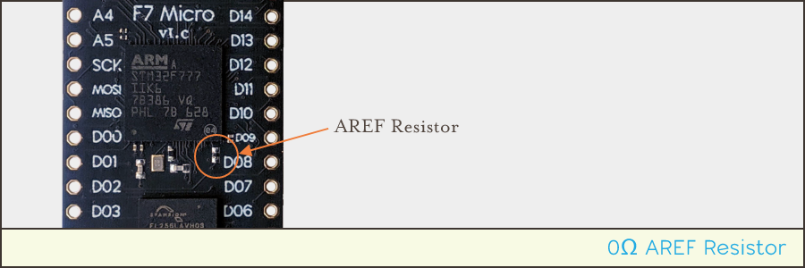
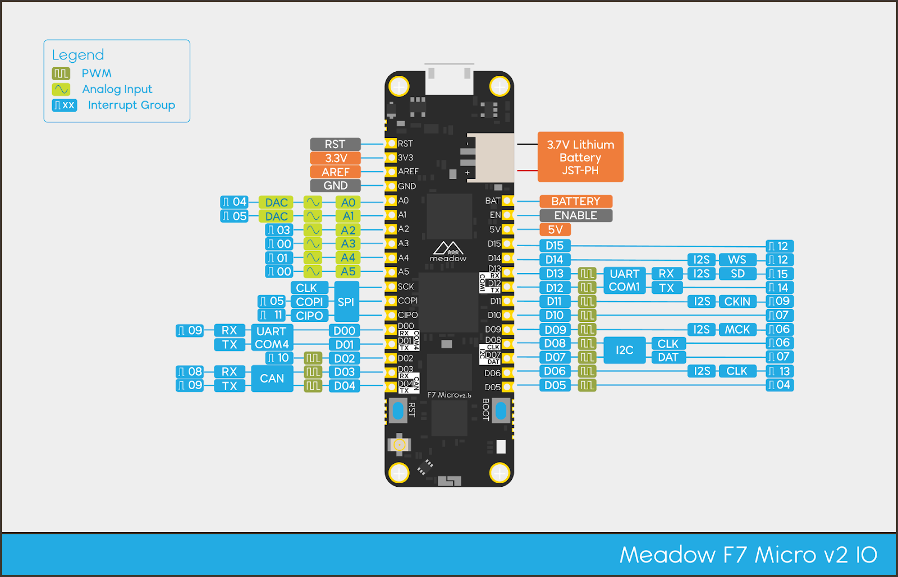
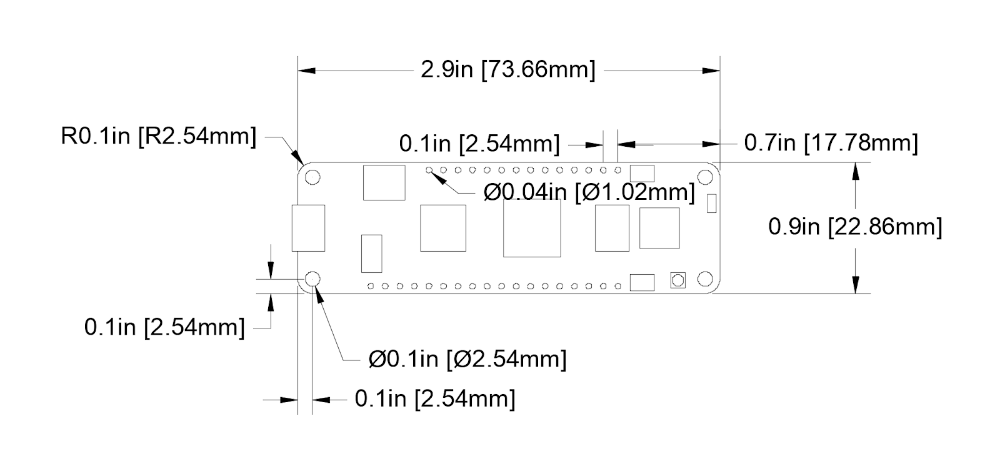
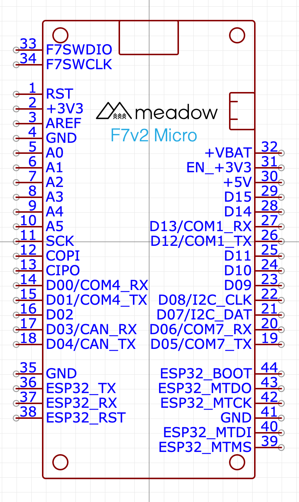
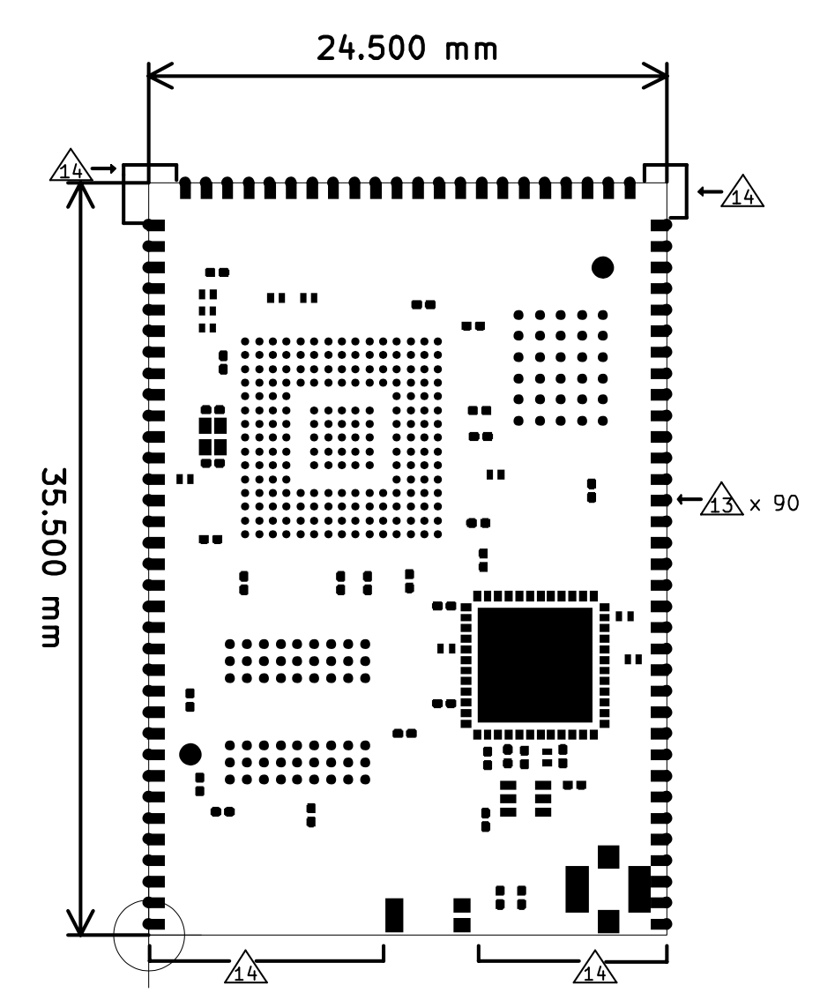
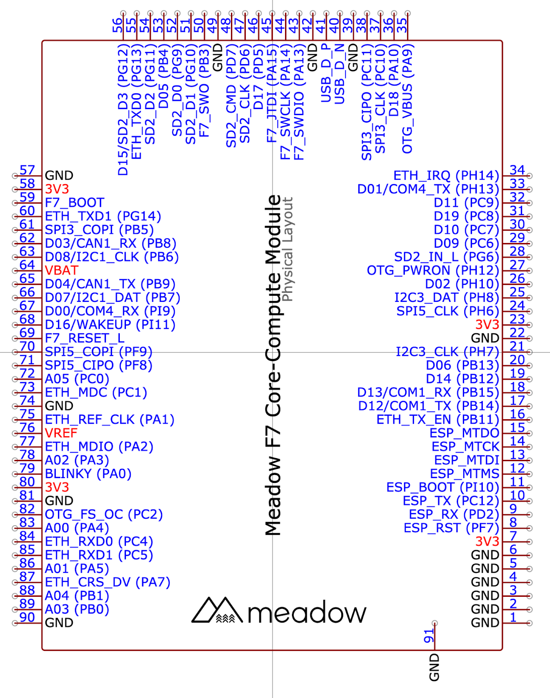
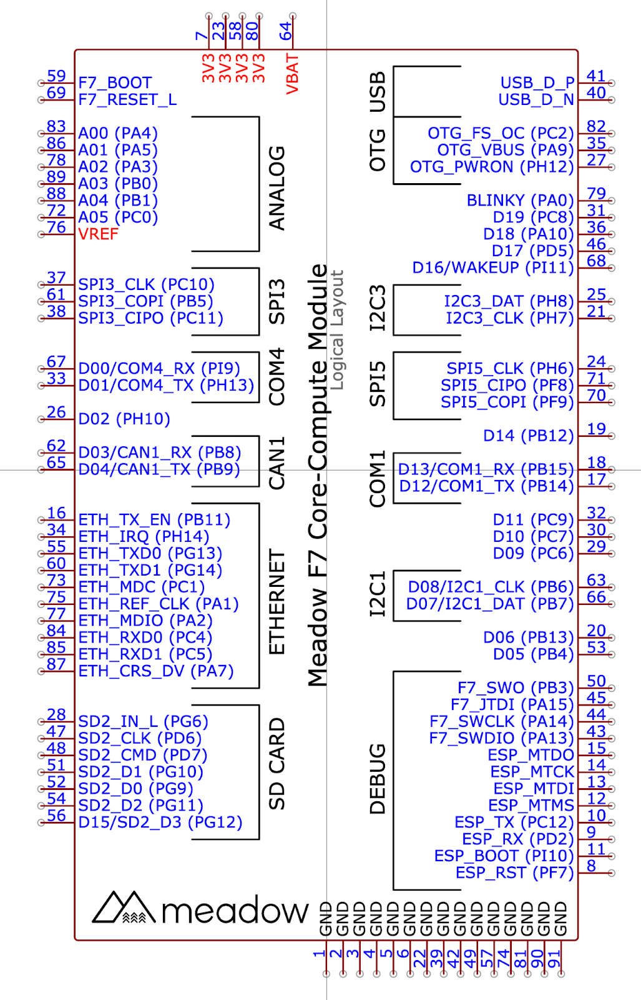
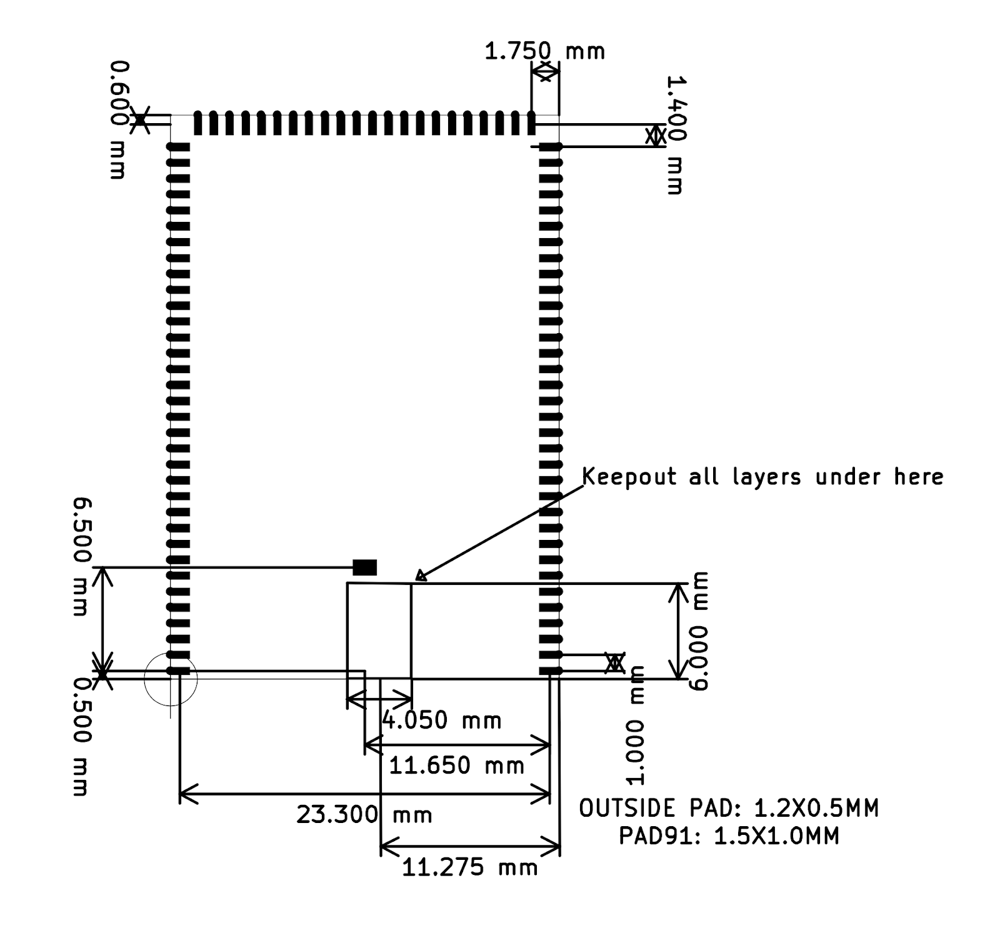

The Meadow F7v2 System-on-Module (SoM) is available in two models, based on two differing form factors:

* **Meadow F7v2 Feather Development Module** - An Adafruit Feather specification compatible design, intended for development, prototyping, and low-volume (1,000 or less) production.
* **Meadow F7v2 Core-Compute Module** -  A surface mount device (SMD) intended for high-volume and industrial production, the F7 Production also adds Ethernet and SD card capabilities.


## What's New?

The F7v2 includes a number of upgrades from the previous v1 board, including:

* **64MB of Flash** - This is an upgrade from 32MB in v1, and with only 4MB or reserved system space, a whopping 60MB is now user accessible.
* **Upgraded Antenna** - We changed out the antenna with a new model that has 10x better performance. In fact, we get better WiFi performance out of the board than our iPhones!
* **Fully SMT-Compatible** - The F7v2 has hybrid castellated header/IO mounts that allow for use as both a through-hole (PTH) device, as well as a surface mount device (SMD/SMT). Additionally, there are no components on the underside, so it will solder flush without impediment.
* **I2S Sound** - Coming soon via Meadow.Core APIs, we’ve added a full set of hardware IO for inter-integrated sound, which enables both I2S microphone input, and sound output.
* **Low-power Timer Input** - Also available soon in software, F7v2 includes a pin that has a low-power timer that can count pulses even while the board is asleep!
* **Fixed Battery Voltage** - A bug in the design of v1.0 meant that the `3V3` rail could dip as low as `3.0V` when being powered by a battery via the integrated battery connector/charging circuit. We changed the power components to make sure that the full `3.3V` is available.
* **Better Buttons** - We also swapped out the buttons on the board with high-quality Wurth Elektrik buttons that have a greater surface area and a much nicer click.
* **Upgraded Silkscreen Design** - The new silk screen makes bus IO identification much easier.
* **Open Source** - We'll be open-sourcing the design soon. This will allow folks to use it with other platform technologies, or build their own board.

## F7v2 Features

* Fully Surface Mount Technology (SMT) compatible. Both modules can be used in SMD designs without the need for through-hole (PTH)  soldering.
* [STMicroelectronics STM32F7](https://www.st.com/en/microcontrollers-microprocessors/stm32f7-series.html) 32-bit ARM Cortex-M7 based core MCU at up to 216MHz
  * 2MB internal Flash memory
  * 412Kb internal RAM
  * 2D Graphics Acceleration (DMA2D) via ST Chrom-ART Accelerator
  * Internal, low-power realtime clock (RTC)
  * Cryptographic Hardware Acceleration for AES 128, 192, 256, triple DES, HASH (MD5, SHA-1, SHA-2), and HMAC
    * True random number generator
    * Floating point unit (FPU)
    * Secure Boot secure, encrypted firmware loader
* [Espressif ESP32](https://www.espressif.com/en/products/socs/esp32) (ESP-Pico-D4) Xtensa 32-bit dual-core LX6 up to 240MHz coprocessor.
  * 2.4GHz WiFi 802.11 b/g/n with WFA, WPA/WPA2 and WAPI
  * Bluetooth 4.2, 5.1
* 32MB external, onboard QSPI RAM
* 64MB external, onboard non-volatile Flash memory (60MB available for user code)
* 25 Mixed Signal IO ports (6/8x Analog, 12x PWM, 3x UART, I2C, SPI, CAN, 2x DAC)
* On-board 2.4GHz ceramic chip antenna
* U.FL external antenna connector
* RoHS compliant (lead and hazardous materials-free)

## Meadow F7v2 Feather Features

The Meadow F7 Feather models have additional onboard features designed to make developing and prototyping easier.


* Reset and Boot buttons
* Onboard user-accessible RGB LED
* Micro USB 3.0 with USB On-the-Go (OTG)
* Integrated 3.7V LiPo/LiIon battery charging and JST-PH 2-pin battery connector
* Can be powered via standard USB, or 5V/3V3 rails
* Integrated switching power supply capable of providing 800mA when powered from USB or 5V rail
* SMT and PTH compatible

## Meadow F7v2 Core-Compute Features

The Meadow F7 Core-Compute model is designed to be an easy upgrade path to production volume solution, or for when Ethernet and an external SD card interface is required.


* **Surface Mount Device (SMD**) form factor.
* **Ethernet** - The core-compute module contains an RMII interface for hooking up to an ethernet PHY, and Meadow.OS now has built-in ethernet support.
* **SD-Card IO** - A high-speed SDMMC interface is also broken out, allowing full-speed SD-Card read/writes.
* **Additional IO** - An additional I2C bus, SPI bus, and additional GPIO have been added.

## Developing with the F7v2

Developing with the F7v2 board is largely the same as with the v1 series, but with two minor differences.

### `App` Class Definition

The Meadow.Core API includes strongly-typed APIs for the pinout of the board, but in order to get the right pin definition, you'll need to modify you `App` class definition from `F7Feather` to `F7FeatherV2` as illustrated below:

```csharp
public class LEDApp : App<F7FeatherV2>
```

Then in your application, you can get strongly-typed access to the pins on the board as before. From within the app class, it's available via the `Device` class:

```csharp
var d5 = Device.CreateDigitalInputPort(Device.Pins.D05);
```

And from other classes, it's available via a singleton instance of your app:

```csharp
var d5 = Device.CreateDigitalInputPort(MeadowApp.Device.Pins.D05);
```

Note that `MeadowApp` should be the name of your application class.

### Pinout

Also note that the pinout of the device is _slightly_ different than the v1. Please refer to the following illustration for pinout information:


### Battery (BAT) Pin

The battery pin (BAT) provides an alternative positive terminal connection for an external battery or power source to the built-in JST-PH battery connector. If using the BAT pin, make sure to tie the negative terminal of the battery to the board ground (GND).

### Enable (EN) Pin

The enable pin (EN) serves as a power switch for the board. By default, it is pulled HIGH (3.3V), but when pulled LOW (0V), it will disconnect most of the power to the MCU. However, it will not disconnect backup power to the MCU, so that it will keep the RTC going and keeping time. The following schematic illustrates a sample application with a switch controlling the EN pin:



### Analog Reference (AREF) Pin

The analog reference (AREF) pin provides a reference voltage for the Analog to Digital Converter (ADC) to compare against. Typically, this should be supplied with 3.3V, so as a convenience, the AREF pin is actually connected to the 3.3V rail via 0Ω resistor that is located next to the D08 pin, just below the main MCU:



### Reset (RST) Pin

The reset pin is used to do an MCU system reset. If you pull this pin LOW (to GND) momentarily, the MCU will reboot, clearing out it’s volatile registers. The RST button on the board does exactly this.
Note that as long as the board still has power, the RTC will continue to keep time without resetting.

### Real-Time Clock (RTC)

The STM32F7 is equipped with a real-time clock (RTC), which, when set, will retain the system time as long as the board has power. If the board will have intermittent power, as when powered by a solar panel, having a battery hooked up to the board will ensure the RTC will not lose the time.

### Antenna

There is an onboard ceramic chip antenna and a U.FL connector for an external antenna for the 2.4GHz WiFi and Bluetooth radio. Additionally, there is a [SKY] antenna switch for switching between the two; by default, the chip antenna is selected, and you must use the Meadow.OS device API to switch to the external antenna.

## Peripherals and IO Pinout

Both Meadow F7v2 Feather and F7 Core-Compute share a nearly identical pinout which provides an easy upgrade path from low volume to high volume production - an application built on the F7 Feature can easily be upgraded to run on a Core-Compute module.



### Pinout Definitions

| Meadow Pin  | MCU Pin | Analog Channel | PWM Channel | Interrupt Group |
| ----------- | ------- | -------------- | ----------- | --------------- |
| A00         | PA4     | ADC1_IN4       |             | 4               |
| A01         | PA5     | ADC1_IN5       |             | 5               |
| A02         | PA3     | ADC1_IN3       |             | 3               |
| A03         | PB0     | ADC1_IN8       |             | 0               |
| A04         | PB1     | ADC1_IN9       |             | 1               |
| A05         | PC0     | ADC1_IN10      |             | 0               |
| SCK         | PC10    |                |             | 10              |
| MOSI        | PB5     |                |             | 5               |
| MISO        | PC11    |                |             | 11              |
| D00         | PI9     |                |             | 9               |
| D01         | PH13    |                |             | 13              |
| D02         | PH10    |                | 1           | 10              |
| D03         | PB8     |                | 3           | 8               |
| D04         | PB9     |                | 4           | 9               |
| D05         | PB4     |                | 1           | 4               |
| D06         | PB13    |                | 1           | 13              |
| D07         | PB7     |                | 2           | 7               |
| D08         | PB6     |                | 1           | 6               |
| D09         | PC6     |                | 1           | 6               |
| D10         | PC7     |                | 2           | 7               |
| D11         | PC9     |                | 4           |                 |
| D12         | PB14    |                | 1           | 14              |
| D13         | PB15    |                | 2           | 15              |
| D14         | PB12    |                |             | 12              |
| D15         | PG12    |                |             | 12              |
| OnBoardLEDR | PA2     |                | 3           | 2               |
| OnBoardLEDG | PA1     |                | 2           | 1               |
| OnBoardLEDB | PA0     |                | 1           | 0               |

### IO Voltage Tolerance

IOs all operate nominally within 0V and 3.3V, but pins configured for digital IO are 5V tolerant while configured.

## Mechanical Specifications

Please note that symbols and footprints for EDA tools can be found in the [Meadow EDA Parts Repo](https://github.com/WildernessLabs/Meadow_EDA_Parts).

Additionally, all of the Meadow F7 hardware designs are open source and available in the [Meadow Hardware Designs](https://github.com/WildernessLabs/Meadow_Hardware_Designs) repo.

EasyEDA symbols and footprints for a variety of use cases can be found online [here](https://easyeda.com/search?wd=meadow&indextype=components).

The following are direct links to specific schematics:

* [Meadow F7v2 Feather Schematic](https://github.com/WildernessLabs/Meadow_Hardware_Designs/blob/main/Meadow_F7v2/Feather_Dev_Module/PCA_Meadow_F7_Micro_SCH_V2b.pdf)
* [Meadow F7v2 Core-Compute Schematic](https://github.com/WildernessLabs/Meadow_Hardware_Designs/blob/main/Meadow_F7v2/Core-Compute_Module/F7CoreComputeModuleSchV2a.pdf)
* [Meadow F7v2 Core-Compute Debug Breakout Schematic](https://github.com/WildernessLabs/Meadow_Hardware_Designs/blob/main/Meadow_F7v2/Core-Compute_Module_Breakouts/Schematic_Meadow%20F7v2%20Core%20Compute%20-%20Debug%20Breakout.pdf)

### Dimensions and Weight - F7v2 Feather

Basic dimensions are as follows; for 3D CAD models and extended dimensional information, please see the [Wilderness Labs 3D Designs Git Repository](https://github.com/WildernessLabs/3D_Print_Designs/tree/master/Meadow/Reference_Models).



* Width = 0.9” [22.86mm]
* Length = 2.9” [73.66mm]
* Weight = 0.3oz [7.0 grams]

### Schematic Symbol - F7v2 Feather



### Dimensions and Weight - F7v2 Core-Compute Module



* Width = 24.5mm
* Length = 35.5mm
* Height = 1.6mm to top of PCB, 3mm total height clearance required
* Weight = 0.1oz [3.0 grams]

### Schematic Symbols and Footprints - F7v2 Core-Compute Module

#### Physical Layout

The following schematic symbol represents the physcial pin layout:



#### Logical Layout

The following schematic symbol provides a suggested logical layout of pins based on primary function:



#### Recommended PCB Footprint



## Technical Specifications

### Absolute Maximum Ratings

| Parameter                                | Symbol                | Min | Typ | Max  | Unit |
| ---------------------------------------- | --------------------- | --- | --- | ---- | ---- |
| Supply Input Voltage                     | V<sub>IN-MAX</sub>    |     |     | +9   | V    |
| Battery Input Voltage                    | V<sub>LiPo</sub>      |     |     | +6.5 | V    |
| Supply Output Current                    | I<sub>3V3-MAX-L</sub> |     |     | 800  | mA   |
| Storage Temperature                      | T<sub>stg</sub>       | -30 |     | +75  | °C   |
| ESD Susceptibility HBM (Human Body Mode) | V<sub>ESD</sub>       |     |     | 2    | kV   |

### Recommended Operating Conditions

| Parameter                                        | Symbol                | Min  | Typ  | Max  | Unit |
| ------------------------------------------------ | --------------------- | ---- | ---- | ---- | ---- |
| LiPo Battery Voltage                             | V<sub>LiPo</sub>      | +3.3 |      | +4.4 | V    |
| Supply Input Voltage                             | V<sub>3V3</sub>       | +3.0 | +3.3 | +3.6 | V    |
| Supply Output Voltage                            | V<sub>3V3</sub>       |      | +3.3 |      | V    |
| Operating Temperature                            | T<sub>op</sub>        | -20  |      | +60  | °C   |
| Humidty Range, Non-Condensing, Relative Humidity |                       |      |      | 95   | %    |


