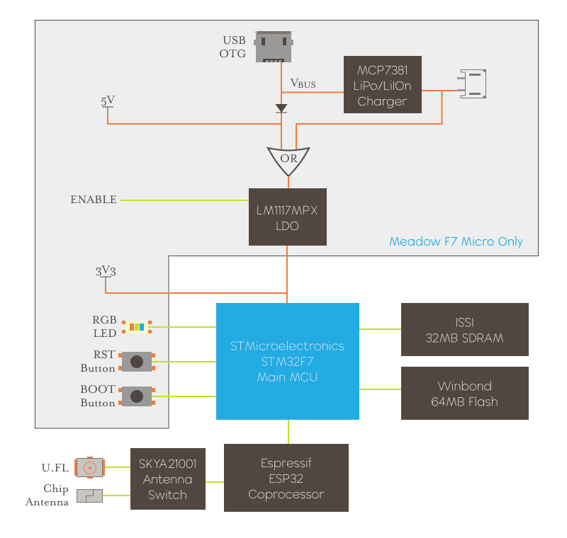
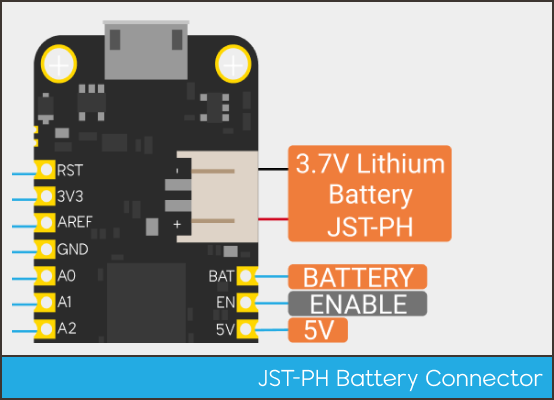

The Meadow F7 is a workhorse Wi-Fi and Bluetooth enabled System-on-Module (SoM) microcontroller-based board designed for sophisticated IoT applications and is based on the STMicroelectronics STM32F7 microcontroller (MCU) with an Espressif ESP32 coprocessor.

The Meadow F7 is provisioned with Meadow.OS which runs full .NET Standard v2.1 applications and can be managed remotely via Meadow.Cloud with secure, over-the-air (OtA) updates, reliable push messaging, and device and application health monitoring over a Wi-Fi or ethernet (F7 Core-Compute model only) network.

## Meadow F7 Block Diagram

## Hardware Resources

* [F7v2 Hardware Designs GitHub Repo](https://github.com/WildernessLabs/Meadow_Hardware_Designs)
  * [Meadow F7v2 Feather Development Module v2.d STEP file](https://github.com/WildernessLabs/Meadow_Hardware_Designs/blob/main/Meadow_F7v2/Feather_Dev_Module/F7CoreComputeModuleV2a.step)
  * [Meadow F7v2 Core-Compute Module v2 STEP file](https://github.com/WildernessLabs/Meadow_Hardware_Designs/blob/main/Meadow_F7v2/Core-Compute_Module/F7CoreComputeModuleV2a.step)
* [Meadow EDA Symbols and Footprints Github Repo](https://github.com/WildernessLabs/Meadow_EDA_Parts)
* [Meadow Core-Compute Developer Module Repo](https://github.com/WildernessLabs/Meadow.Core-Compute.DevBreakouts)
* [Meadow Hardware Add-on Module Designs GitHub Repo](https://github.com/WildernessLabs/Hardware_Addon_Modules)

## Power
### Meadow F7 Feather

The Meadow F7 Feather development board has onboard power features not present on the embedded version, including an LDA and battery charging circuit, and is designed such that it can be powered by supplying the appropriate voltage to either the USB connector, or the 5V or 3.3V power rails.

### LiPo, LiIon Battery Charging

Supplying voltage via either the USB connector or 5V rail is effectively the same; it will output 3.3V on the 3V3 power rail, and enable the battery charging circuit, which will charge any standard 3.7V LiPo/LiIon battery.

To use a battery, you can either hook it to the JST-PH battery connector, or wire it directly to the VBAT and GND pins on the header. Both Adafruit and SparkFun have a good selection of LiPo/LiIon batteries that will work.

The battery charging circuit will supply a battery with up to 200mA of current (at up to 4.2V).

If you supply voltage only to the 3.3V power rail, the board will operate as expected, but the battery charging circuit will not be enabled and the 5V power rail will only be at 3.3V.

#### Charge Status LED

When charging, the yellow charge status LED next to the JST-PH connector will light up.

### Meadow F7 Core-Compute

Unlike the Meadow F7 Feather, the F7 Core-Compute SoM doesn’t include onboard power regulation or battery charging circuit. It must be supplied with at least 500mA of available current on the 3V3 pin.

### Power Budget

The Meadow F7 and IOs are intended to operate on a combined maximum power budget of ~500mA with 400mA reserved for onboard functionality including both MCUs, RAM, and flash. This leaves, at a minimum, 100mA for peripherals, including anything drawing power from the IOs on the board.

#### Peripheral Usage

In addition to the overall power budget, the amount of power being delivered to peripherals via the IO pins must be considered. There is both an overall maximum that the MCU can drive, as well as a per pin maximum.

On the Meadow F7, there is a 25mA per IO maximum, and a total maximum of 120mA.

For additional information on supplying and using power on the Meadow F7 boards, including using solar panels, please refer to the [Power Guide](http://developer.wildernesslabs.co/Meadow/Meadow_Basics/IO/Power/).

