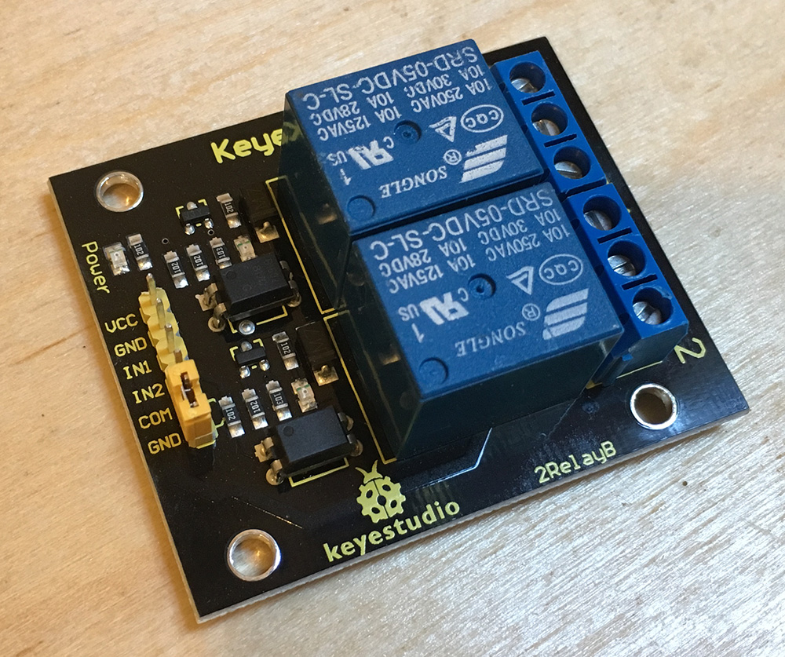

## Overview

Relays are electromechanical switches that allow a circuit to switch current on another circuit while being electrically isolated from each other. Inside a relay is an electromagnet powered by the controlling circuit which physically moves a switch. Conceptually, a relay functions much like a transistor, except that because the controlling circuit is electrically isolated from the switched current, meaning that relays can use small amounts of current to physically control large amounts of current, or completely different types of current.

For example, a common type of relay is a DC controlled AC relay which uses a small amount of DC current (often supplied by a microcontroller) to switch an AC circuit on or off. This type of setup is common in appliances and other applications in which the logic circuit is DC, but various mechanical parts of the appliance are powered by AC current, such as motors, or heating elements.

#### Supporting Circuits

Relays have some interesting electrical behaviors due to the fact that they're typically driven electromagnetically. For this reason, a relay requires a simple, but ancillary circuit to properly control them and handle current spikes created by them. For a more complete discussion of these circuits, see this [excellent tutorial](http://www.electronics-tutorials.ws/blog/relay-switch-circuit.html). However, there are many relay boards that come with a supporting circuit that can be wired up to a microcontroller very easily.

#### All in One Relay Boards

For example this, [Keyestudio 2 Channel relay board](https://www.amazon.com/Keyestudio-Module-Arduino-raspberry-2-channel/dp/B0177WOT1E/ref=sr_1_1?ie=UTF8&qid=1503712979&sr=8-1&keywords=2+channel+relay+keyestudio) can control up to 10A of 250V AC or 30V DC with 5V of power:

{:standalone}

### Power Requirements

Because these relays are electromagnetic; they can require quite a lot of power to drive. Their power requirements are usually listed in their datasheet under _coil voltage_ and _coil current_. The Songle relays on the Keyestudio relay board above take around `120mA` at `5V` each. Typically, a USB port is rated to deliver only `400mA` in total, and a microcontroller actively driving IO will often use `300mA` on its own, leaving very little power leftover for the relay. Additionally, the relay itself can cause power spikes when it operates. For this reason, it's best to use a second power supply dedicated to the relay.

[general setup with two power supplies]

#### Keyestudio Optoisolation Circuit

Additionally, the Keyestudio relay board above has a nice circuit that further isolates the power circuit from the control inputs, allowing it to be hooked to a second power source and makes sure that it draws very little power from the inputs by using an [optoisolator]() to read the inputs.

##### Keyestudio Sample Circuit

Unfortunately, this design is effectively undocumented, so when using them, make sure to wire them up as shown in the following schematic and breadboard diagrams:

{:standalone}

{:standalone}

Note that this configuration requires the jumper to be removed from the header.

### Netduino.Foundation Support

[Netduino.Foundation](http://Netduino.Foundation) includes a [`Relay`](http://netduino.foundation/API/Relays/Relay/) class that simplifies relay control.

### Pole and Throw

Relays, like other switches, come in various _pole_ (P) and _throw_ (T) configurations. Pole refers to the source current nodes, and throw refers to the switched current nodes, and they are often come in single (S), and dual (D) configurations:

{:standalone}

The most common set of configurations are:

 * **SPST** - Single Pole, Single Throw
 * **SPDT** - Single Pole, Dual Throw
 * **DPST** - Dual Pole, Single Throw
 * **DPDT** - Dual Pole, Dual Throw

The throw end of the switch most commonly comes in a _normally closed_ (NC), or _normally open_ configuration, which refers to whether or not that throw node is in the open or closed circuit configuration when at rest.

### Sample Circuit

The following schematic shows a simplified circuit diagram of how to use a relay to power LEDs. In this example, the current controlled by the relay is actually on the same circuit as the current that controls the relay for simplicity, but in a practical scenario, instead of LEDs, the relay might power an AC appliance circuit for a fan, heater, or similar:

{:standalone}

Note that the relay in this schematic actually represents a relay circuit such as one contained in the Keyes all in one relay board mentioned above. So a practical example might look like the following:

{:standalone}

### Controlling the Relay

Because the relay is controlled by simply supplying power to the pole side of the relay, all that is required is to wire the controlling lead to a digital IO pin. The following example illustrates switching between throws every 1/2 second on the SPDT relay shown above:

```csharp
using System;
using Microsoft.SPOT;
using Microsoft.SPOT.Hardware;
using SecretLabs.NETMF.Hardware.Netduino;
using System.Threading;

namespace Relay
{
    public class Program
    {
        public static void Main()
        {
            // create an output port (a port that can be written to) and connect it to Digital Pin 2
            OutputPort relay = new OutputPort(Pins.GPIO_PIN_D2, false);

            // run forever
            while (true)
            {
                relay.Write(true); // turn on the relay
                Thread.Sleep(500); // sleep for 1/2 second
                relay.Write(false); // turn off the relay
                Thread.Sleep(500); // sleep for 1/2 second
            }
        }
    }
}
```

### See Also

* [Netduino.Foundation `Relay` class](http://netduino.foundation/API/Relays/Relay/)
* [Controlling a Coffee Maker with a relay blog post](http://blog.wildernesslabs.co/connectedcoffeemaker_part2/)
* [Wikipedia Relay Article](https://en.wikipedia.org/wiki/Relay)
