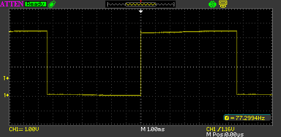
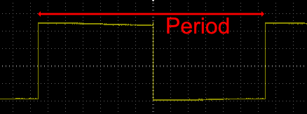

Digital signals use two voltages to represent two distinct states, digital 0 and digital 1.  These two values are the basics of digital data processing and communication.

This guide will use oscilloscope traces to introduce the following terms commonly used when discussing digital signals:

* High and low digital values
* Duty cycle
* Rising and falling edges
* Period
* Frequency

## Supply Voltage

The supply voltage determines the voltage used to represent a digital 1 and a digital 0.  Common supply voltages are:

* 5V
* 3.3V
* 2.5V
* 1.8V

Supply voltages (Vcc) of 5V are gradually being replaced by 3.3V and lower voltages.

## High (1) and Low (0)

Digital circuits work with two logic levels:

* High (known as logic 1 or true)
* Low (known as logic 0 or false)

In a perfect world, a high logic level is represented by the supply voltage and a low logic level is represented by ground.

The Nedtuino family of boards use 3.3V to represent a digital 1 and ground to represent digital 0.  The boards will tolerate 5V as a digital 1 input signal.

## Oscilloscope Traces

An oscilloscope can be used to examine a digital signal in a circuit:

{:standalone}

When understanding digital signals it is essential to understand a number of key terms:

* High and low
* Duty Cycle
* Rising and falling edge
* Period
* Frequency

### High and Low Logic Levels

Binary signals are represented by a high (logic level 1 or true) and low (logic level 0 or false):

{:standalone}

This shows a simple trace where the signal is high for 50% of the time and low for 50% of the time.

### Duty Cycle

The **duty cylce** is a percentage of time the signal is high.  When the time the signal is high is the same as the time the signal is low then the duty cycle is 50%:

{:standalone}

The measurement panel on the right of the oscilloscope trace presents a number of measurements for the signal.  This shows that the duty cycle is 50%.

Compare this with the following:

{:standalone}

In this trace the amount of time the signal is high is lower than in the previous trace.  The measurement panel gives the duty cycle as 26%.

### Rising and Falling Edges

The digital signals shown all present a transition from low to high and high to low.  The transitions are known as rising and falling edges:

{:standalone}

The trace at point 1 represents a **rising edge** where the digital signal makes a transition from 0 to 1.  This is sometimes known as a _positive_ edge.

At point 2, the signal is moving from 1 to 0.  This is known as a **falling edge** or _negative_ edge.

## Period and Frequency

Signals with a repeating pattern such as a clock signal have two related properties, namely the period and the frequency.

### Period

The period is the time between two rising edges:

{:standalone}

### Frequency

The frequency of a signal is the number of repeating events in 1 second.  The frequency of a signal is measured in Hertz (Hz) with frequencies above a 1000 Hz represented as Kilohertz (KHz), Megahertz (MHz) and Gigahertz (GHz).

The frequency can be calculated from the period.  The number of events per second is given by the formula:

No events per second (frequency) = 1 / time for 1 event (period)

or

Frequency in Hz = 1 / period in seconds

So for a repeating signal with a period of 1 millisecond (0.001 seconds), the frequency (f) is:

f = 1 / 0.001

or

f = 1000 Hz (1 KHz).
