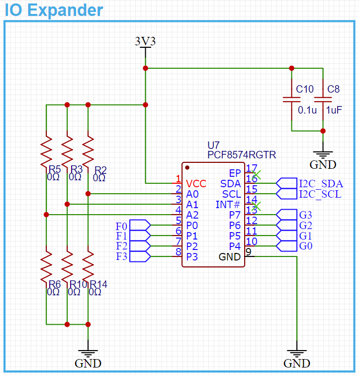
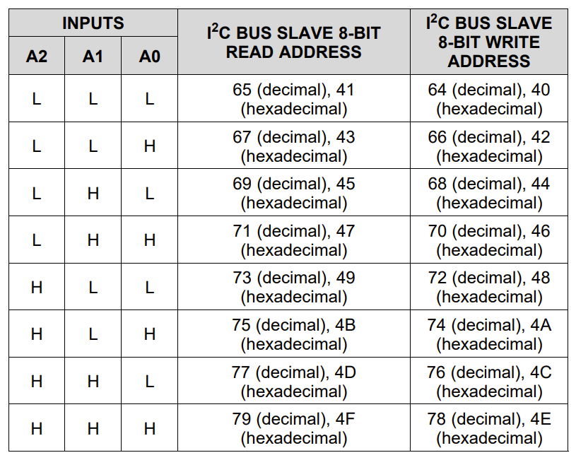

I2C, or Inter-Integrated Circuit, is a powerful communication protocol that allows multiple digital integrated circuits to communicate with one or more controllers, with the added benefit of using just two wires! This makes it super easy to connect loads of sensors, drivers, expanders, and other devices without monopolizing every pin on your microcontroller. 

However, because each device on an I2C line must have its own address, it can be tricky to work around. If you’re designing something that uses I2C and you need a way to change up an address, a common way to do so would be to add a set of pads that can either be left open or jumped closed. This works great for chips that only have a couple options for addresses but if there’s quite a few possible configurations, using the jumper method can impede what could be a dynamic system.

That’s where addressing via dip switch control comes in handy! Depending on the component you’re using, there may be multiple pins dedicated to changing the I2C address of the device. This information will be available in the part’s datasheet; let’s take a look at an example from an I2C enabled I/O expander we’ve used in one of our designs.

This part has 3 dedicated addressing pins available to be pulled high or low for varying addresses. If we wanted to do the jump method, it’d look something like this, with 0Ω resistors as placeholders for our bridges (these can either actually be 0Ω resistors, or just open/closed solder joints):

But, if we check the datasheet for this part, we can see that it’d be quite a bit of soldering on and off if we want to use all the available addresses:

Thus enters our handsome hero, the dip switch! By placing a 3-position dip switch inline with our addressing pins, along with some 10K Ω resistors, we’re able to change our device address much more dynamically and with greater ease of use.

And it’s as easy as that! We hope this short guide proves helpful for you and your next project; happy designing!