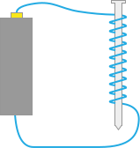

## Magnetic Field

One last point of clarification on the physics of electricity, and we'll be ready to start looking at practical aspects that arise from the underlying physics. But first, we need to understand electromagnetism.

Magnetism, that is, the effect of a magnetic field, is caused by rotating electrical charges; that is, electrons orbiting and "spinning" around a nucleus. <!-- Spin is another arbitrarily named characteristic of subatomic particles, similar to charge. --> In simple terms, we can think of magnetism as a kind of magnification of electrical charges, caused by the angular momentum of electrons. Unlike simple attraction or repulsion in all directions like simple electric charge, however, a magnetic field has a three dimensional polarity with a north/south:

{:standalone}

Magnetic North and South are arbitrary names just like positive and negative charge used to describe repulsion of like polarity and attraction of opposite polarity along an axis.

Magnetism in metals arises when enough electrons have a similar angular momentum to create a net _magnetic domain_. This can happen as part of the natural geological process of creation, or during manufacturing for manmade magnets. A strong enough magnetic field can also induce a magnetic field in other metals, by pulling their electrons into a unified orbit.

A magnetic field can also be created electrically. A weak magnetic field is created when a current flows through a piece of straight wire, but if that wire is coiled, a much stronger magnetic field is created. In fact, a simple, yet effective magnet can be created with just a standard AA battery, a piece of coated wire, and a nail:

{:standalone}

### Induction

Just as a magnetic field arises from the electric charges, a magnetic field can _induce_ current into a wire that enters the magnetic field.

<!--
[illustration of a wire in a magnetic field with moving charge carriers]
-->

<!-- is there a simple induction experiment we can make that would power an LED with a battery and a couple of simple coils that we can put here? -->

As we'll explore later, induction is a powerful tool, and in fact, it's how most commercial electricity has traditionally been generated. Whether hydroelectric, coal, or nuclear, or wind, a turbine attached to what is essentially a large electric motor (coils of wire surrounded by fixed magnets) is spun, causing those wires to rotate within the magnetic field, which causes a current through them.

Induction is also important for a host of other uses, including transforming high voltages into lower voltages by inducing a current into a wire that's coiled next to a higher voltage wire. We'll explore this more in the next part of the tutorial.

For further reading on magnetism, see:

 * [Introduction to Magnetism and Induced Current, Rensselaer Polytechnic Institute](http://www.rpi.edu/dept/phys/ScIT/InformationStorage/faraday/magnetism_a.html)
 * [Electromagnetism, Electronics-Tutorials.ws](http://www.electronics-tutorials.ws/electromagnetism/electromagnetism.html)

## [Next - Part 1 Review](../Review/)
