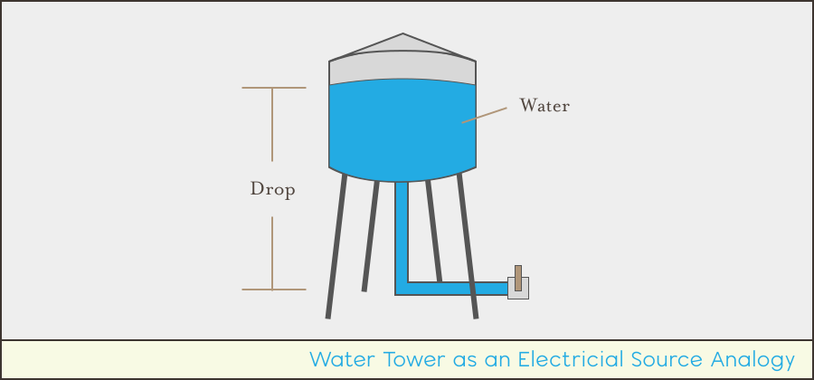
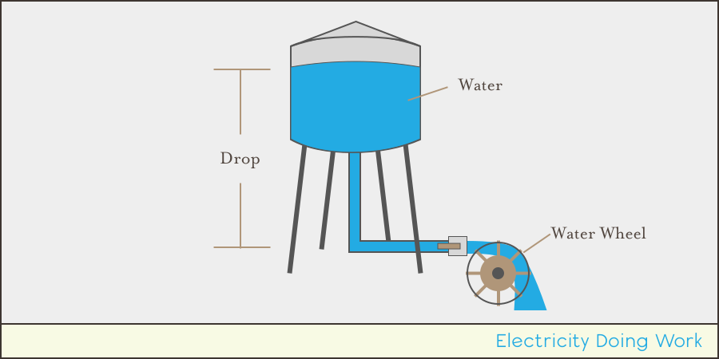
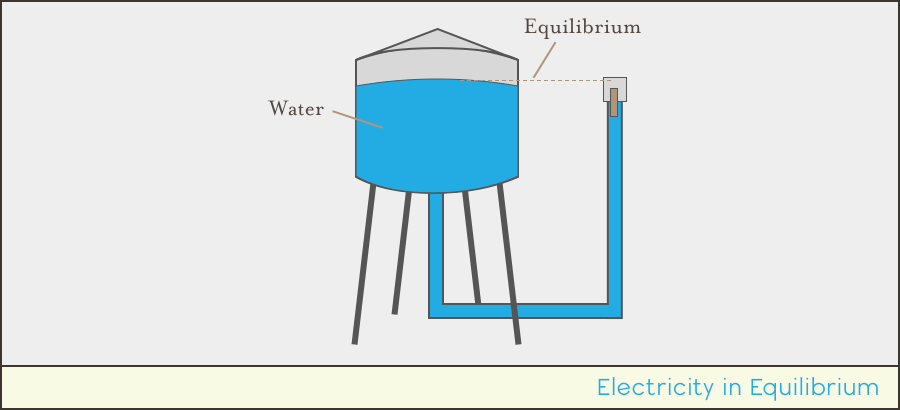
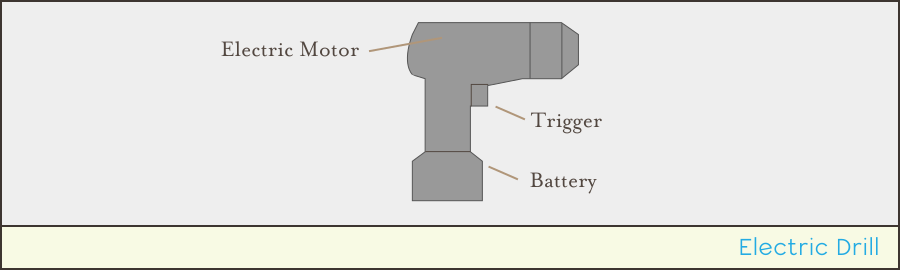

## Intro

In part 1 of our electronics primer we got an understanding of the physical nature of electricity. In this part, we're going to start to look at some of the practical aspects that arise from that nature.

## Describing Electrical Amount and Force

Electricity is useful because of its ability to do work. We can heat with electricity, generate light, and use the magnetic force of electricity to turn electric motors that propel our cars, vacuum our houses, and mix our smoothies.

In order to describe the amount of work that electricity can do, we use two characteristics:

 * **Amperage** - Measured in amps (`A`), this is the quantity of electrons that are being moved.
 * **Voltage** - Measured in volts (`V`), this is the amount of force in which those electrons are being moved.

Water is used as a common analogy to relate these characteristics. Imagine a water tower full of water, and a pipe extending down to the ground below it:

In this analogy, we can think of the water tower as a battery. 

Now imagine, at the bottom of the pipe is a valve that can release water and a water wheel that spins when water flows over it.

The water tower has a quantity of water in it, and the gravity pulling from the water down to the ground, generates a force to move that water. When water is flowing over our water wheel, the molecules of water (analogous to our charge carriers) are causing the water wheel to move, and gravity acting on the difference in height from the top of the water to the bottom of the water to generate a force to push those water molecules and do work.

In order for electricity to be useful, we must have both a quantity of charge carriers (amps) and force to move them (volts). Imagine a water tower full of water, but the pipe outflow is the same height as the top of the water stored in the tank:

Even though charge carriers exist, there is no difference in height to create a potential, or force to move them.

Similarly, even with a very tall, but empty tower, if there are no charge carriers to move, there can be no work done, even though gravity could be acting over a large height difference.

This system, taken as a whole, is analogous to something like a cordless electric drill, in which the battery is our water tower, the electric motor is the water wheel, and the trigger is the valve that lets water flow:

## [Next - Amperage](../Amperage)
