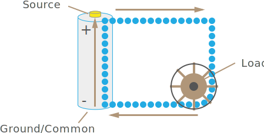

## Electrical Circuits

Electrical circuits get their name because they are actually closed loops. Charge carriers flow from a positive voltage _source_ to a return point and are propelled by the electromagnetic force differential between those two points.

In between the voltage source, and the return point, is almost always some sort of _load_, which is a thing that uses electricity to do work, and has some finite amount of resistance (which we'll learn about in part 3 of the tutorial):

{:standalone}

The return point is often termed the [_ground_](https://en.wikipedia.org/wiki/Ground_(electricity)), or _common_, which is short for _common return path_.

All circuits can be described as a whole in these terms, and almost all of circuit analysis and design is built on this concept.

### Common and Ground

Common and ground are terms that are often used interchangeably, but have slightly different technical meanings. They are both the reference point from which voltages or EMF potential is measured. The difference between ground and source gives a relative value of work potential, expressed in volts.

However, the term ground is literal in its meaning, as it refers to the earth, which is, in all practical purposes, an infinite charge sink, that is, something that can absorb an infinite number of charge carriers.

However, common refers to a return point that may not actually be connected to the earth, but still serves as the return point for charge carriers. Another term that means effectively the same thing is _chassis ground_, and it refers to the fact that a lot of electrical devices and appliances use the metal chassis of the device as part of the grounding.

In a circuit diagram, the symbol for ground is usually:

{:standalone}

And chassis ground is:

{:standalone}

## [Next - Review](../Review)
