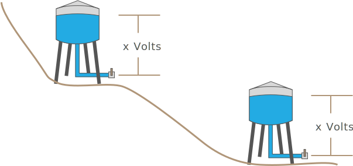

## Electromotive Force (EMF)

In order for a current to exist, charge carriers must be motivated to move. Returning to our water tower analogy, gravity acting on the difference in height of the top water to the bottom, generates a potential force that can be exploited to move water and turn the water wheel:

{:standalone}

This pressure at the valve is known as _electromotive force (EMF)_ and is expressed as a difference between the top and bottom of the water path and represents a potential for work.

When water (or charge carriers) is flowing through the valve, the amount of force is expressed as voltage, in _volts_ (V).

Another way to think about voltage is to imagine that a battery provides an engine to lift charge carriers up to a particular energy level. For example, a standard AA cell has the power to lift charge carriers up to 1.5V:

{:standalone}

### Relative Voltage

It's important to note that this force is relative; even if the water towers were at different altitudes, the pressure at the valve is still dependent on the _voltage drop_ from the top of the water to the ground.

{:standalone}

This means that current flowing from a 10V source to 5V, the potential difference is still only 5V. The amount of force differential between those two points would be the same as 5V flowing to 0V.

A minor, technical point, is that while EMF exists whether curent is flowing or not, voltage only applies when a current exists. 

### Common Source Voltages

Voltage amounts vary greatly around the world, and for different uses, consider the following sources:

| Source                          | Voltage      |
|---------------------------------|--------------|
| High power transmission lines   | 230kV - 500kV |
| North American Household Mains  | ~117V (110 nominal) |
| European Household Mains        | ~220V (230 nominal) |
| AA Battery                      | 1.5V |
| USB Power                       | 5V   |
| Netduino Digital IO             | 3.3V |
| Low-power Peripherals           | 1.8V |

For most of the circuits that we'll explore here, voltages of 5V and 3.3V are the most common. However, many logic circuits control higher voltage circuits that power motors, heaters, and other loads that do heavy lifting and are typically powered by household mains of 110V and 220V.

## [Next - Wattage](../Wattage)
