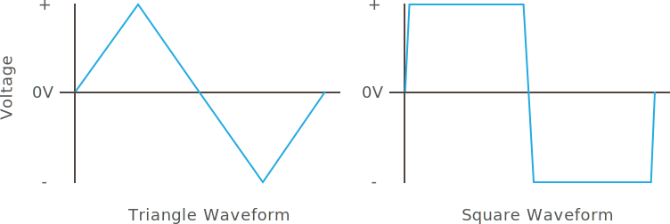
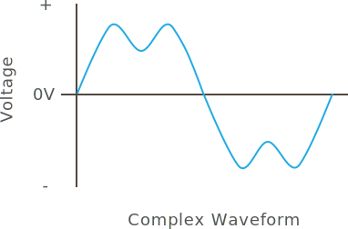

## Characteristics

AC electricity is described in terms of _period_, _frequency_, and _amplitude_.

{:standalone}

* **Period** - Period is the amount of time that it takes the waveform to make one complete cycle.
* **Frequency** - Measured in _hertz_ (hz), frequency is the number of time the waveform repeats itself in one second. In the United States, this is usually `60hz`, and `50hz` in most of the rest of the world.
* **Amplitude** - This is the magnitude of the waveform and is usually measured in volts or amps.

## Other Waveforms

Alternating current is not always a perfect sine wave. In fact, alternating currents are often generated digitally by using triangle and square waves:

{:standalone}

Sometimes, even more complex waveforms are generated, usually by adding other waveforms on top of an existing carrier wave, in what's known as [_modulation_](https://en.wikipedia.org/wiki/Modulation):

{:standalone}

<!-- probably confusing, given that radio transmissions are broadcasted wirelessly, even if it's the same physics

In fact, this is how radio transmissions work! A message signal is added to a carrier signal, for instance 107.7 MHZ, then a radio receiver "tunes" into that particular frequency of carrier signal, and then subtracts it from the transmission, leaving only the message signal.

-->

## [Next - Review](../Review)