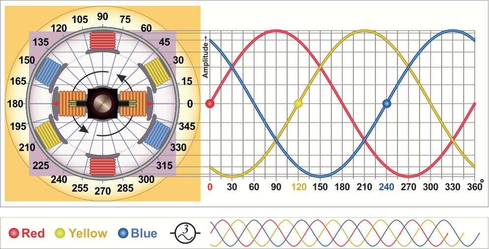

## Generators

Alternating current gets its waveform by the way that it's generated.

AC current has historically been created by electrical generators, which, in their simplest form, consist of a central turning [_rotor_](https://en.wikipedia.org/wiki/Rotor_(electric)) and an enclosing [_stator_](https://en.wikipedia.org/wiki/Stator). Generators have powerful magnets in them which induce a current into wires as they move relative to each other:

[Illustration Credit: Egmason - Own work, CC BY 3.0](https://commons.wikimedia.org/w/index.php?curid=10250453)

As the rotor turns, the wire coils get closer to the magnetic and then farther away; causing an alternating voltage to be induced as the electrons are moved back and forth in the wires. As such, alternating current looks like a sine wave when the voltage is mapped over time, because the induction is actually a function of a circle:

### Multiphase AC Generation

By adding multiple wire coils to a stator, a generator can create multiple AC waves that are _out of phase_ to each other. For instance, most modern electrical generators, like the kind found at power generating plants, have three, `120º` opposed inductors that create [_three phase electric power_](https://en.wikipedia.org/wiki/Three-phase_electric_power), which is effectively the worldwide standard for AC power generation and transmission.

## [Next - AC Characteristics](../AC_Characteristics)
