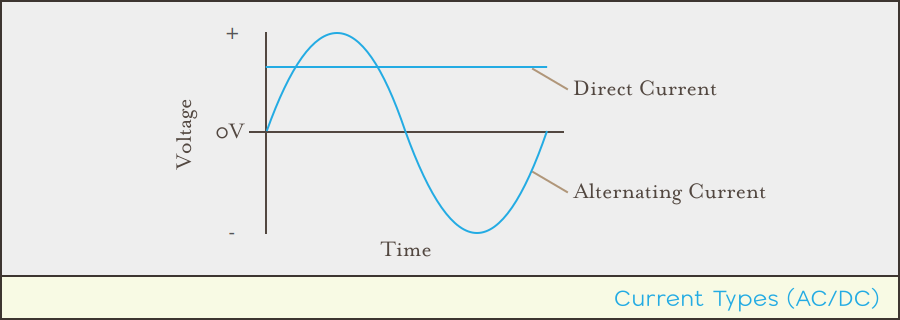

## Introduction

In part 1, we learned that electricity is quantified in two ways; voltage and amperage, which describe force and quantity, respectively. However, in addition to those quantifiers, there is one other characteristic of electricity that has to do with the motion of the current. Electricity comes in two forms of charge carrier movement; _direct current_ and _alternating current_.

Let's take a quick look at DC, and then we'll examine AC.

## [Next - Direct Current](../Direct_Current)
