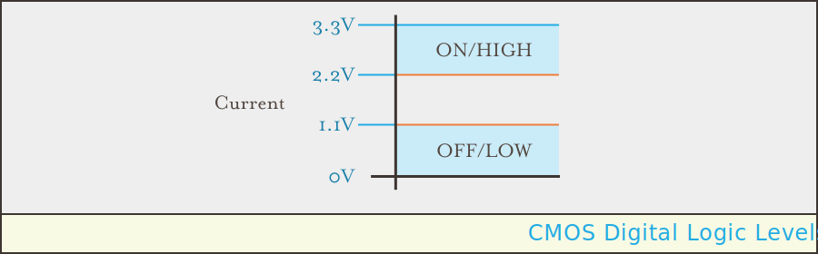

## Overview

[Direct current (DC)](https://en.wikipedia.org/wiki/Direct_current) specifies a unidirectional flow of electrons; that is they flow in one direction only.

The simple nature of direct current lends itself well to creating digital logic circuits, because it can represent binary `1` when `ON` (within a given voltage range), and binary `0` when `OFF` (at ground, or `0V`). It's also the type of current that batteries generate.
 
Because DC is used as the primary type of current in digital logic circuits, most of this tutorial will focus on DC circuits.

Direct curent is also used in [long distance, high power, electrical transmission lines](https://en.wikipedia.org/wiki/High-voltage_direct_current) (usually >250kV) because of lower electrical losses.

Netduino provides two _power rails_ that supply 5V and 3.3V direct current. They can be found on the power header:

{:standalone}

### DC Power Symbols

A general DC power source symbol looks like the following:

{:standalone}

But many specific power sources have their own symbols, such as batteries, as we'll see later.

### Digital Logic Levels

Due to the nature of electronic circuits, digital signals are rarely exactly `0V` or `3.3V` (or whatever `HIGH` value is defined for a particular circuit). For this reason, `HIGH` and `LOW` signals just need to be close to the defined values for a digital circuit to function correctly.

The allowable range of values for digital `0` and `1` in modern circuits are based on what kind of [_logic level_](https://en.wikipedia.org/wiki/Logic_level) the circuit uses.

The logic level is based on what `HIGH` means in a circuit, and falls into two categories, CMOS and TTL.

#### Complementary Metal-Oxide-Semiconductor (CMOS)

CMOS is the technology that nearly all modern integrated circuits use. CMOS `HIGH` signals can vary but they're defined as the `V``DD` level, which is usually `3.3V` in most common circuits. In fact, for nearly all circuits we'll create, we'll use the CMOS standard with `V``DD` = `3.3V` as the upper end of the voltage supply source. 

Internally, most microcontrollers, CPUs, and other complex chips use a lower `V``DD`, often `1.8V` or less, which allows them to operate at faster speeds. However, most microcontrollers use `3.3V` on their IO pins.

#### Transistor-Transistor-Logic (TTL)

TTL is based on older transistor technologies in which the `HIGH` signal is defined as `V``CC`, which is usually `5V`. 

#### VCC/VDD

While CMOS and TTL logic define differing terms for upper end of their supply voltage (`V``DD` and `V``CC`, respectively), they both refer to the same thing.

#### Acceptable Logic Levels

The following levels are acceptable for CMOS and TTL circuits:

| Technology | Acceptable `LOW` Voltage | Acceptable `HIGH` Voltage |
|------------|--------------------------|---------------------------|
| CMOS       | `0V` to `1/3V``DD` | `2/3V``DD` to `V``DD`|
| TTL        | `0V` to `0.8V`           | `2V` to `V``CC` |

Therefore, for a `3.3V` CMOS circuit, the acceptable levels are between `0V` - `1.1V` for `LOW`, and `2.2V` - `3.3V` for `HIGH`:

{:standalone}

#### Logic Level Shifters

When connecting two circuits together that have differing logic levels, _logic level shifters_ (also known as _logic level converters_) are typically employed. These are small, integrated circuit chips that convert one or both ways between varying logic voltages.

### [Next - Alternating Current](../Alternating_Current)