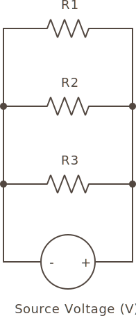
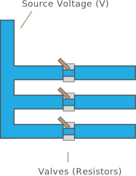

## Intro

When arranging resistors (or resistances) in parallel, as in the following diagram, something interesting occurs:

{:standalone}

Instead of providing more resistance than a single resistor, or resistors in series, it actually provides less. To understand this, we have to put turn the idea of a resistor on its head, and consider the amount of current it conducts. Imagine the water analogy from before, but this time there is three resistor valves that let water through:

{:standalone}

Each resistor lets through some current, so in order to figure out how much total resistance there is, we actually have to figure out how much is current is conducted by each resistor, add those conductances together, and then convert back to resistance.

## Conductance; the Siemens (S)

Perhaps intuitively then, we could reason that conductance could be expressed as the opposite of resistance. It turns out, that's exactly true; conductance is measured in _siemens_ (S), which is defined as the reciprocal of resistance: 

`Siemens = 1 / Resistance in Ω`

The letter `G` is often used to denote conductance/siemens, so the units calculate as follows:

```
G = 1/R
R = 1/G
```

Therefore, to calculate the resistance of a parallel resistor network, we have to:
 
 1. Convert each individual resistance to conductance
 2. Add the conductances together
 3. Convert the sum back to resistance

### Example

Let's consider the same resistor values we had in series, and calculate them in parallel:

 * R1 - 100Ω
 * R2 - 5Ω
 * R3 - 1KΩ

First, we need to convert each value to siemens:

```
G1 = 1/100Ω = 0.01 S
G2 = 1/5Ω = 0.2 S
G3 = 1/1KΩ = 1/1000Ω = 0.001 S
```

Once we have their conductance, we add them to get the total conductance:

```
0.01 + 0.2 + 0.001 = 0.211 S
```

Converting from `0.211` siemens to ohms:

``` 
Resistance = 0.211 S = 1/0.211 = 4.74Ω
``` 

Total resistance with the same resistors as we had in series is now `4.7Ω` in parallel.

## Parallel Resistor Banks

Sometimes, resistors in parallel come in banks of the same resistor values. In this case, there's a shortcut to calculate the total resistance:

```
Total Resistance = Resistance of Each Resistor / Number of Resistors
```

Therefore, (10), 5KΩ resistors in parallel would be:

```
5,000Ω / 10 = 500Ω
```

## Common Voltage, Different Current

In a parallel resistance circuit, the voltage at each resistor is the same, but the current flowing through each resistor is dependent on the amount of resistance that resistor has.

### Power Calculation

Since we know the voltage and resistance, we can use the `P = V^2 / R` form of the power calculation equation, and just as with series resistance, we add an `n` to specify power and resistance at resistor number `n`:

```
Pn = V^2 / Rn
```

## [Next - Reading Resistors](../Reading_Resistors)