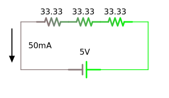

| Single Resistor   | Resistors in Series  | Resistors in Parallel     |
|-------------------|--------------|----------|
| {:standalone} | {:standalone} | {:standalone} |

### [Next - Non-Ohmic Devices](../Non-Ohmic_Devices)