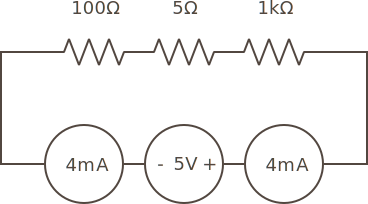

## Intro

Resistors can be placed in series (end to end), in a circuit like the following:

{:standalone}

In this case, the total resistance is the _sum_ of each resistor. So for instance, given the following resistors:

 * **R1** - `100Ω`
 * **R2** - `5Ω`
 * **R3** - `1kΩ`

Then the total resistance would be:

```
Total Resistance = 1,000Ω + 100Ω + 5Ω = 1,105Ω
```

## Common Current, Different Voltage

Resistors in a series share a common current, that is the amount of amps flowing through each one is the same, since there's only one path. 

So for instance, given the previously calculated resistance of `1,105Ω`, if we were to supply `5V` of electrical force, we can use Ohm's law to calculate the current at any given point as:

```
I = 5V / 1,105Ω = 0.004A = 4mA
```

So no matter where in the circuit that we measure the current, we would get the same value of `4mA`:

{:standalone}

### Power Calculation

Given that we know the current and resistance at any resistor in a series, we can use the `P = I^2 * R` form of the power law we derived earlier from Ohm's law and the definition of the watt. However, since there are multiple resistors in the series, we add an `n` to specific power and resistance at resistor number `n`:

```
Pn = I^2 * Rn
```

### Voltage Division

Although the current at any given point in a series circuit is the same, the voltage drops as it passes through each component as the electromagnetic force is resisted. Because of this, resistances in series forms the fundamental circuit for _voltage division_, which we're going to explore more thoroughly in part 5 of this tutorial.


## Advantages and Disadvantages of Series Resistors

Because series resistance is simply the sum of each of the individual resistances, stringing resistors together end to end allows for a specific resistance to be built using various combinations of individual resistors. This can be especially useful when using spare parts for prototyping.

A disadvantage of series resistance is that if one resistor fails open (no longer conducting current across it), the whole series circuit will also fail open. If the resistor fails as a short (it no longer provides resistance, but becomes a conductor), the totality of resistance in the series will be lowered by its amount of resistance.

Because there's little advantage to a series resistor network in terms of pure resistance, usually resistors in series are used in circuits to divide voltage.


## [Next - Parallel Resistance](../Parallel_Resistance)