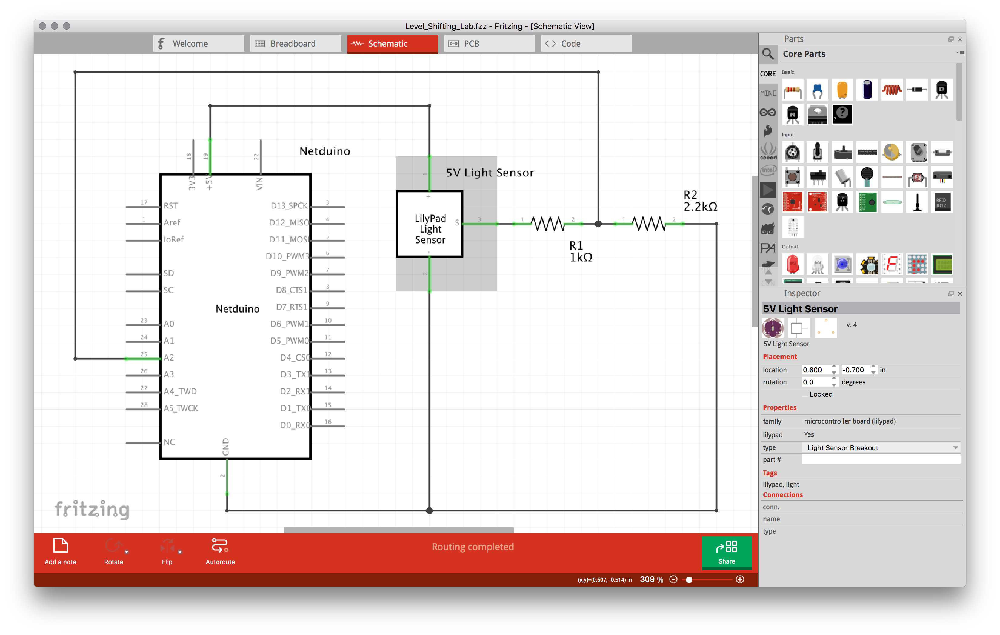
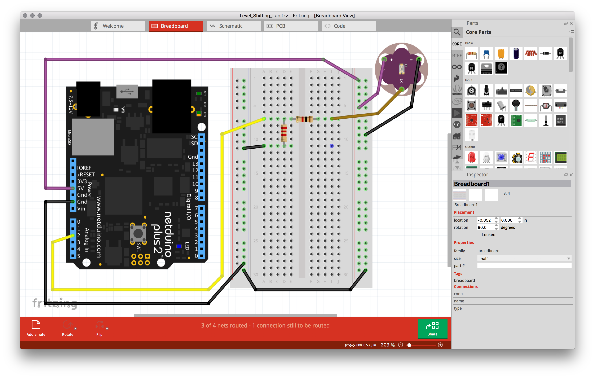
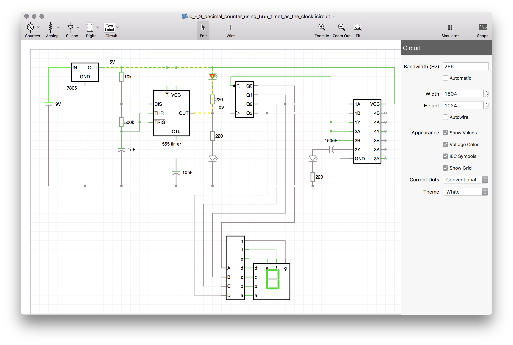
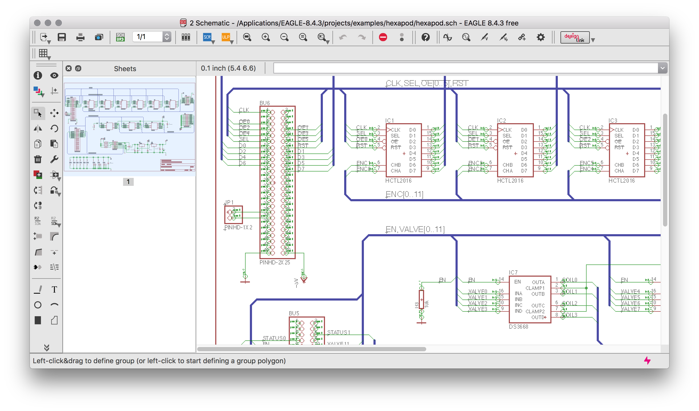
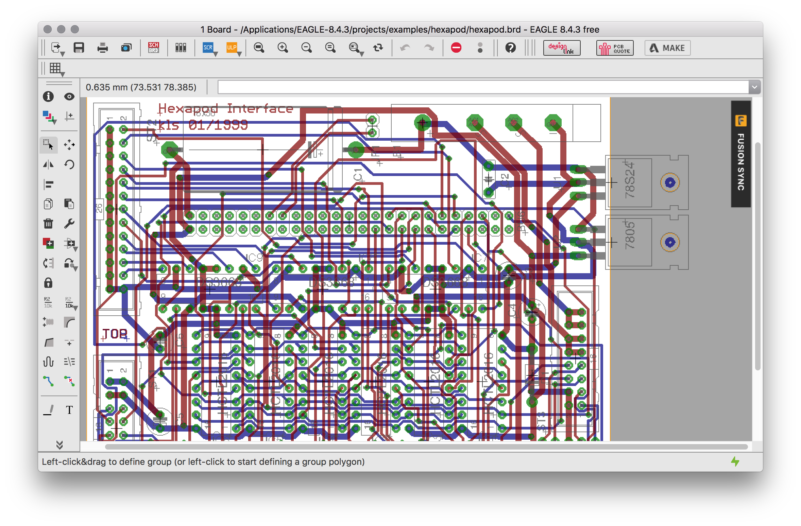
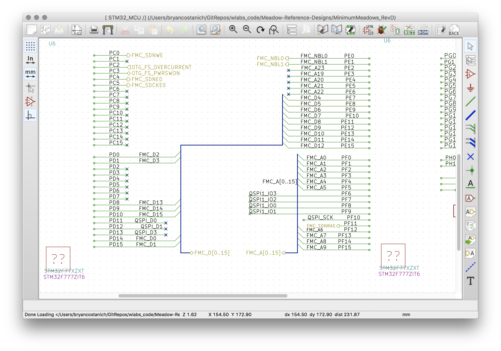
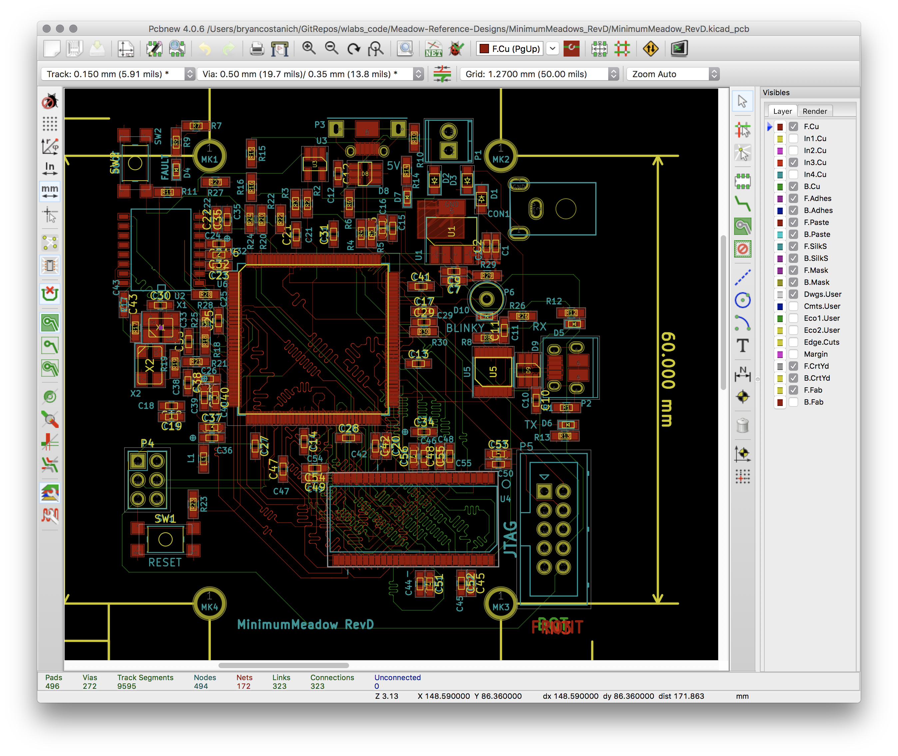

## Intro

There are a number of good and decent circuit simulation and design programs out there that are either free or reasonably priced. The following is a curated selection of programs that we use at Wilderness Labs for various things.

## Fritzing

[Fritzing](http://fritzing.org/) in a free, open-source application that is easy to use and is good for creating schematic designs and breadboard views from those schematics. It also has some printed-circuit-board (PCB) design functionality, though it's best for simple PCBs. It's available for both Windows and Mac.

Here's a screenshot showing the schematic view:

{:standalone}

And the breadboard view of the same schematic:

{:standalone}

Much of the circuits created in this tutorial are done in Fritzing.

## iCircuit

[iCircuit](http://icircuitapp.com/) is a commercial, yet affordable (USD$5 - $10), and very powerful real time circuit simulator. It's available for iOS, Android, Windows Phone, Mac, and Windows, and has a lot of great example circuits. It's great for doing all the circuit math for you and actually model how a circuit works in real time. The following screenshot is a circuit that has a 555 timer changing a 7-segment LED, and what's neat about it, is that you can watch the 7-segment LED go through numbers in the app!

{:standalone}

## Eagle CAD

[Eagle CAD](https://www.autodesk.com/products/eagle/free-download) is a semi-professional schematic and PCB design program that's published by AutoDesk. It's a quality piece of software with a decent, user-friendly UX. There is a free version, but to create anything more than the most simple of boards (more than 2 layers), it's at least USD$100/year, and to do anything more than 4 layers (which is needed for a lot of modern designs), it's USD$500/year. It's available for Windows, Mac, and Linux.

SparkFun and Adafruit publish most of their open-source designs in eagle, so it's a good choice for most connected things designs.

The following screenshot shows the schematic view in Eagle:

{:standalone}

And the PCB editor looks like the following:

{:standalone}

## KiCAD

[KiCad](http://kicad-pcb.org/) is a free, open-source, professional grade schematic and PCB editor. It does unlimited layers and complexity of designs, but the UX is atrocious. It's available for Windows, Mac, and Linux.

The following is a screenshot of the schematic editor:

{:standalone}

And the PCB editor looks like the following:

{:standalone}

## Others

There are countless other schematic and PCB design programs, both free and professional, some are even online. The higher-end professional programs do a lot more, but they run a minimum of USD$10,000/year or even USD$50,000/year and more, depending on the features. I've also used most of them, and while they may do things that the free and prosumer software I listed above don't, I've yet to find one that has a user-friendly UX. Most of the other free and low-cost schematic and PCB design software is not very good, or is uses very proprietary file formats.

## [Next - Review](../Review)