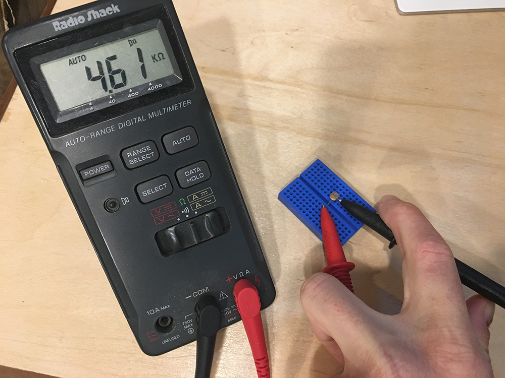

## Lab Overview

In this lab we're going to build a simple and practical circuit to read a resistive sensor. Our sensor will be a photoresistor which will measure the amount of light available, but the steps and process are the same no matter what kind of resistive sensor is used.

### Requirements

To do this lab, you'll need the following new items:

| Item                                   | Approximate Cost (USD) |
|----------------------------------------|------------------------|
| Photoresistor                          | <$1                    |
| Netduino                               | $25 - $70              |

Additionally, you'll reuse the following tools and components from earlier labs:

 * Multimeter
 * Half size breadboard
 * Resistor Kit
 * Breadboard jumper wires
 * Wire cutter (optional, for trimming resistors)

#### Component Sourcing

To build a photoresistor sensor circuit, we need to start with a photoresistor. Photoresistors usually look something like the following, and can usually be [sourced for less than USD$1](http://www.mouser.com/ProductDetail/Adafruit/161/?qs=%2fha2pyFadugRELlGV3EJvhiJsyG6%2fjztqGMot59Rgn9%2fJAtRYbFvdw%3d%3d):

{:standalone}

There are several major component supply websites that serve the majority of the world. The most common ones we use are:

 * [Mouser](https://www.mouser.com)
 * [Digikey](https://www.digikey.com)
 * [Arrow](https://www.arrow.com)
 * [SparkFun](https://www.sparkfun.com)
 * [Adafruit](https://www.adafruit.com)
 * [Alibaba](https://www.alibaba.com)

#### Datasheets

Components usually have a [_datasheet_](http://www.mouser.com/ds/2/737/photocells-932884.pdf) that describes their characteristics and they will often give sample circuits that describe how to wire them up. When building circuits, a lot of time is actually spent looking at datasheets to understand the behavior of various components and how to connect them together. Manufacturers want people to use their components, so it's in their best interest to provide good documentation and schematics to make them easier to use. Datasheets are usually easy to find; simply searching on Google for the part number + "datasheet" will often turn up a PDF datasheet.

In the case of my photoresistor, I found it in a pile of components, so I'm not sure if it conforms to the values in the above datasheet, since I'm not sure it's the same component. That's not a problem, however, with a simple resistive sensor like this because I can just measure the resistance with a multimeter under varying conditions to determine its characteristics. 

## Resistive Sensors

There is a class of sensors, called resistive sensors, that have a variable resistance based on various input such as light or heat. [Photoresistors](https://www.wikipedia.com/en/Photoresistor), for instance, provide less resistance the more light that they receive. Similarly, [thermistors](https://en.wikipedia.org/wiki/Thermistor) change their resistance (either more resistance or less resistance, depending on the type), as their temperature changes.

Resistance can't be measured directly with a Netduino, but voltage can be measured by the Analog to Digital Converter (ADC) via the analog input pins. By placing a resistive sensor in a voltage divider with another resistor of known value, we can measure the voltage output and use Ohm's law to calculate the resistance of the resistive sensor. 

The following circuit schematic is the exact same as our voltage divider from before, except now, `R2` is a resistive sensor, in this case, it's a photoresistor:

{:standalone}

## Exercise 1 - Reading a Resistive Sensor


### Step 1: Measure the photoresistor resistance in various light conditions.

To measure the resistance of a photoresistor, set the multimeter to its resistance measurement setting, which is usually denoted by the ohm (`Ω`) symbol, and put the multimeter leads on each of the photoresistor leads. It might be helpful to put the photoresistor in a breadboard to keep it still:

{:standalone}

If using a breadboard, make sure each leg of the photoresistor is on opposite sides of the center well (or on different rows), so the legs aren't connected.

I measured the resistance of my photoresistor in varying light conditions and came up with the following ranges:

| Luminance      | Resistance Range       |
|----------------|------------------------|
| Bright Light   | <= ~1kΩ                |
| Room Light     | ~1kΩ - ~75kΩ           |
| Darkness       | >= 75kΩ (up to 350kΩ+) |

This photoresistor is very good at detecting very little light, in fact, from the table above, most of its range is in the relative darkness. However, for my purposes, "mostly" dark is good enough, so I can ignore anything above `75kΩ`.

I live in the Pacific Northwest and on a November day, sunlight is a commodity that is hard to find, so to simulate sunlight, I shone the LED from my phone on the sensor from a few inches away.

The datasheet for the Adafruit photoresistor gave a range of `200kΩ - 10kΩ`, so I'm glad I measured mine.

#### Lab Process & Questions:

Using a multimeter in resistance measuring mode, measure your photoresistor under varying conditions. What resistance does it supply in the following conditions? Write them down:

 * Bright sunlight
 * A moderately lit room
 * When the sensor's light collector is covered by something dark (a dark condition)

### Step 2: Calculate the fixed resistor (`R1`) value.

Netduino has an onboard Analog to Digital Converter (ADC) that reads voltage values from `0V` - `3.3V` in 1,024 steps, which means it will give a value from `0` to `1023` that represents the voltage. For the best resolution therefore, we want the total resistance when it's very bright to be near the ADC max of `3.3V`. And when it's low, it should be near `0V`. This ensures that we are using the biggest range possible.

#### Calculating the High and Low Resistance Values of the Bottom Half of the Voltage Divider

The easiest way to select an `R1` resistor is to choose a value that splits the difference between the high and low resistance threshold values of the bottom half of the voltage divider (resistive sensor and ADC). Recall that the parallel resistance of the resistive sensor and the ADC is calculated using conductance (G):

```
Given:
ADC Conductance = 1 / 11kΩ = 0.000091S ~= 0.0001S
Photoresistor low R/bright threshold < 1kΩ
Photoresistor high R/dark threshold > 75kΩ

Therefore:
Photoresistor low G = 1 / 1,000Ω = 0.001S
Photoresistor high G = 1 / 75,000Ω = 0.000013S

Total voltage divider bottom half (ADC + Photoresistor) resistance:
Low (bright) = 0.000091S + 0.001S = 0.001091S = 916Ω ~= 0.9kΩ
High (dark) = 0.00091S + 0.000013S = 0.00010391S = 9,624Ω ~= 9.6kΩ
```

Since these are approximations, I've rounded them a little to make the calculations simpler.

#### Choosing an `R1` that Splits the Difference

Therefore, I would need an R1 that has a value halfway between `9.6kΩ` and `0.9kΩ`.  You might be able to guess at a midpoint in your head that's close enough, but we can also use a formula that calculates the difference between the two resistors, divides it in half, and then subtracts that from the bigger resistor:

```
Given:
Halfway = R2High - ((R2High - R2Low) / 2)

Therefore
Halfway = 9.6kΩ - ((9.6kΩ - 0.9kΩ) / 2) = 5.3kΩ
```

`5.3kΩ` isn't a very common resistor value, but `4.7kΩ` is the closest common resistor, so I'll start with that and calculate my expected `Vout` based on that in order to validate that resistor choice.

In practice, there's no real need to do this next step; you can simply grab a resistor that is somewhere near the halfway point, put the voltage divider together and then test the resulting output under various conditions to find the threshold values that you're happy with. However, for the purposes of understanding, I think it's important to go through these steps.

#### Calculating Expected `Vout`

Using the voltage divider equation from before (`Vout = Vs * (R2 / (R1 + R2))`), and using the total parallel resistance of `R2` & `ADC` as the new value for `R2`, we can calculate the expected spread of values. For example, the following calculation is for **very bright** resistance:

```
Example calculation:
Vout = Vs * ((R2 & ADC) / (R1 + R2 & ADC)) )
Bright Threshold = 3.3V * (0.9kΩ / (4.7kΩ + 0.9kΩ)) = 0.53V
```

<!--
Dark Threshold = 3.3V * (9.6kΩ / (4.7kΩ + 9.6kΩ)) = 2.2V
-->

Using that formula, I created the following table of values:

| Light Level Threshold | R1 Value  | Sensor Resistance (R2) | R2 & ADC Resistance | Total R | Vin   | Vout  |
|-----------------------|-----------|------------------------|---------------------|---------|-------|-------|
| Bright                | 4.7kΩ     | < 1kΩ                  | 0.9kΩ               | 5.6kΩ   | 3.3V  | 0.53V |
| Dark                  | 4.7kΩ     | > 75kΩ                 | 9.6kΩ               | 14.3kΩ  | 3.3V  | 2.2V  |


The circuit therefore would look something like this:

{:standalone}

My measured voltage spread with a `4.7kΩ` resistor should then be somewhere between `0.53V` and `2.2V`, which provides a good resolution for reading the value.

#### Lab Process & Questions:

Using the resistance values you measured with your photoresistor, and the example calculations above:

 * Calculate the expected high and low values of the bottom half of your voltage divider.
   * What is the expected high resistance value?
   * What is the expected low resistance value?
   * What is the expected moderate resistance value?
 * Calculate the halfway point between the high and low resistance values, and find a suitable `R1` that's close to that halfway point. 
   * What is the halfway point?
   * What is the closest common resistor?
 * Create a table of expected values that match your photoresistor and `R1` choice

### Step 3: Convert expected voltages to digital values and back.

In order to write our code and validate our readings, we need to know what the expected voltage readings will be when they are read.

Given that voltage is reported by the ADC as a digital value from `0` to `1,023`, we can calculate the expected value output from the ADC as a percentage of the maximum voltage, multiplied by `1,023`:

```
Given:
Digital Value = (Vout / 3.3V) * 1,023

Therefore:
Bright value = (0.5V / 3.3V) * 1,023 = 155
Dark value = (2.2V / 3.3V) * 1,023 = 682
```

Therefore, if my photoresistor were in bright light, the voltage divider should output around `0.53V`, which would read somewhere around `155`. We can then convert that back to voltage by reversing the process and multiplying the ratio of value over max steps (`1,023`) and multiplying by `3.3V`:

```
Vout = (Digital Value / 1,023) * 3.3V
Bright Vout = 155 / 1,023 * 3.3V = 0.5V
```

Using the expected high and low `Vout` values from your calculations in step 2, calculate the digital values that correspond to them, and write them down:

 * Bright Digital Value = ?
 * Moderate Digital Value = ?
 * Dark Digital Value = ?

### Step 4: Build the circuit.

The following circuit schematic represents the circuit that we're going to build. Circuit schematics reduce component complexities to a minimum to illustrate the functional design of a circuit. As such, they usually show a simplified version of many components. Nearly all complex items and sub circuits are shown as a box with leads, representing pins or other connections. In this case, the Netduino is represented by one such box:

{:standalone}

Additionally, schematics are usually arranged logically by functional area, as opposed to physical layout. For instance, compare the schematic of the lab above, to the breadboard layout schematic below:

{:standalone}

The breadboard view above, which I've created in [Fritzing](http://fritzing.org), is electrically equivalent to the schematic, but shows a possible real-world prototype layout. Note that because of routing, it's a bit more complex than the schematic:

#### Breadboard Overlay

The printable breadboard overlay for this circuit can be found [here](Photoresistor_Lab_BB_Overlay.pdf).

#### Baseboard

A baseboard to mount the Netduino and the breadboard on is really helpful to hold the whole assembly together, though it's not required:

{:standalone}

Our [Wilderness Labs Hack kit](http://amzn.to/2y8LzPg) includes a laser etched wooden baseboard, but if you have access to a 3D printer, you can also print one from our [3D designs repo](https://github.com/WildernessLabs/3D_Print_Designs/tree/master/Baseboards).

Assemble the circuit similar to what's shown in the breadboard overlay illustration above.


### Step 5: Deploy Photoresistor_Lab app to the Netduino.

If you haven't setup your development environment yet, follow the [Getting Started Guide](/Netduino/Getting_Started/).

Clone the [Netduino_Samples](https://github.com/WildernessLabs/Netduino_Samples) git repo to your local drive, and open the [Photoresistor_Lab](https://github.com/WildernessLabs/Netduino_Samples/tree/master/Electronics_Tutorial/Photoresistor_Lab) app.

Make sure to modify the `lightThresholdVoltage` and `darkThresholdVoltage` variables to match your photoresistor, and deploy the app to your Netduino.

The _Photoresistor\_Lab_ code is copied below; it illustrates creating a new `AnalogInput` on pin 3, and reading the voltage to get the value of the light hitting the photoresistor:

```csharp
using System;
using System.Threading;
using Microsoft.SPOT;
using SecretLabs.NETMF.Hardware;
using SecretLabs.NETMF.Hardware.Netduino;

namespace Photoresistor_Lab
{
    public class Program
    {
        public static void Main()
        {
            var photoresistor = new AnalogInput(Pins.GPIO_PIN_A3);
            int ambientLight = 0;
            float sensorVoltage = 0;

            float lightThresholdVoltage = 0.85f;
            float darkThresholdVoltage = 2.1f;

            while (true)
            {
                // read the analog input
                ambientLight = photoresistor.Read();

                // convert the digital value back to voltage
                sensorVoltage = AnalogValueToVoltage(ambientLight);

                // output
                Debug.Print("Light Level = Raw: " + ambientLight.ToString() + 
                            ", Voltage: " + AnalogValueToVoltage(ambientLight).ToString());

                if (sensorVoltage < lightThresholdVoltage) {
                    Debug.Print("Very bright.");
                } else if (sensorVoltage > darkThresholdVoltage ) {
                    Debug.Print("Dark.");
                } else {
                    Debug.Print("Moderately Bright.");
                }

                // wait 1/4 second
                Thread.Sleep(250);
            }
        }

        /// <summary>
        /// Converts an analog input value voltage.
        /// </summary>
        public static float AnalogValueToVoltage (int analogValue)
        {
            return ((float)analogValue / 1023f) * 3.3f;
        }
    }
}
```

In a later part of this tutorial, we'll examine reading analog signals and digital communication in a more depth.


#### Oversampling/Averaging Results

When I run this application, I mostly get the results that I expect, but the output has quite a bit of variance within any given light condition. This has to do with the way the ADC does the actual sampling. In a later part of the tutorial, we're going to examine some circuit modifications to deal with this to smooth out the readings, but we can actually clean some of this up using code, as well. 

The technique that we'll use is called _oversampling_, which just means that for every reading we take, we'll average it with the last few readings to smooth out the value. The following method is a general function that examines an existing sample set and calculates a new average, given a new sample value. Note that the `sampleSet` parameter is passed by reference, so that it can update the sample set with the new value to keep the sample set current:

```csharp
public static int AverageAndStore(ref int[] sampleSet, int newValue)
{
    int sum = 0;
    int average = 0;

    // sum up all the values
    for (int i = 0; i < sampleSet.Length; i++) {
        sum += sampleSet[i];
    }
    sum += newValue;

    // calculate the average
    average = sum / (sampleSet.Length + 1);

    // swap the values a slot
    for (int i = 0; i < sampleSet.Length - 1; i++) {
        sampleSet[i] = sampleSet[(i + 1)];
    }
    sampleSet[sampleSet.Length - 1] = newValue;

    return average;
}
```

Adding this to our code then, we now have a program that looks something like the following (the full sample can be found in [Photoresistor\_Lab\_Oversampled folder](https://github.com/WildernessLabs/Netduino_Samples/tree/master/Electronics_Tutorial/Photoresistor_Lab_Oversampled)):

```csharp
using System;
using System.Threading;
using Microsoft.SPOT;
using SecretLabs.NETMF.Hardware;
using SecretLabs.NETMF.Hardware.Netduino;

namespace Photoresistor_Lab
{
    public class Program
    {
        public static void Main()
        {
            var photoresistor = new AnalogInput(Pins.GPIO_PIN_A3);
            int ambientLight = 0;
            int averageAmbientLight = 0;
            float sensorVoltage = 0;

            float lightThresholdVoltage = 0.85f;
            float darkThresholdVoltage = 2.1f;

            // setup an array to hold our samples
            int numberOfSamplesToAverage = 3;
            int[] previousSamples = new int[numberOfSamplesToAverage];
            for (int i = 0; i < numberOfSamplesToAverage; i++) {
                previousSamples[i] = 0;
            }

            while (true)
            {
                // read the analog input
                ambientLight = photoresistor.Read();

                // average (oversample) the last two readings
                averageAmbientLight = AverageAndStore(ref previousSamples, ambientLight);

                // convert the digital value back to voltage
                // sensorVoltage = AnalogValueToVoltage(ambientLight);
                sensorVoltage = AnalogValueToVoltage(averageAmbientLight);

                // output
                Debug.Print("Light Level = Raw: " + ambientLight.ToString() + 
                            ", Average: " + averageAmbientLight.ToString() + 
                            ", Voltage: " + AnalogValueToVoltage(averageAmbientLight).ToString());

                if (sensorVoltage < lightThresholdVoltage) {
                    Debug.Print("Very bright.");
                } else if (sensorVoltage > darkThresholdVoltage ) {
                    Debug.Print("Dark.");
                } else {
                    Debug.Print("Moderately Bright.");
                }

                // wait 1/4 second
                Thread.Sleep(250);
            }
        }

        /// <summary>
        /// Converts an analog input value voltage.
        /// </summary>
        public static float AnalogValueToVoltage (int analogValue)
        {
            return ((float)analogValue / 1023f) * 3.3f;
        }

        /// <summary>
        /// Averages the new value in with an existing sample set of any size. Adds the new value
        /// to the sample set and returns the average.
        /// </summary>
        /// <returns>The and store.</returns>
        /// <param name="sampleSet">existing sample set.</param>
        /// <param name="newValue">New value.</param>
        public static int AverageAndStore(ref int[] sampleSet, int newValue)
        {
            int sum = 0;
            int average = 0;

            // sum up all the values
            for (int i = 0; i < sampleSet.Length; i++) {
                sum += sampleSet[i];
            }
            sum += newValue;

            // calculate the average
            average = sum / (sampleSet.Length + 1);

            // swap the values a slot
            for (int i = 0; i < sampleSet.Length - 1; i++) {
                sampleSet[i] = sampleSet[(i + 1)];
            }
            sampleSet[sampleSet.Length - 1] = newValue;

            return average;
        }
    }
}
```

When I run this, the output becomes much cleaner. Testing under varying conditions I get approximately the following values:

```
Bright < 0.5V
Moderate 1.0V
Dark > 2.9V
```

<!-- N2 has an ADC with a slightly different resistance
```
N2:
Bright < 0.85V
Moderate Light 2.5V
Dark > 3V
```
-->

These values are fairly close to what I expect. The dark reading is a little off, but that could very well be explained by my initial resistance measurements. In any case, this is a great range of values, and provides an excellent way to measure light with only a few dollars worth of components!

Run the new code with your sensor. What are your output values under varying conditions?


## [Next - Lab: Level Shifting with a Voltage Divider](../Level_Shifting_Lab)