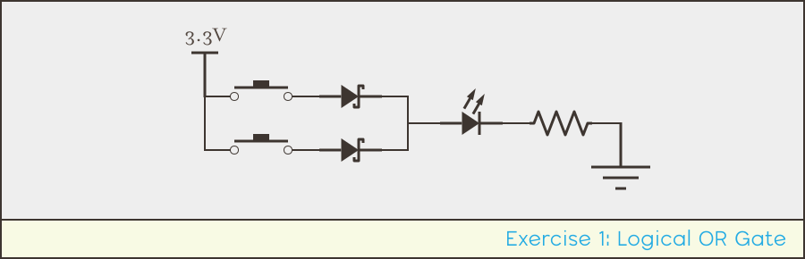
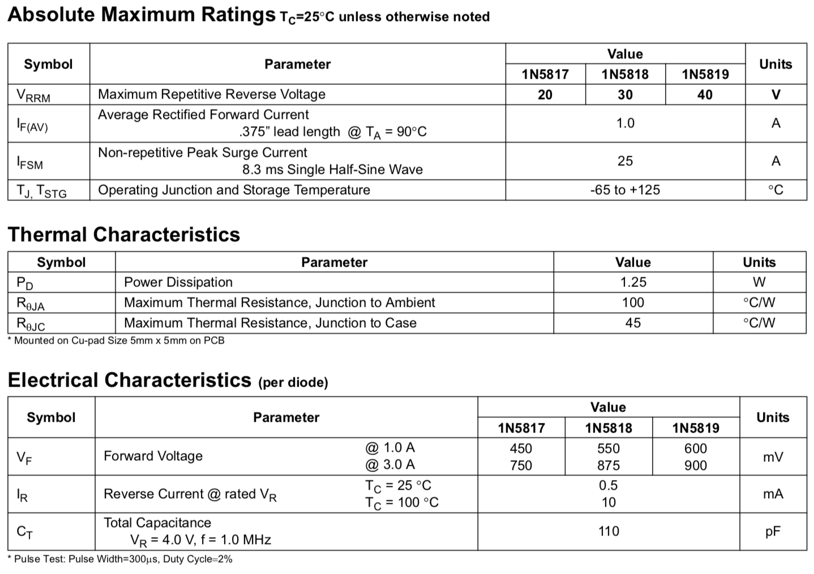
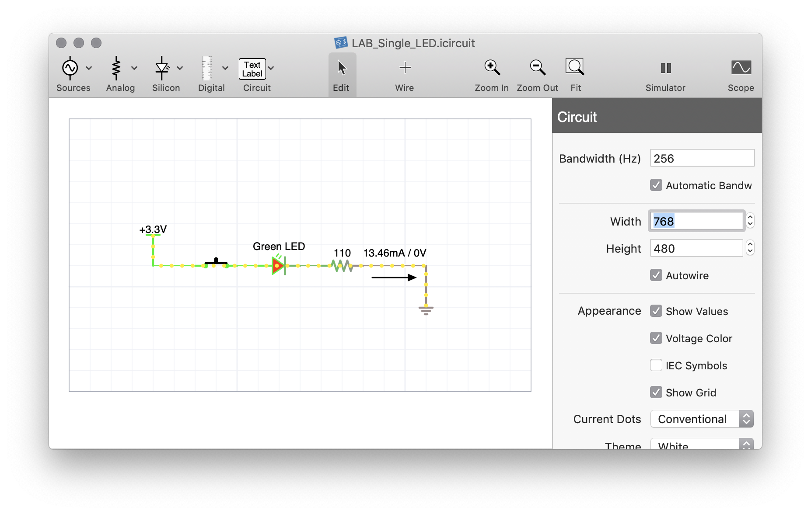
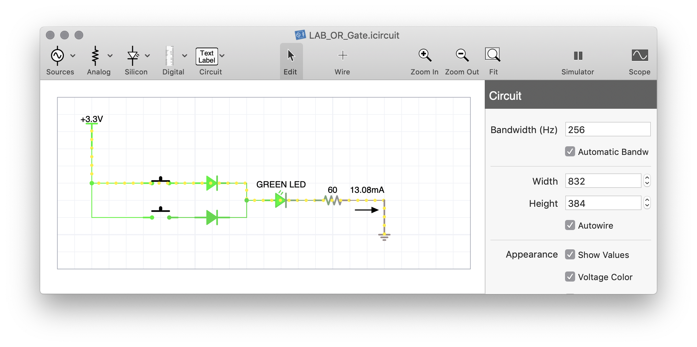

## Intro

In this lab we're going to create some logic gate circuits that can be used as building blocks for more complex circuit control later, and examine some interesting practical challenges of designing circuits in regards to logic inversion.

## Requirements
These circuits use the LED circuits from the last lab as indicators of the output from the logic operations.

| Item | Approximate Cost (USD) |
| --- | --- |
| 1N5817 Schottky Diodes |
| (2) Switches |
| LEDs | |
| Push Buttons | |

## Exercise 1: OR Gate
# Requirements

| Item                                     | Approximate Cost (USD) |
| ---------------------------------------- | ---------------------- |
| 1N5817 Schottky Diodes                    |
| (2) Switches                             |
| LEDs  ||
| Push Buttons   ||

## Schottky Diodes

[model number, specs]
[can build with other diodes, too]

## Switches

[SPDT]

# Exercise 1: OR Gate

This lab




## Understanding the Datasheet



[couple of confusing things:]

[First, `I`<sub>`F(AV)`</sub> as _Average Rectified Forward Current_; the diode can handle EMF spikes up known as _surge current_ up to `25A`, but can nominally pass `1A` of current constantly.]

[`V`<sub>`f`</sub> is given at two current ratings, `1A` and `3A`, at `450mV`, and `750mV`, as the current flow increases above the normal operating amount, it pushes back a little more. [how the feck? this is different than the LED PN, is it because it's a barrier diode with no P-type?]

[In our case, we're passing a small amount of current, so `0.45V` is the number we'll use for our calculations.]

[therefore, important values]

* **`V`<sub>`f`</sub>**: `0.45V`
* **`I`<sub>`f`</sub>**: `1A`
* **`P`<sub>`D`</sub>**: `1.25W`


## Step 1 - Design

[going through two diodes, the logic/Schottky diode and the LED, so have to account for both voltage drops]

### Circuit Model

[when designing circuits, i usually start off by modeling them. 
If you have [iCircuit](http://icircuitapp.com), you can begin your design in there. It will help to get the various values of your circuit components at least close to correct:


]

### Power Calculation

[rough napkin calculation]

```
Given:
PD = Vf * I

Therefore:

```

### Final Numbers

[for my circuit;]

## Exercise 2: Inverted AND Gate w/Buttons

## Exercise 3: AND Gate w/Switches

## [Next - Review](../Review)
### Lab Files

* [iCircuit file](../Support_Files/LAB_OR_Gate.icircuit)
* Breadboard Overlay (Coming soon)


# Exercise 2: AND Gate w/Switches


# [Next - Review](../Review)
