## Intro

As we examined in the last section, a diode is basically just a P-N junction with leads attached to either side. The anode (`A`) is the lead attached to the P-type side, the cathode (`K`) is attached to the N-type side, and the preferential, or forward bias is when electrons flow from cathode to anode (which means anode is hooked to the positive voltage source):

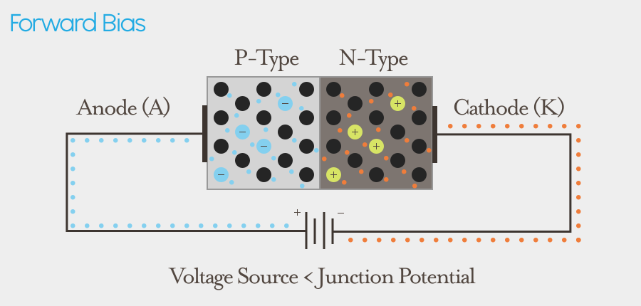{:standalone}

The symbol is a triangle pointing in the direction of current (hole-flow) connected to a perpendicular line which represents the junction:

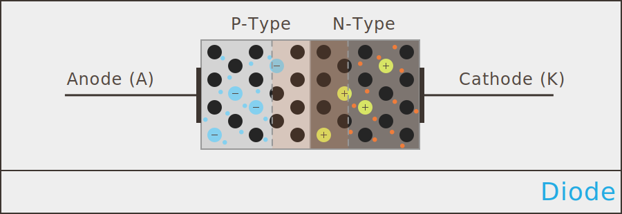{:standalone}

There are a number of different types of diodes, but all of their circuit symbols are based on the one above.

The [Wikipedia diode entry](https://en.wikipedia.org/wiki/Diode) lists almost 20 different types of diodes, but in practice, most circuit design only uses a handful of them. As we explore more circuits, we'll also introduce additional, specialized diodes. 

### Polarity

To differentiate which end of a diode is the anode, and which is the cathode, they usually have a marking on end denoting the **cathode**. The following photo shows four different diodes, each with their cathode mark on the right:

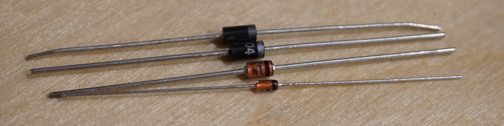{:standalone}

Recall that positive charge carriers (holes) flow preferentially from anode to cathode, so the diodes above are in the same orientation as the circuit symbol below:

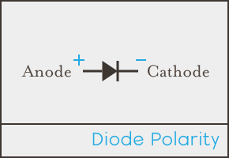{:standalone}

### Diode Characteristics

Depending on how they're constructed, a diode can have some interesting behaviors. For general diodes, there are a number of characteristics that are used to describe how they work:

 * **Forward Voltage (`V``f`)** - This is the amount of voltage drop, or the amount of voltage needed to enable current flow. 
 * **Maximum Forward Current (`I``f(max)`)** - This is the maximum amount of current that the diode can safely conduct when forward-biased without breaking.
 * **Peak Inverse Voltage (PIV) or _maximum reverse voltage_ (`V``R(max)`)** - This is the maximum amount of voltage that can be applied in reverse bias without an avalanche breakdown.
 * **Total Power Dissipation (`P``D(max)`)** - A diode has some resistance, so some power is lost in the form of heat. As such, a diode usually has a maximum amount of power that it can safely conduct without overheating. Total power dissipation is based on the voltage of the junction potential, and the current: `P``D` = `V``f` * `I`.
 * **Reverse Recovery Time (`Trr`)** - This is how quickly a diode can go from `OFF` to `ON`. It's generally only important in fast-switching circuits.

## Common General Diodes

 * **Switching Diodes** - Also known as _small signal_ diodes, they have an extremely fast `Trr`, and are used for fast current switching.
 * **Rectifier/Power Diodes** - High current capacity, usually `1A` or more. Used for converting AC to DC and protection of circuits from power spikes.
 * **Schottky Barrier Diodes** - Have a very low voltage drop, so they can be used in a clever way to get to a digital `0`/`OFF`. Also very fast. Used for basic logic control.
 * **Zener Diodes** - Have a precise breakdown voltage. Typically used in a reverse bias configuration to provide a voltage reference.

### Switching/Small Signal Diodes

Switching diodes are one of the most common diodes available, largely because of their usefulness in high frequency circuits like radios, where their fast switching abilities are required.

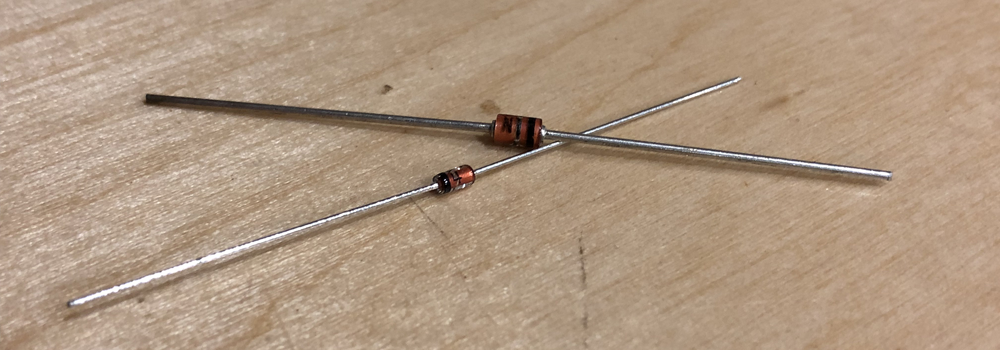{:standalone}

They typically have small power ratings, `150mA` or less, and a `V``f` of `0.7V`. 

Despite their commonality, most of the digital circuits we'll explore will use other diodes.

### Power/Rectifier Diodes

Power (aka _rectifier_) diodes are similar to signal diodes but are designed to handle higher current. The [1N4001](https://octopart.com/search?q=1N4001) is a common rectifier diode and is capable of handling `1A`, but the `V``f` (forward voltage) drop is `1.1V`. These are commonly used to protect certain parts of circuits from voltage spikes, as well as for conversion of AC to DC electricity.

Because diodes control the direction of current, they're often used to protect circuits from unwanted current, especially power spikes.

#### Flywheel Diodes

Flywheel diodes provide circuit protected from collapsing magnetic fields created by de-powering electric motors and other coils by feeding excess current back into the coil. We'll use a flywheel diode in a later chapter to safely control a relay.

#### Voltage Clamping

Voltage clamping refers to clipping a signal to a maximum/minimum value to prevent it from going outside a particular range, or shifting an entire AC signal wave above or below `0V`.

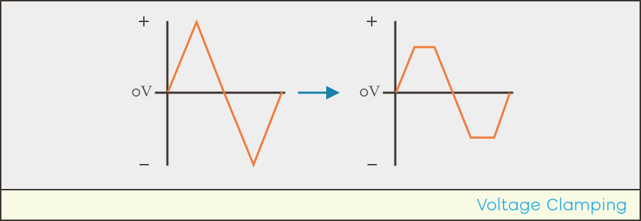{:standalone}

#### Rectifiers

Alternating Current (AC) electrical signals can be converted into Direct Current (DC) through a clever arrangement of diodes known as a _rectifier_:

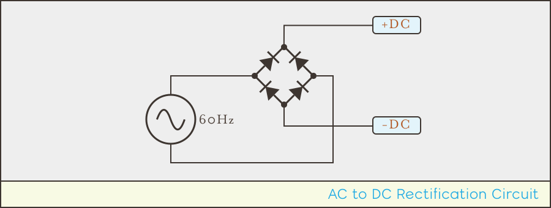{:standalone}

The above circuit will transform a two-phase AC wave form into positive and ground voltages:

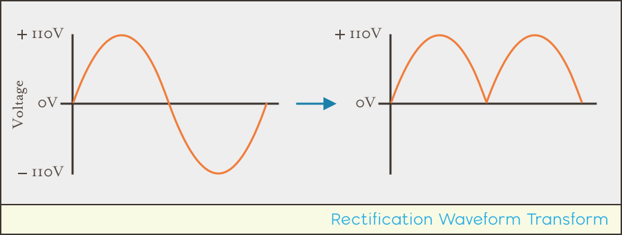{:standalone}

With some additional components, the DC wave output above can be transformed into a smooth, level DC signal.

Rectifiers are used as the first stage in converting household mains AC current into DC current for use in electronics in nearly all AC power adapters. For example, the USB wall adapter that you plug your phone into to charge converts AC to DC using a rectifier. In fact, nearly every electronic device around you that plugs into the wall use a rectifier circuit.

### Schottky Barrier Diodes

Typically just called _Schottky diodes_, instead of a P-type semiconductor, it just a piece of metal against the N-type. This results in a much lower voltage drop, and also fast switching speeds.

The circuit symbol for a Schottky diode looks similar to the diode symbol, except that the perpendicular line looks similar to an `S`.

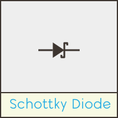{:standalone}

Schottky diodes typically have a very low voltage drop (`V``f`), typically around `0.2V` (`0.15V` to `0.45V`) which makes them very fast and also makes them ideal for use in simple circuit logic.

#### Reverse Current Protection

Because diodes act like one-way valves, they can prevent reverse current from happening in situations where a battery is plugged in the wrong way. Schottky diodes are ideal for this because their low `V``f` means that it doesn't cost much battery voltage to protect the circuit.

#### Diode Logic Gates

These logic circuits can be arranged to provide operations such as `AND` and `OR`, called _logic gates_. This allows you to determine if multiple inputs are all `ON` as well as if any of the inputs are `ON` or `OFF`.

Consider the following circuits:

{:standalone}

##### OR Gate Truth Table

_Truth tables_ are used to describe the resulting output from inputs based on the operation/function. The following truth table describes the resulting output based on the possible inputs to an `OR` gate:

| Input 1 | Input 2 | Output |
|---------|---------|--------|
| 0       | 0       | 0      |
| 0       | **1**   | **1**  |
| **1**   | 0       | **1**  |
| **1**   | **1**   | **1**  |

In the truth table, `0` and `1` represent `LOW` and `HIGH`, respectively. In the case of our circuit, this means somewhere around `0V` for `LOW` and `3.3V` for `HIGH`. 

In the case of an `OR` gate, as long as any input is `1`, the output will also be `1`. This makes sense, because applying voltage to either diode will provide voltage to the output.

However, recall from [earlier](/Hardware/Tutorials/Electronics/Part3/Direct_Current#digital-logic-levels) that digital logic levels don't have to be exactly `0V` and `3.3V`, but rather, `LOW` can be up to `1.1V`, and `HIGH` can be as low as `2.2V`. This is important, because in a practical circuit implementation of the above, some voltage is actually lost to the voltage drop of the diode. If the `V``f` of the diodes are `0.2V`, then only `3.1V` is actually read on the output.

##### AND Gate Truth Table

The `AND` gate is a slightly more clever than the `OR` gate. In the case of the `AND` operation, a `HIGH` voltage is only seen at the output when both inputs are `HIGH`, therefore, blocking the ground path for the `3.3V` voltage source:

| Input 1 | Input 2 | Output |
|---------|---------|--------|
| 0       | 0       | 0      |
| 0       | 1       | 0      |
| 1       | 0       | 0      |
| **1**   | **1**   | **1**  |

##### Logic Gate Uses

In this way, low `V``f` Schottky diodes can be used to determine if conditions are met within a circuit, such as if multiple inputs are `ON`. We'll explore this more by building these gates in one of this chapter's labs.
 
### Zener Diodes

Zener diodes have a known, precise breakdown voltage, which make them very useful for providing a _reference voltage_.
   
#### Voltage Reference

Sometimes, a circuit needs a reference signal at a precise voltage. By utilizing the breakdown voltage of a reverse-biased Zener in a circuit, its `V``f` back-pressure can provide that voltage reference. Consider the following circuit:

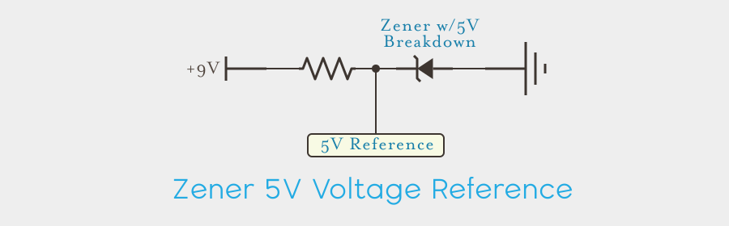{:standalone}

In the case of the circuit above, a Zener with a `5V` breakdown voltage is being reverse biased with `9V`, which means that it's breakdown threshold has been reached, and will conduct current, with a `5V` voltage drop. Since the voltage drop acts like a dam, no matter how much voltage is applied, `5V` of back pressure will always be present:

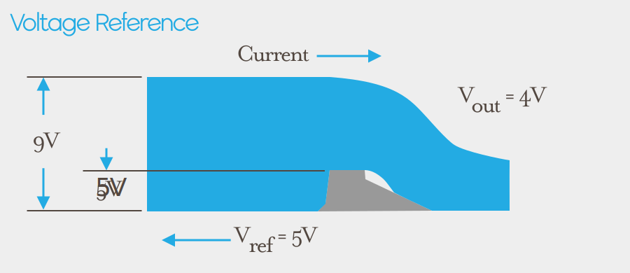{:standalone}

As long as the current is limited, in this case with a resistor, it will stay within that precise operating band. Recall the diode behavior chart from before, specifically the breakdown behavior:

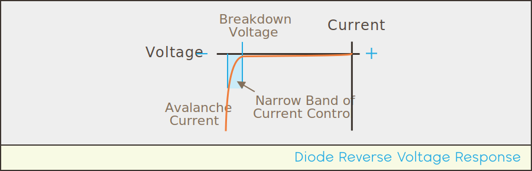{:standalone}

While this circuit looks a lot like a two resistor voltage divider, it's got a huge advantage over a divider; as long as the current is limited, no matter what amount of voltage is applied (within the diode's tolerance), the `V``out` reference will always be the same. 

And while the limited amount of current prevents this from being a useful voltage regulator, it does serve as a reliable voltage reference, which is used in ADC conversions, voltage regulator circuits, and more.

#### Zener Diodes come in many Reverse Voltage Ratings

Because Zener diodes are often used as voltage references, they come in a wide variety of reverse voltages. In fact, Zeners cover all common voltages you're likely to find in modern circuits.

## [Next - Light-Related Diodes](../Light_Related_Diodes)