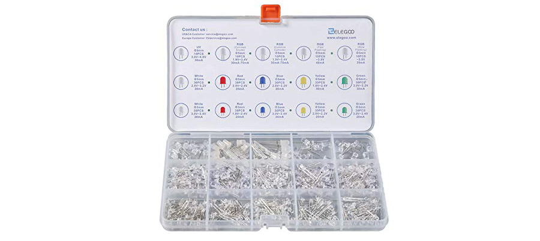
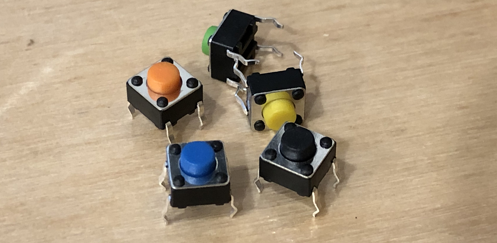
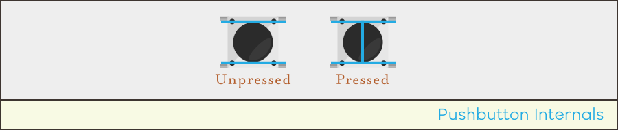
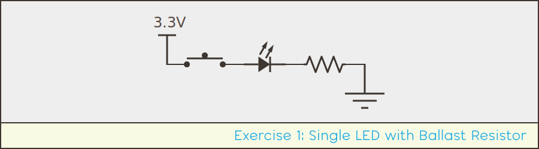
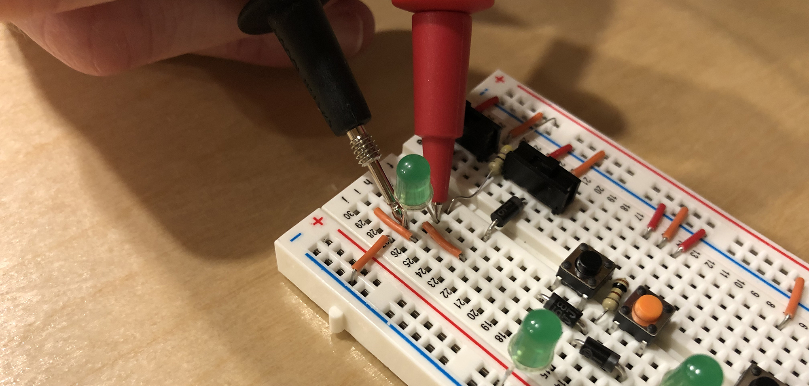
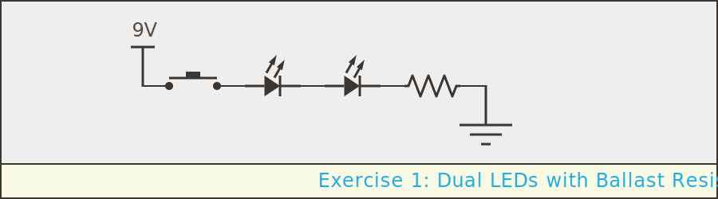
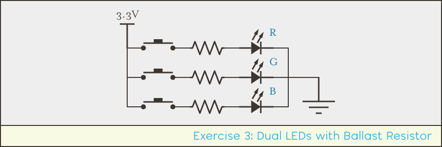
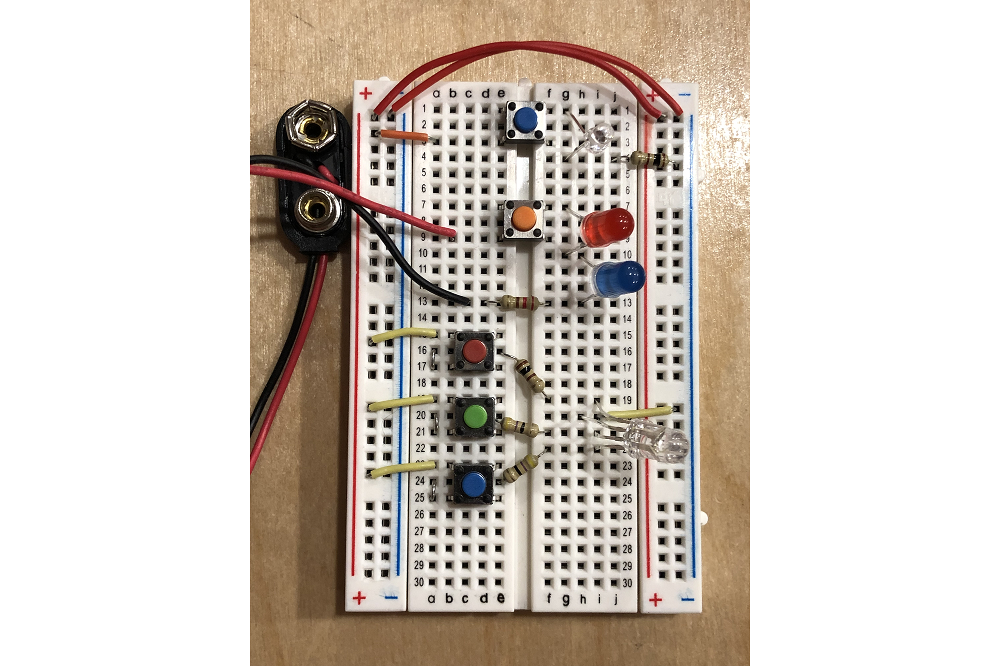

## Intro

In this lab, we're going to build some simple push button activated LED circuits that use a ballast resistor to limit the current.

Part of the challenge of these labs is building a breadboard circuit based on a schematic, so try to build them first without using the breadboard layout solutions.

## Requirements

To do this lab, you'll need the following new items:

| Item                                     | Approximate Cost (USD) |
| ---------------------------------------- | ---------------------- |
| (2) LEDs, any color                      | $0.02/each             |
| (1) RGB LED (Common Cathode)             | $0.09/each             |
| (2) 6mm x 6mm Pushbuttons                | $0.04/each             |
| (1) `9V` Battery Adapter (optional)      |  |
| (1) `9V` Battery (optional)              |  |

Additionally, you'll reuse the following items from earlier labs:

 * Breadboard
 * Resistor Kit
 * Breadboard Jumper Wires

### Single Color LEDs

LEDs are pretty useful, and pretty cheap, so I like to keep a pile of them around. They most commonly come in 3mm and 5mm sizes, and have either clear or diffused lenses. The clear ones tend to have a spotlight focus, whereas the diffused ones shine kind of in all directions. The diffused lenses work best for indicators, and are a little easier on the eyes. The 3mm size tends to fit a little better on breadboards next to each other, and they're just as bright, so they're my preference.

For [$14, you can get a lifetime supply (750) of single color LEDs in white, red, green, blue, and yellow on Amazon.com](https://amzn.to/2RmpjyV):

{:standalone}

When buying LEDs, make sure that the `V`<sub>`f`</sub> of the LEDs you want to use are less than your voltage source. In the LED set above, all of them can be driven with a `3.3V` source.

### RGB LEDs

RGB LEDs come in common anode or common cathode, and I prefer common cathode, in which the common leg goes to the `LOW`/`0V` side of the circuit, because it's more intuitive. For [$9, you can get 100 common cathode RGB LEDs that can be driven by a `3.3V` source](https://amzn.to/2LH6hOp).

### Pushbuttons

These are also sometimes called _tactile switches_, and for prototyping on breadboards, the 6mm x 6mm versions fit well. They usually come in a variety of colors and dimensions. These are 6mm x 6mm x 4.3mm:

{:standalone}

4.3mm refers to the height of the button; these are available in tall heights to account for designs where the circuit board is far away from the control panel.

A pack of 100 black ones runs [~USD$7 on Amazon](https://amzn.to/2StraPJ). Also, AliExpress has a fantastic [160pc set of 8 different colors of them for ~USD$5](https://www.aliexpress.com/item/Each-color-20PCS-Red-blue-black-green-white-Yellow-brown-Orange-6x6-5mm-Tactile-Touch-micro/32847719379.html?spm=a2g0s.9042311.0.0.5be34c4daVxxQw)

#### Pushbutton Wiring

These pushbuttons have two sets of legs, with the top set and the bottom set always connected. When the switch is pressed, the top and bottom set are connected:

{:standalone}

Having four legs instead of two makes them more stable.

## Exercise 1: Single LED Circuit

For the first lab exercise, we're going to build a very simple, pushbutton activated, single-LED circuit with a ballast resistor:

{:standalone}

Note that the new circuit symbol introduced above represents a pushbutton:

{:standalone}

The power can come from the `3.3V` rail on the Meadow or Netduino board. Use an LED of your choosing that has less than a `3.3V`<sub>`f`</sub>.

### Step 1 - Design

This is a very simple circuit, so design is not complex. First, determine the size of resistor you nee. In my circuit I used a green LED with a `2.1V`<sub>`f`</sub>, and a `20mA` max current rating:

```
R = V / I
R = 3.3V - 2.1V / 0.02A = 60Ω
```

For mine, I'd need at least `60Ω` to prevent the LED from overcurrent. However, recall that resistors come in magnitudes of [preferred values](/Hardware/Tutorials/Electronics/Part4/Resistor_Tolerance#preferred-values), with the nearest larger resistor being `68Ω`, so that's a good resistor to start with.

### Step 2 - Build and Test

Once your resistor value is chosen, build the circuit and power it.

Try various resistor values to see where the LED brightness lands. If you have extra LEDs, I recommend trying smaller and smaller resistors to see when/if the LED will burn out.

#### Troubleshooting

In this simple circuit, the most likely failure point is getting the polarity of the LED wrong. If it doesn't work, first try reversing the LED leads.

You can also test the voltage across the LED with a multimeter:

{:standalone}

## Exercise 2: Series LED Circuit

For this exercise, we're going to wire up two LEDs in series that are button actuated as before and use a ballast resistor:

{:standalone}

For my circuit, I've chosen a red and a blue LED that have a `2.1V` and a `3.3V` `V`<sub>`f`</sub>, respectively. That means a total `V`<sub>`f`</sub> of `5.4V`, so I'm going to power the circuit with a `9V` battery.

If you don't have a `9V` battery and/or connector, you can choose two LEDs with smaller voltage drops and power from the `5V` power rail on the Meadow or Netduino board.

### Step 1 - Design

The same Ohm's law applies as before, but this time we have to take into account both LED voltage drops. Mine looks like the following:

```
R = V / I
R = 9V - (3.3V + 2.1V) / 0.02A = 180Ω
```

### Step 2 - Build and Test

Once you've calculated your necessary voltage source and resistor, build and test the circuit as before.

## Exercise 3: 7 Color RGB LED Circuit

By putting a pushbutton in front of each color component of an RGB LED, 7 different colors can be created, depending on the combination of switch presses. Each button has two possible values, and there are three buttons, therefore there are 8 combinations (`2 x 2 x 2`), however, one combination is all `OFF`, which is no color at all.

The circuit we're going to build looks like this:

{:standalone}

It doesn't matter which side of the LED (or button) the resistor goes on, since each LED current path has the same amount of current flowing through it at any given point, but as we'll see, wiring it this makes it fit on the breadboard nicely. In fact, I was able to comfortably fit all four of the exercises in this lab on a single breadboard.

### Step 1 - Design

The first thing we need to do is calculate the necessary resistor for each color component. The following calculation is based on the RGB LED linked above:

```
Given:
RED: 2.0V - 2.4V
GREEN/BLUE: 3.0V - 3.2V
Max Current: 20mA

Therefore:
Rr = 3.3V - 2V / 0.020A = 65Ω
Rgb = 3.3V - 3V / 0.020A = 15Ω

Preferred Resistor Values:
65Ω -> 100Ω Resistor
15Ω -> 47Ω Resistor
```

I rounded up to the nearest preferred resistor values, which might seem high, but the LED would still be plenty bright with much higher values.

### Step 2 - Build and Test

Once you've calculated your resistor values, assemble and test the circuit. Try the various button press combinations to create different colors. Also, put your hand or a piece of paper above the LED and look at it when all three buttons are pressed for white. Notice that light paths don't line up perfectly; and only where all three intersect is it white.

The wiring for this exercise can be a little tricky. Look at the solution below if you get stuck.


## Breadboard Solutions

PDF versions coming soon. In the meantime, here's a photo:

{:standalone}

Note the jumpers to the left of the RGB buttons that connect the bottom legs to the resistor.


## Exercise 4: Specific Color RGB LED Circuit

Coming Soon.


## [Next - Diode Logic Gate Lab](../Diode_Logic_Lab)
