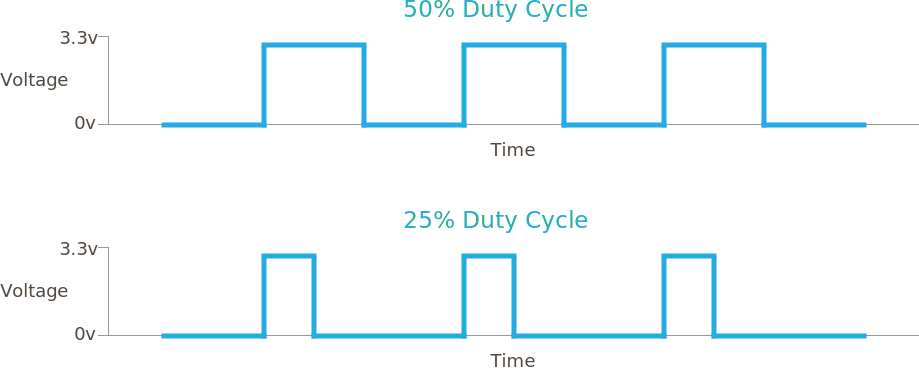

# Overview

LEDs come in a variety of packages and combinations. Many packages have an arrangement of multiple LEDs in one, such as bar graphs and _7 segment_ displays that are often used to show levels or digit characters, respectively:


However, no matter what they look like, they're all basically the same to use and there are only practical circuit concerns; first, making sure the _polarity_ is correct, and second, limiting the current through them so they don't burn out.

The circuit symbol for an LED is a diode with arrows coming out of it, signifying the photon emission:


## Physics

As electrons move into the holes in the P-Type lattice from the N-Type, they move from a higher energy orbit/state, known as the _conductance band_, to a lower energy orbit/state. When that transition happens, they lose energy. However, as the [first law of thermodynamics](https://en.wikipedia.org/wiki/First_law_of_thermodynamics) states; energy cannot be destroyed or created, only converted; so that energy is released in the form of photons (light particles):


In silicon, the electron orbital drop is very small, so the light released is also low energy, and the photon escapes at a low frequency of vibration. Since the color of light depends on its frequency, the light emitted is in the infrared spectrum, which is just below the frequency energies of the visible light spectrum.

Most diodes are designed in such a way that the P-N junction is hidden inside its casing, so these emissions are not visible. LEDs, however, are constructed in such a way that light can escape through them, and the materials used also have a much higher electron orbital energy drop when they combine with the holes. 

Typical through-hole LEDs have a flat spot on the cathode side, and a longer anode leg, signifying how to wire them up with the correct polarity:


Through-hole RGB LEDs will have a "common" leg that's longer than the rest, which could be anode or cathode, depending on if they're "common anode" or "common cathode":

[picture of an RGB LED]

## LED Colors

Because LEDs have a higher electron orbital energy transition than most diodes, the photons released are at higher energy/frequency, usually in the visible light spectrum (note that the energy/frequency is higher to the left, and lower to the right in the following image):


What's interesting about this, is that in order to change the color of light emitted, differing voltage drops (`V`<sub>`f`</sub>) are needed. The voltage drop therefore generally increases with the light frequency:

| Color  | V<sub>f</sub> (Voltage drop)| I<sub>fmax</sub> (max. current) |
|--------|---------------|------------------|
| Red    | 1.8V          | 15mA - 20mA      |
| Yellow | 2.0V          | 15mA             |
| Green  | 2.1V          | 20ma - 30mA      |
| Blue   | 2.7V - 3.6 V  | 20mA             |
| White  | 1.9V - 2.4V   | 30mA             |

White LEDs are usually a blue LED with a coating that makes the light white, however, some higher-end white LEDs actually have red, green, and blue LEDs in them which light in unison to create white.

Powering Blue LEDs can be tricky on `3.3V` because many of them have a `3.3V`<sub>`f`</sub>, requiring them to be driven by a special circuit that increases voltages. However, it's much easier just to use blue LEDs with a smaller voltage drop. There are many that have as low as `2.65V`<sub>`f`</sub>. So if you're using `3.3V` to power your LEDs, make sure that you check the voltage drop on them when purchasing them.

## Using LEDs in Circuits

Single LED circuits are typically fairly simple, requiring only a DC power source, and typically, a resistor to restrict current flow:


RGB LEDs are only slightly more complex, and come in two flavors, depending on whether they're common cathode common anode:

[RGB wiring diagram]

### Reducing Voltage and Current

If you plug in an LED to a `3.3V` voltage source without reducing the voltage (and current), two things are likely to occur; one the LED is going to be very bright, and two, it's going to burn out.

This is because of conduction behavior of the P-N junction. Recall the generalized diode behavior graph:

[illustration: right half of the Diode behavior curve]

The issue is that once the voltage requirement has been met to overcome the junction potential, further increase in voltage greatly reduce the resistance of the diode, and therefore, the amount of current that the diode will conduct rises rapidly. The trick then with LEDs is to supply just enough voltage to light them up.

There are two common ways to control the voltage, either with a resistor, or by driving it with a PWM signal.

Using a resistor is the simplest way, but has the limitation of setting it at a fixed brightness when on. A PWM signal is also reasonably simple, but is often done in software. The advantage of a PWM signal is that you have dynamic control of the voltage, allowing you to gently "pulse" the LED on and off.

### Limiting Current with a Resistor

To calculate the resistance needed to reduce the voltage, we start with Ohm's law, solved for resistance:

```
R = V / I
ohms = volts / amps
```

However, because P-N junctions have a voltage-drop (`V`<sub>`f`</sub>), in which they "push back," that does something interesting to our calculation.

This means that the overall voltage available to the LED is actually reduced by that `V`<sub>`f`</sub>. Therefore to calculate the resistance needed, we need to account for the voltage drop by subtracting it from the voltage source:

```
R = (Vs - Fv) / I
```

#### Example

For example, let's say that we have a red LED that has a maximum current rating of `20mA`, and a `V`<sub>`f`</sub> of `1.8V`, and we're driving it from a `3.3V` voltage source. Solving for `R` then:

```
R = (3.3V - 1.8V) / 0.020A = 75Ω
```

The circuit would need at least a `75Ω` resistor to safely drive the LED.

However, in practice, we typically use a much larger resistor value because at the maximum current, LEDs tend to be far too bright, and therefore need to be dimmed. I typically double the required resistor value and then tune from there.  In fact, most of the time when throwing together quick circuits, I just grab a `330Ω` resistor and call it good!

### Reducing Current with a PWM Signal

In order to "pulse" an LED, that is; gradually dim it on or off, you'd either need a complicated circuit, or use a Pulse-Width-Modulation (PWM) signal. 

PWM is a way of controlling voltage digitally to emulate an analog signal, in which instead of either being at `HIGH` or `LOW` such as `3.3V` or `0V`, it can actually have an intermediate value such as `1.6V`, by rapidly turning it off and on. Because of the inertia of electrons and the latency of the P-N junction change, the LED actually "sees" a voltage that is an average of the `ON`/`OFF` value:


A PWM signal generated by Meadow is a square wave. The two key parameters available to control it are the _frequency_ and the _duty cycle_.

In the above diagram, the time where the signal is high is the same as the time where the signal is low.  The percentage of time the signal is on (high) is called the duty cycle. So, in the above, the signal is high 50% of the one cycle and so the duty cycle is 50%. Therefore, the voltage is `1.6V`.

To lower the voltage, we typically reduce the duty cycle:



In the above diagram, the frequency is the same in both cases (note how the rising edges of the signal are aligned to the same point in time).  However, the lower signal is high for only 25% of the time compared to 50% for the upper trace.

#### Frequency and Flicker

Because a PWM signal is actually a pulse, at lower frequencies, it can cause a noticeable flicker. Humans start to perceive a flicker around `60Hz` (60 cycles per second) or lower, so it's best to make sure the frequency is above that. Fortunately, this isn't typically an issue, since modern microcontrollers (like the ones that power Meadow and Netduino) are capable of driving PWM signals at many thousands of hertz (Hz).

Incidentally, pigeons notice flicker around `100hz`, so if you're designing circuits for pigeons, you'll need to make sure that your PWM frequency is `100Hz` or higher. 🤣


# [Next - LED Lab](../LED_Lab)