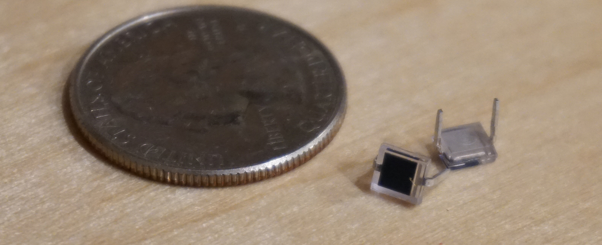
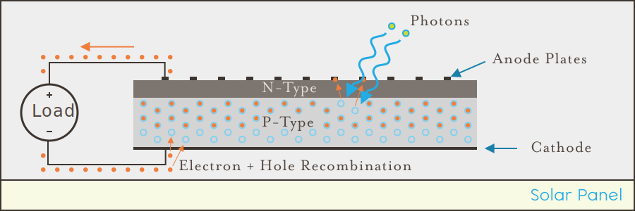

## Intro

In addition to the general diodes examined previously that perform circuit functions, there are a number of other diodes that do some pretty interesting things to do with light, including Light-Emitting Diodes (LEDs), Photodiodes, and Solar Cells.

#### Light Emitting Diodes (LEDs)

LEDs are a type of diode that emit photons (light) as electrons flow through the P-N junction. These are awesome! LEDs are everywhere around us; they're used as lights, indicators, and even display screens. 

These bar graph displays use LEDs to indicate a battery charge or an operating value:

{:standalone}

Many modern [displays](https://en.wikipedia.org/wiki/LED_display) also use LEDs to power their pixels, with each pixel containing three diodes; red, green, and blue. With each color (R, G, B) brightness controlled individually to create nearly any color.

#### Photodiodes

Photodiodes are the opposite of LEDs, when photons enter, they get converted into electrical energy. Fun fact about LEDs; although not as efficient, they can also be used as photodiodes!

{:standalone}

##### Vs. Photoresistors

Photodiodes differ from photoresistors in that while a photoresistor can tell you how much ambient light is present, a photodiode is really only effective at differentiating between light and dark. Unlike a photoresistor, which has a variable resistance depending on the amount of light hitting it, when light hits a photodiode, it actually converts the photons to free electrons and creates a small electric current. 

In this way, photodiodes are the digital counterpart to analog photoresistors.

Additionally, photodiodes are very fast, reacting to light much more quickly than photoresistors. They're sometimes used in a special opto-isolator circuits in which an LED is pointed at a photodiode to transmit digital information between circuits without having an electrical connection. In fact, fiber optic communications are done this way; an LED is connected to a photodiode via a fiber optic cable.

#### Solar Panels

Solar panels are really just big, flat P-N junctions! In fact, they're technically photodiodes. As photons hit electrons in the P-type semiconductor, they add enough energy to the electrons to pop them out of their valence orbits and turn them into free electrons which migrate to strips of metal on top of the cell which serve as anode plates. The pressure of these free electrons causes them to flow out to a load, and then they recombine with the holes in the P-type semiconductor:

{:standalone}

## [Next - LEDs](../LEDs)