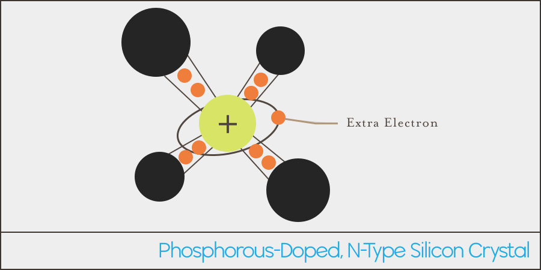
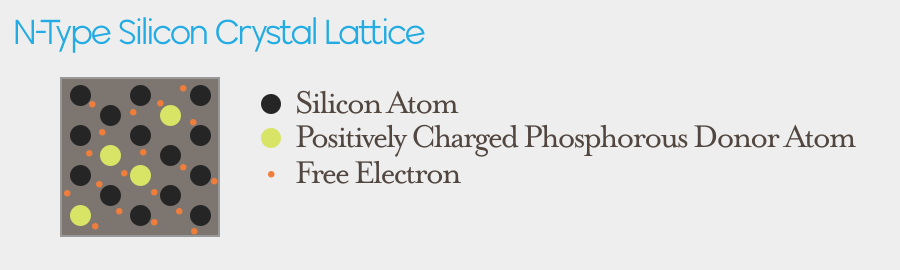

## Creating N-type Semiconductors

N-type semiconductors are electrically opposite to P-type. By doping silicon with _pentavalent_ materials (elements that have 5 valence electrons) such as phosphorous, an extra electron is now present in the lattice where the phosphorous atom is. 

As such, the electron is repelled out of the phosphorous atom and travels around the surrounding lattice. By losing one of it's electrons, it becomes a positively charged ion, because it now has one more proton than electron:

{:standalone}

### Electrically Neutral

However, just as with P-type, while the phosphorous ion may be positively charged, the overall charge of the material is still neutral, because the number of free electrons is equal the number of positively charged donor ions.

### Donor Impurities

Impurities that introduce extra electrons are called _donor impurities_ because they "donate" electrons to the material.

### Negative-Type Semicondutor

Just as the holes move around the P-type semiconductor, free electrons also move around the N-type lattice, trying in perpetuity, to achieve balance. The result is an ever changing mesh of containing an abundance of negatively charged electrons, giving rise to the name N-type, which stands for _Negative-type_.

{:standalone}

Just as with the P-type semiconductor, N-type semiconductors will readily conduct electricity, because it has extra electrons moving around in it already.

### P + N Types

The real magic happens when P-type and N-type semiconductors are sandwiched together, which creates _P-N Junctions_, where interesting behaviors arise.

## [Next - P-N Junctions](../P-N_Junctions)
