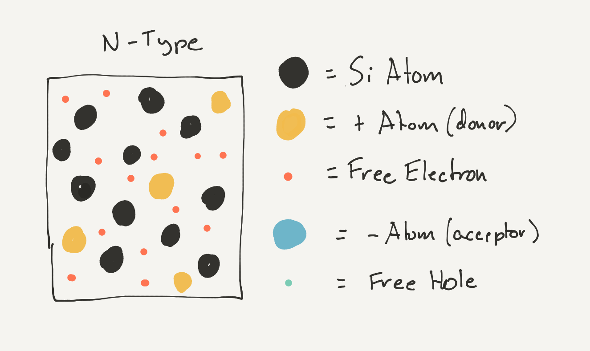

# Intro

[N-type Semiconductors are electrically opposite to P-Type]

[silicon doped with pentavalent elements (5 electrons in the valence shell), such as phosphorous creates a P-Type semiconductor]

[a neutral charged phosphorous atom has 5 electrons in its valence shell]

[now there is one too many electrons. which causes the electron to want to leave the valence shell, reducing the electron count of the boron atom, so now it has one more proton than electron, making it a positive ion:]

[note: fix sketch to have the extra electron popping out]

## Donor Impurities

[Donor impurities "donate" electrons to the material.]

## Electrically Neutral

[however, just as with P-Type, while the phosphorous ion may be negatively charged, the overall charge of the material is still neutral, because the number of free electrons = the number of positively charged donor ions.]

## Negative-Type Semicondutor

[the result is a piece of silicon that has too many electrons (negative charge carriers) this is how it gets its name as N-Type, or _Negative-Type_.]

[The real magic happens when P-Type and N-Type materials are placed next to each other to crated P-N Junctions.]

# [Next - P-N Junctions](../P-N_Junctions)
