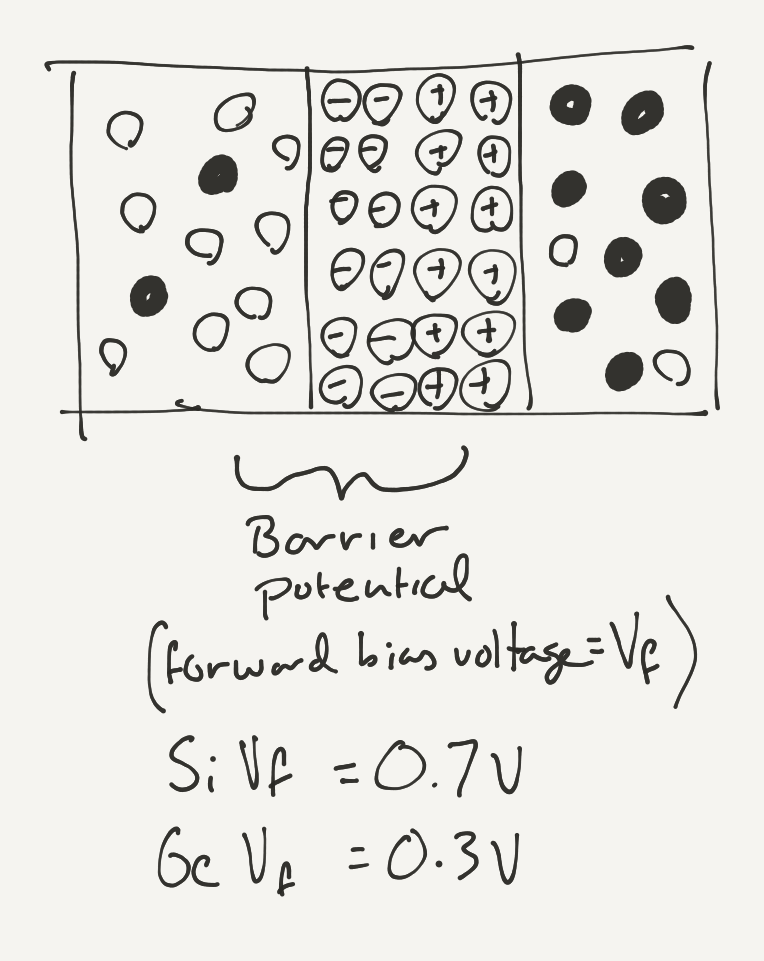

# Intro

[can put P-Type and N-Type semi-conductors together, and something interesting occurs]

[at the junction between the two materials, the free electrons from the N-type _diffuse_ to fill the holes in the P-Type side]:

[this creates a region called the _depletion zone_ because it's been depleted of free charge carriers:]

# Junction Potential

[depletion zone creates an electric field]

[note: this sketch needs to be fixed up:]

[_Junction Potential_][`0.7V` in silicon, and `0.3V` in germanium]

# Forward Biasing

# [Next - Diodes](../Diodes)
