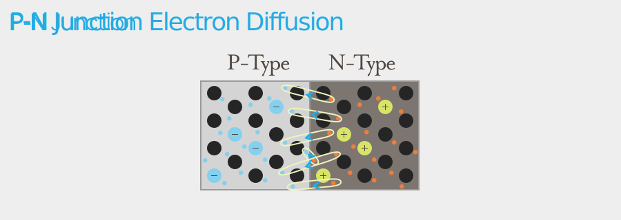
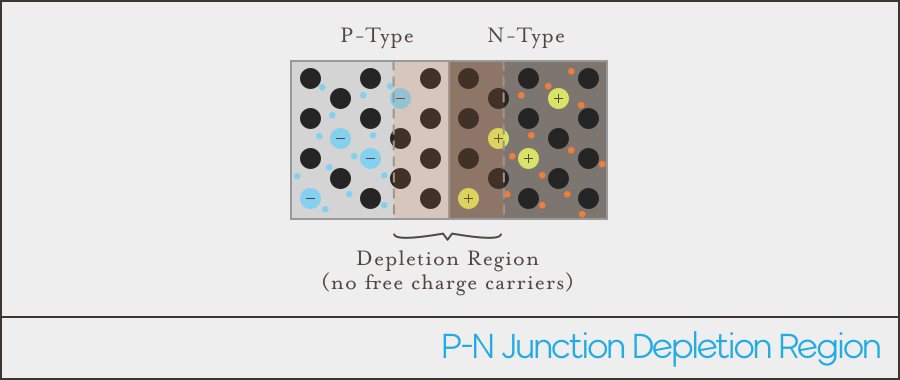
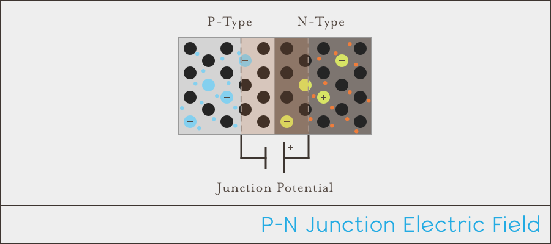
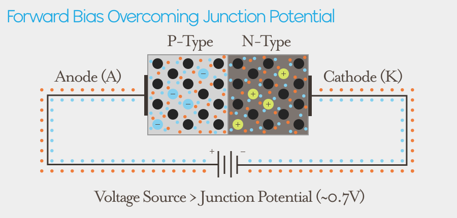
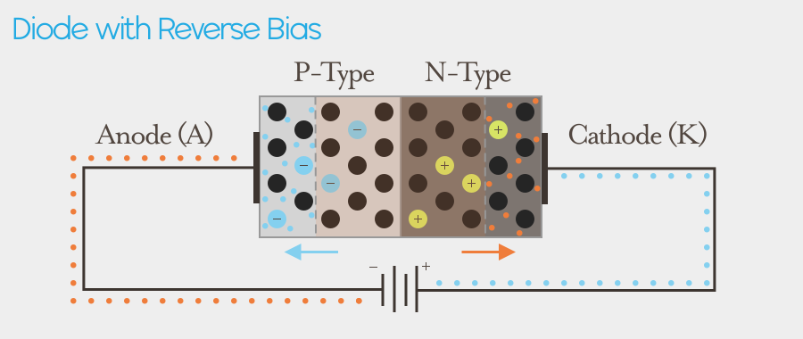
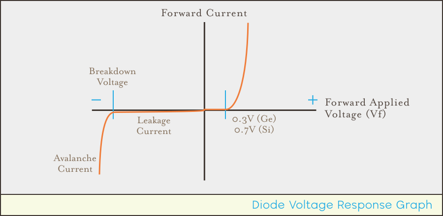

# Combining P-Type and N-Type Semiconductors

By sandwiching a piece of P-Type and N-Type semiconductor together into what's known as a _P-N Junction_, interesting electrical properties arise from the underlying atomic drama. **The P-N Junction is the probably the single most important structure in electronics** and is the heart of many common semiconductor components such as Diodes, Transistors, Integrated Circuits, Solar Cells, and more. 

## Atomic Behavior

When P-Type and N-Type semiconductors are joined, the free electrons from the N-Type side _diffuse_ nearby into the P-Type side to fill the holes:

What remains are the positively and negatively charged ions along the junction boundary, since they have been stripped of the free particles that were keeping that area electrical neutral. This region is called the _depletion region_ (along with [half a dozen other names](https://en.wikipedia.org/wiki/Depletion_region)):

## Junction Electric Field

The depletion region gives rise to an electric field because there's a electromagnetic force (voltage) differential between the negatively and positively charged ions:

This electric field is known as the _Junction Potential_ and is usually between `600mV - 700mV (0.6V - 0.7V)` in silicon, and `200mV - 300mV` in germanium.

## Anode + Cathode

Putting metal connectors on either side of the P-N Junction creates what are known as an _Anode_ (A) and a _Cathode_ (K). The anode is on the P-Type side, and the cathode is on the N-Type side. This effectively creates a component called a _Diode_:

## Forward Biasing

Applying a positive current to the Anode and a negative current to the cathode side is a preferential _bias_, because the positive hole charge carriers and negative electrons are pushed towards the junction, thus shrinking the depletion zone. This voltage application, in the preferential direction of current flow is called _forward biasing_:

**In order for charge carriers (current) to pass through the electric field, they must have greater electromotive force (EMF, in voltage) than the junction potential to overcome the electric field.** Meaning that it takes greater than `0.7V` (in silicon) of EMF to get them through. In the process of overcoming that junction potential, they actually lose the same amount of EMF to it. 

**The amount of voltage needed to push forward through the depletion region is known as the _forward voltage_ (`V``f`), or _voltage drop_,** because if charge carriers are pushed through this region at `1.0V`, when they come out on the other side they will only have `0.3V` (`1.0V` - `0.7V`) because they dropped `0.7V` in force.

Voltage drop is an important concept that will come up over and over in circuit design.

## Reverse Biasing

_Reverse biasing_ is when a voltage is applied in the opposite direction of preferential current flow. This causes the holes in the P-Type side to be attracted to the Anode, and the electrons in the N-Type side to be attracted to the Cathode, causing the depletion region to widen:

When this happens, the area of negative and positively charged ions increases, which also increases the junction potential.

### Leakage Current/Reverse Saturation Current

However, while the junction potential is actually much higher when reverse biased, some minuscule amount of current current will actually flow because the polarity of the depletion region is opposite to the small amount of minority carriers that are present. So holes can flow from P-Type to N-Type, and electrons can flow from N-Type to P-Type. This current, however, is very small to the point of negligibility, usually in the range of nano-amperes (`nA`). A nano amp is `1 / 1,000,000,000A`.

### Breakdown Voltage and Avalanche Current

While a reverse biased P-N Junction (diode) will resist the overwhelming majority of current flow in the reverse direction, at a high enough voltage, known as the _reverse breakdown voltage_, an _avalanche breakdown_ will occur, in which electrons will flow so quickly that they knock other electrons out of their holes, which leads them to knocking out more, and so on, causing an "avalanche" of electron flow.

Some diodes are specifically designed with this behavior in mind, and we'll examine them in the next section.

## Voltage and Current Response Characteristics

The current response to forward and reverse bias currents is described in the following graph:

The right half of the graph represents forward bias current, that is, positive current applied to the cathode. Until the voltage reaches the forward voltage (`V``f`), almost zero current makes it through, but once that threshold is reached, the P-N junction readily conducts electricity.

The left half of the graph represents a reverse bias current, that is, positive current applied to the anode, instead. Virtually no current (nano amps) is allowed to flow through, until the voltage reaches the reverse breakdown voltage, and an electron avalanche occurs, 

[at a high enough voltage, it reduces the resistance of the diode to almost zero and making it an almost pure conductor.]

### Water Analogy

[dam analogy]

[when you reverse bias a diode, you expand the depletion region, and therefore the junction potential. so if a zener has a known breakdown at say `5V` - that means that the junction potential/`Vf` is `5V` at that point, so that means, if you were feeding it `8V`, it basically becomes a voltage divider (because of Kircchoff’s voltage law), allowing `3V` through.

# [Next - Diodes](../Diodes)
