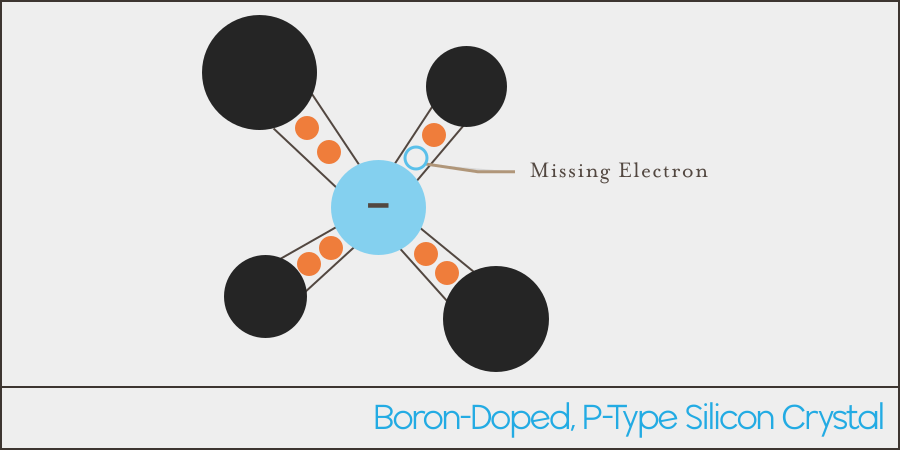

## Creating P-Type Semiconductors

Silicon doped with _tetravalent_ elements (elements that have 3 valence electrons), such as boron, create a _P-type_ semiconductor.

A neutrally charged boron atom has 5 protons (positively charged), and 5 electrons (negatively charged), with 3 of those electrons in its valence shell. So when it's combined with 4 other silicon atoms, there is by default, a total of 7 electrons shared between them, creating a positively charged _hole_ (remember, atoms want 8 in their valence shell to be happy). **That hole attracts nearby electrons to try and fill it it. When this occurs, the boron atom turns into a negatively charged ion**, because it attracts an extra electron, which causes it to have one more electron that proton:

{:standalone}

### Neutral Electric Charge

Even thought the boron ion is negatively charged, **the overall charge of the P-type material is still electrically neutral**, because the number of holes is equal to the number of negatively charged acceptor ions.

### Acceptor Impurities

Impurities that introduce holes in the lattice are called _acceptor impurities_ because they "accept" electrons into their holes.

### Positive-Type Semiconductor

The hole surrounding a boron (or other acceptor impurity) is not continuously occupied by a single electron, but is instead replaced by another electron as the last moves out to occupy another nearby hole. 

The resulting silicon crystal has an ever changing mesh of abundant positively charged holes, giving rise to the name P-type, which stands for _Positive-type_:

{:standalone}

P-type silicon will readily conduct electricity because electrons want to flow into it to fill the holes.

## [Next - N-type Semiconductor](../N-Type)