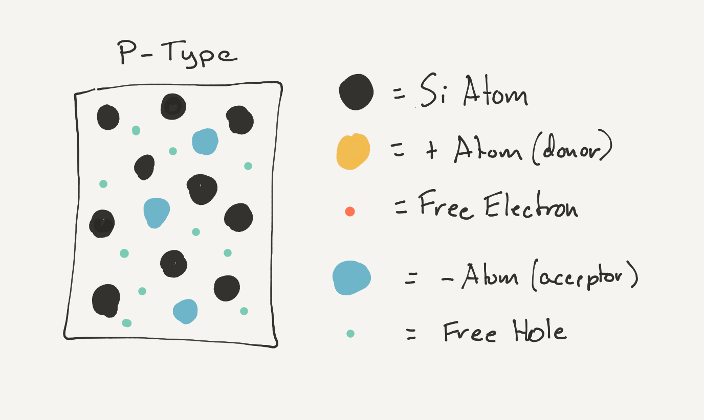

# Creating P-Type Semiconductors

Silicon doped with tetravalent elements (elements that have 3 valence electrons), such as boron, create a _P-Type_ semiconductor.

A neutrally charged boron atom has 5 protons (positively charged), and 5 electrons (negatively charged), with 3 of those electrons in it valence shell. So when it's combined with 4 other silicon atoms, there is by default, a total of 7 electrons shared between them, creating a positively charged _hole_. That hole attracts nearby electrons to try and fill it it. When this occurs, the boron atom turns into a negatively charged ion, because it's got one extra electron:

## Acceptor Impurities

Impurities that introduce holes in the lattice are called _acceptor impurities_ because they "accept" electrons into their holes.

## Neutral Electric Charge

Even thought the boron ion is negatively charged, the overall charge of the P-Type material is still electrically neutral, because the number of holes is equal to the number of negatively charged acceptor ions.

## Positive-Type Semiconductor

The hole surrounding a boron (or other acceptor impurity) is not continuously occupied by a single electron, but is instead replaced by another electron as one moves out to occupy a different hole. 

The resulting silicon crystal has an ever changing mesh of abundant positively charged holes, giving rise to the name P-Type, which stands for _Positive-Type_:

P-Type silicon will readily conduct electricity because electrons want to flow into it to fill the holes.

# [Next - N-Type Semiconductor](../N-Type)