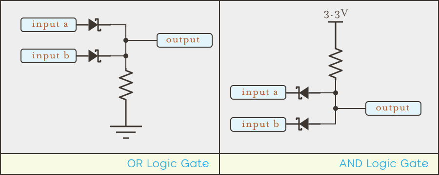

{:standalone}

## CHAPTER IN BETA

**NOTE:** This chapter is in beta, for review. The labs are incomplete and there are likely errors.

## Intro

The semiconductor is easily the most important apparatus of modern electronics. By taking metalloid elements like germanium or silicon and adding minor impurities, they can be made to conduct electricity in very specific ways; such as primarily allowing the flow of electrons, or holes. Start sandwiching those materials together, and they create structures whose behavior allows us to precisely control electricity by creating one way valves such as _diodes_, switches such as _transistors_, or even memory. 

The scale at which semiconductors have been manufactured is incredible. A modern CPU chip has billions of transistors on a single chip, and many modern microcontrollers have millions.

{:standalone}

**In 2014, Forbes magazine estimated the number of transistors ever manufactured since their invention in 1947. [The number they came up with was somewhere in the neighborhood of 2,913,276,327,576,980,000,000](https://www.forbes.com/sites/jimhandy/2014/05/26/how-many-transistors-have-ever-shipped/#7406af54425b)**. That's 2.9 sextillion; a number that's so large as to be absolutely meaningless to our sapient brains. It's more than the square of all the stars in the Milky Way Galaxy, at 200 billion. It's the equivalent to all of the cells in every human in the State of California. 

Semiconductors are such a fundamental part of modern circuits that we're going to cover them in multiple chapters. 

In this first chapter on them, we're going to explore:
 
 * How semiconductor behaviors emerge from their atomic structure.
 * The _P-N junction_; a fundamental semiconductor structure that underlies most modern electronics.
 * What diodes are, and how their _voltage drop_ affects circuit designs.
 * Light-Emitting-Diodes (LEDs) and how to use them in circuits.

Along the way, we'll also continue our exploration of circuit design, building on what we've learned up to this point and adding new concepts to build more complex circuits, including simple _logic gates_:

{:standalone}

## [Next - Silicon](../Silicon)

