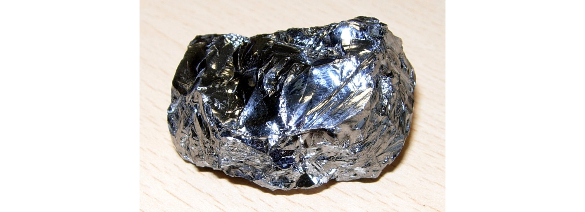
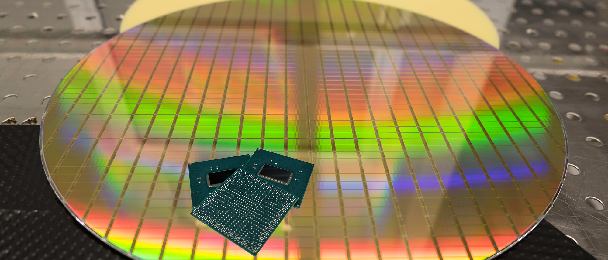
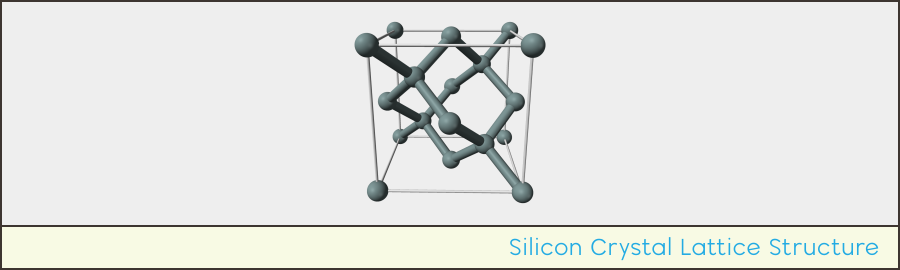
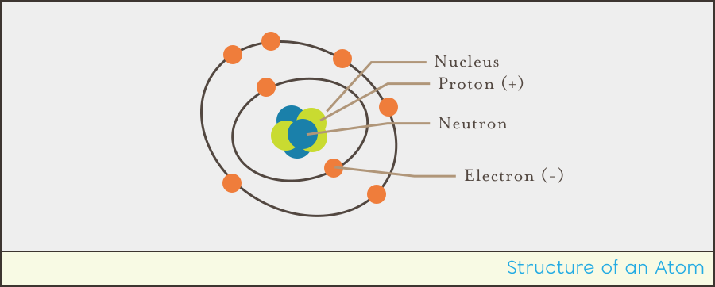
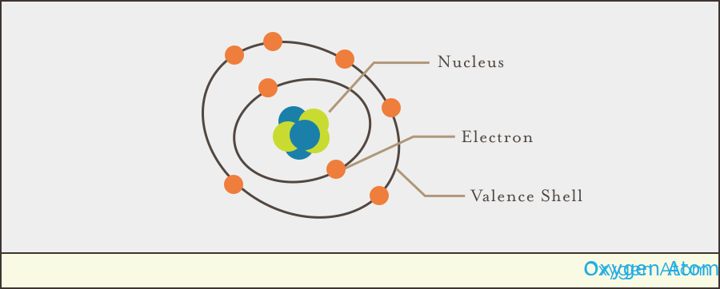
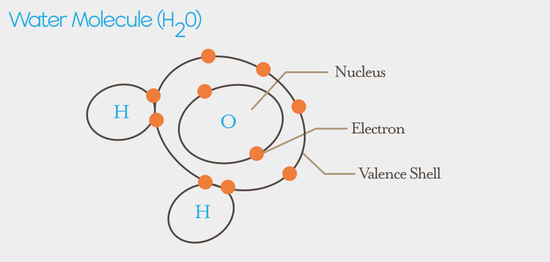
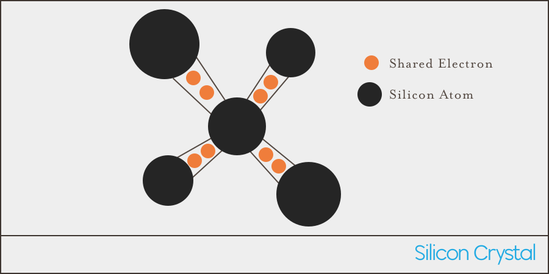

## Silicon Crystal

At the heart of most modern electronic semiconductors is a wafer thin slice of [silicon (Si)](https://en.wikipedia.org/wiki/Silicon) crystal. Silicon is considered a [Metalloid](https://en.wikipedia.org/wiki/Metalloid); not quite a metal, not quite _not_ a metal, and is the second most abundant element in the earth's crust (after oxygen):

[{:standalone}](https://commons.wikimedia.org/wiki/File:SiliconCroda.jpg){:standalone}

Silicon for semiconductor usage is highly purified down to _11n_ purity, which means 99.999999999% pure, or 1 non silicon atom per 100 million silicon atoms. In fact there's [less than a dozen companies in the world that have the ability to purify it enough to be used in chips](https://www.wired.com/story/inside-story-of-the-great-silicon-heist/). Once purified, it's sliced very thin and then individual components such as transistors are etched onto it to form the basis of chips, known as _Integrated Circuits_ (ICs):

{:standalone}

Silicon's ability to be both a conductor and an insulator, lies in its atomic structure; which gives rise to a crystal lattice, in which every atom is connected to four other silicon atoms, creating what's known as a _face-centered-diamond-cubic_, which basically means that it creates a cube with a diamond structure in the middle:

[{:standalone}](https://upload.wikimedia.org/wikipedia/commons/f/f1/Silicon-unit-cell-3D-balls.png){:standalone}

In order to understand why silicon is such a great semiconductor, we have to first understand its atomic structure.

### Valence Electrons

Recall from [chapter 1](/Hardware/Tutorials/Electronics/Part1/Atoms/), that an atom is made up of a nucleus, containing positively-charged protons and neutrally-charged neutrons, and negatively-charged electrons orbiting around it:

{:standalone}

The electrons that orbit the nucleus can exist in different energy states, which correspond to their average distance from the nucleus. Each of these energy states is called an [_electron shell_](https://en.wikipedia.org/wiki/Electron_shell). The electrons that travel the farthest from the nucleus have the most energy and are called [_valance electrons_](https://en.wikipedia.org/wiki/Valence_electron), which, generally, form the valance shell. For example, oxygen has 8 electrons total, but only 6 of them are in the valence shell:

{:standalone}

The valence shell is the most chemically important portion of an atom, because it determines how readily, and how many, other atoms it will combine (bond) with, to form molecules. A full valence shell contains 8 electrons, and when this exists, it's called a _closed shell_, and these atoms are chemically inert. Examples of elements with a closed shell are the noble gasses; so-called because they don't react with other elements.

When two atoms are bonded together in a molecule or material, they share valence electrons. So an element tends to bond in ways that fill its valence electron count to 8. For instance, water, which has the molecular signature of H2O, meaning it has 2 hydrogen atoms and one oxygen atom, fills its valence shell with 6 valence electrons from oxygen, and 1 electron from each hydrogen atom:

{:standalone}

#### Silicon Valence Electrons

The atomic lattice shape of a silicon crystal comes from the fact that it has 4 valence electrons, and will therefore readily bond with 4 other silicon atoms, sharing an electron from each of the other four silicon atoms:

{:standalone}

This forms a crystalline structure that acts as an insulator at room temp and loses its resistance as its temperature increases, becoming a conductor.

### Doping

Pure silicon like this is known as an _intrinsic semiconductor_, and isn't very interesting in terms of it's behavior. However, through a process known as _doping_, in which impurities are added in precise amounts to change it's chemical structure, _extrinsic semiconductors_ are created. There are two extrinsic semiconductors used in electronics, _P-type_, and _N-type_. Let's examine P-type, first.

## [Next - P-type Semicondutor](../P-Type)
