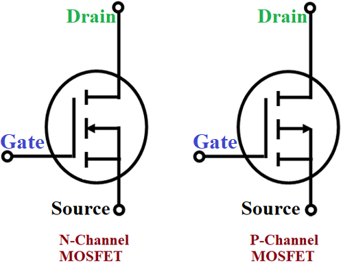

## Voltage Controlled Variable Resistor

It may be useful to think of MOSFETs as variable resistor that is controlled by the voltage at its gate. But unlike a simple resistor, MOSFETs come in four basic designs that enable them to be incredibly versatile.

## Enhancement vs. Depletion Mode

There are two basic modes of operations for MOSFETs, which describes how they work in their default state:

 * **Enhancement** - By default, if no voltage is applied to the gate, the resistance between source and drain is at its highest, and therefore current will not flow.
 * **Depletion** - By default, if no voltage is applied to the gate, the resistance between source and drain is at the lowest, so current will flow.

## Gate to Source Voltage: Controlling a MOSFET

`V``gs`

## N-Type vs. P-Type

In addition to the mode, MOSFETs also come in two flavors of construction:
 * N-TYPE

Mnemonics:

* NPN = "Not pointing in."
* PNP = "Points in proudly."

# =======
# OLD OLD
# =======

### Parts

* **Gate** - Like the base on a BJT. Controlling voltage lead.
* **Drain** - 
* **Source** - 

## Anatomy; Base, Collector, Emitter/Gate, Source, Drain

Whether BJT, MOSFET, or nearly any other type, transistors almost always have three legs and though they're called different things on a BJT or a MOSFET, they basically do the same thing:

| Lead Function | MOSFET Name | BJT Name    |
|---------------|-------------|-------------|
| **Control**   | _Gate_      | _Base_      |
| **Lead 1**    | _Source_    | _Collector_ |
| **Lead 2**    | _Drain_     | _Emitter_   |

The _gate_ or _base_ is the lead that controls current flow between the _source_ and _drain_ (on a MOSFET), or the _collector_ and _emitter_ on a BJT.

* **`V``c`** - Voltage at the Collector
* **`i``B`** - Current at Base
* **`V``BE`** - Voltage from Base to Emitter

[Note: `VCC` comes from Common Voltage at all Collectors in an IC.]

### Beta (β)

Relationship between Base current and current flowing from Collector to Emitter.

Also known as `HFE`.

`I``C` `= I``B` `* β`

### Operation

When voltage is at gate (`V``G`), then current flows from Drain to Source.

Work like a variable resistor, in which the amount of resistance between drain and source is controlled by the gate voltage. The great thing about MOSFETs, is that unlike BJTs, which require current at the base, a MOSFET just needs Voltage, and actually uses almost no current!

### Nomenclature

* **Threshold Voltage** - `V``GS` Threshold. The amount of voltage necessary at the gate to allow current to flow between source and drain. 
* **`R``DS``ON`** - Resistance between the drain and the source.

Logic-level MOSFETs allow you to control them with "logical-level" voltages, or <`5V`. F1P30N06L is a common one.

### Heat Dissipation

MOSFETs are variable resistors. So in high-current situations, you may need a heat-sink to dissipate the heat away from the MOSFET to protect it from overheating.

`P` = `R` x `I``2`

`R``DS` * `I``2`

## Caution - Static Electricity

[susceptible to destruction via static electric discharge]

# [Next - Basics of BJT Usage](../BJT_Basics)