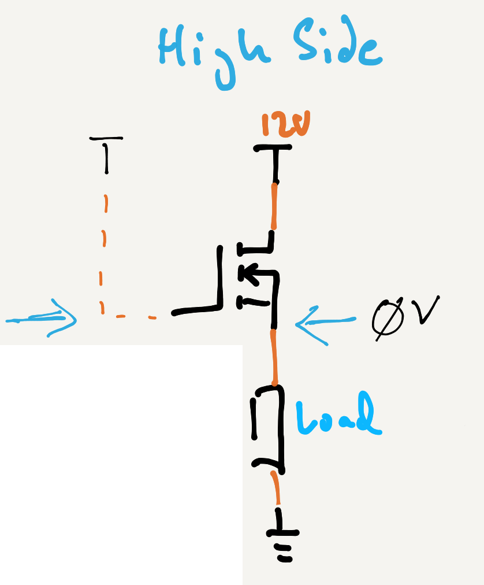

Imagine that in your design, you needed to switch on the high-side. Perhaps you needed to provide a `HIGH` signal to a circuit to indicate it needed to do something:

With an N-Channel MOSFET this wouldn't work because the `V``GS` would be `0V`, due to Kirchhoff's Voltage Law.

## Kirchhoff's Voltage Law

Recall from Kirchhoff's second law, that as current flows from the positive voltage source to ground, it's voltage drops as it hits resistance:

By the time it gets to the end at `GND`, then the voltage potential is effectively `0V`.

## High-Side

In the High-side circuit above, the main resistance in the circuit is the load. 