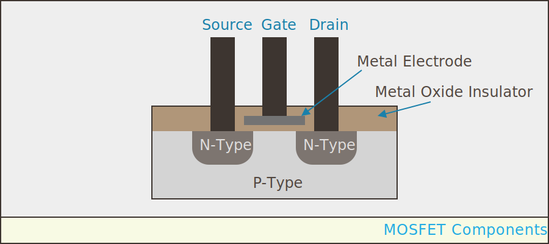
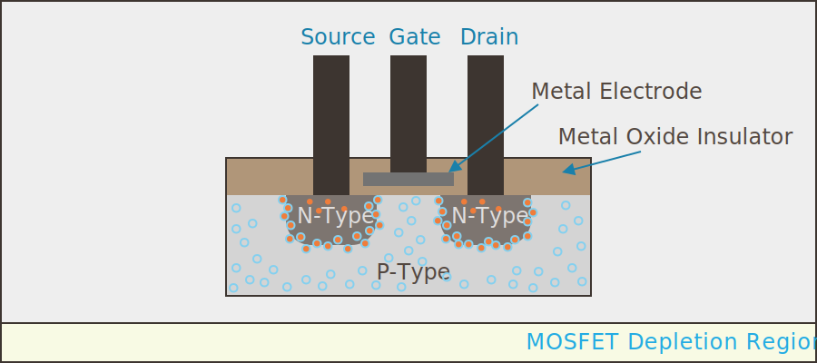
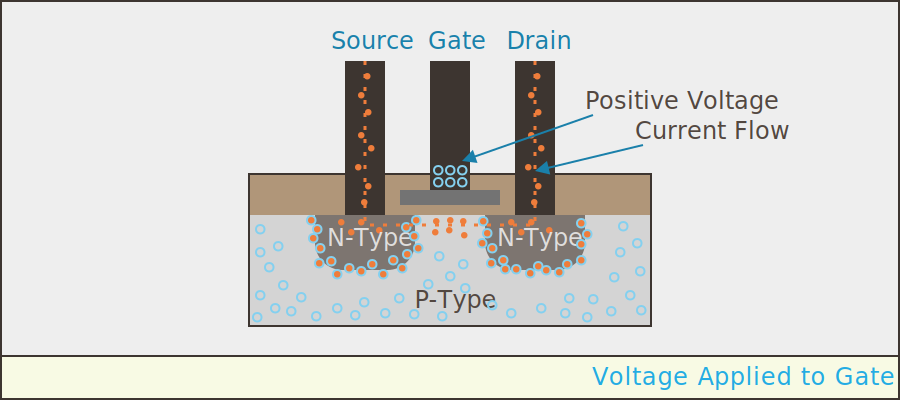
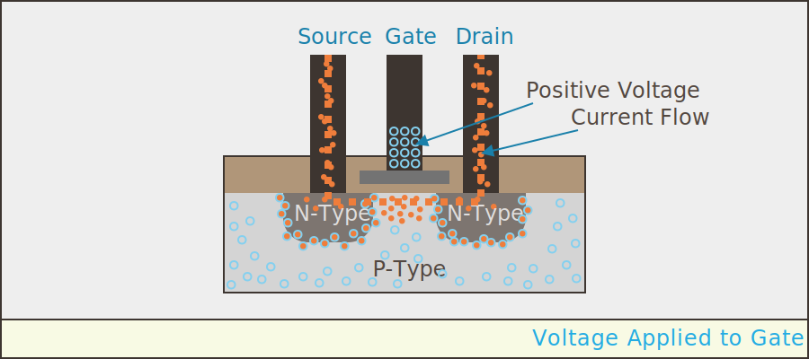

## Components of a MOSFET

In order to understand how MOSFETs work, we need to look at their construction. Consider the following simplified cross-section of one of the most commonly used MOSFETs; an _N-Channel_, _depletion mode_ MOSFET:

{:standalone}

In the illustration above, there are two _channels_ of N-type (negatively charged) silicon laid down in a body of P-type (positively charged) silicon. It has three leads; _source_ and _drain_ connect directly to the N-type silicon channels, and the _gate_ almost touches the P-type body, but has an insulator between its metal electrode and the body of the MOSFET.

## Depletion Region

Recall from the last chapter that the P-type and N-type junction creates a depletion region because the nearby holes and electrons combine. Without any free charge carriers, the area between the P and N-type silicon becomes an insulator:

{:standalone}

## Making Current Flow

As the name implies, MOSFETs work by creating an electric field. If we apply a positive voltage to the gate, it creates an electric field that attracts electrons to the area between the channels and the gate electrode:

{:standalone}

Now, with free electrons in that area, current can flow between the gate and source leads.

### Voltage Device

What's interesting, is that because there is an insulator between the gate electrode and the body of the MOSFET, current doesn't flow in or out of the gate, instead, it creates an electromagnetic field via the voltage force alone. If more voltage is appplied, the field gets stronger, attracting more electrons to the gap, and allowing more current to flow:

{:standalone}

### Saturation

[only so much current can flow (saturation), adding more voltage won't enable more current]

### Power Efficiency

As we'll see later,in contrast to BJTs, which require current to flow to their _base_ (the BJT equivalent of gate). Because MOSFETs only require voltage, their inherently more power efficient. 

# [Next - Basics of MOSFET Usage](../MOSFET_Basics)

[notes: https://www.elprocus.com/difference-between-bjt-and-mosfet/]