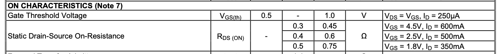

Now that we understand how to use both N-Channel and P-Channel MOSFETs in both Low-Side and High-Side switching circuits from a conceptual perspetive, let's dig into the technical specifications and practical details of MOSFETs that will aid us in finding appropriate parts when designing circuits.

## Gate Sensitivity

MOSFETs have notoriously sensitive gates to Electro-Static Discharges (ESD). This means that static buildup that hits the Gate can cause the MOSFET to fail. For this reason, many modern MOSFET designs have built in Transient-Voltage Suppression (TVS) diodes built in to the gate.

For example, we use the [DMG1012UW-7](https://octopart.com/search?q=DMG1012UW-7) N-Channel MOSFET in a lot of our designs, and if you look at its symbol from the datasheet, it has not only a TVS _gate protection diode_, but it also has a flywheel diode for reverse load spikes:


When sourcing MOSFETs, we recommend looking for these features.

## Important Specifications

There are a number of important parameters and ratings when choosing a MOSFET the main ones are below. [found in the datasheet, and you can search them in octopart of digikey, etc., searches]

[all images from DMG1012UW-7 datasheet]

### `V`<sub>`DSS`</sub>

`Drain` to `Source` voltage. Maximum voltage that the MOSFET can carry between its `Drain` and `Source`. This should be greater than the amount of voltage your load needs. For example, if you're expecting to control a `6V` motor, the `Vdss` should be at least `6V`, but better if it were a little higher.


### `V`<sub>`GS(TH)`</sub> & `R`<sub>`DS(ON)`</sub>

* **`Vgs`** - Sometimes abbreviated as `V`<sub>`TH`</sub>, the `Gate` to `Source` threshold voltage is the minimum voltage needed to _begin_ conducting current on the channel between `Gate` and `Source`.
* **`Rds(on)`** - Resistance between `Drain` and `Source` when `ON`. Typically given in a datasheet in a range, because it changes depending on the amount of voltage difference of `V`<sub>`GS`</sub>

_Logic-Level_ MOSFETs typically operate at `5V` or less (CMS/TTL)



[**NOTE**: redo with the `Symbol` | `MIN` | `TYP` | `MAX` headers showing]


### `V`<sub>`GS`</sub>

`Voltage` between `Gate` and `Source`. 


### `R`<sub>`DS(ON)`</sub>


### `R`<sub>`ΘJA`</sub>

Junction to ambient coefficient
`X°C/Watt`

## 


## Power Rating and Dissipation

### Calculating the Maximum Power it can dissipate

* `P`<sub>`D`</sub> - Maximum it can dissipate without a heatsink.
* `Max`<sub>`TJ`</sub> - Maxmimun junction temperature it can withstand (175°C for example)
* `T`<sub>`A`</sub> - Ambient temperature.
* Thermal Resistance

Equation:
`P`<sub>`D`</sub> = (`Max`<sub>`TJ`</sub> - `T`<sub>`A`</sub>) / `R`<sub>`ΘJA`</sub>

Example:
```
Pd = (175°C - 25°C) / (62.5°C/Watt)
Pd = 150/62.5
Pd = 2.5Watts
```

Then calculate the power you'll actually use:

Recall power law is `P = RI^2`

`P = R`<sub>`DS(ON)`</sub>`* I^2`

Where `I` is the current your load will draw.

For example, if your MOSFET `RDS`<sub>`(ON)`</sub> is `20mΩ` and your load draws `2A` of current:

```
Power = 20mΩ * 2A^2
P = 20mΩ * 4A
P = 40mW
```

`40mW` is way less than `2.5W`, therefore, no heat sink needed.

Also a maximum power dissipation assuming you can keep it to x°

# [Next - Depletion Mode MOSFETs.](../Depletion_MOSFETs)