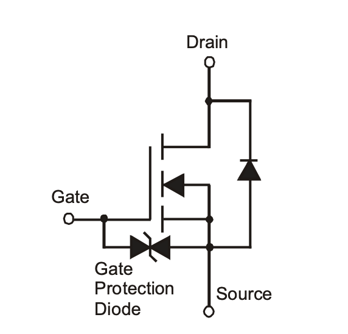
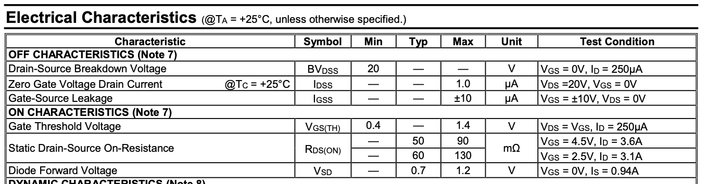
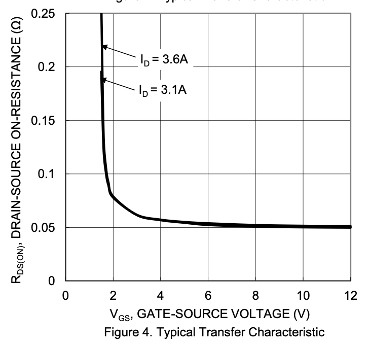
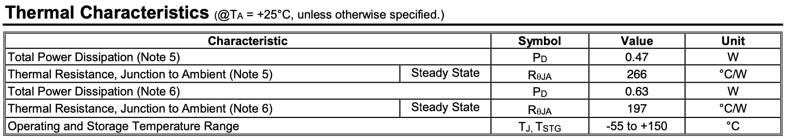
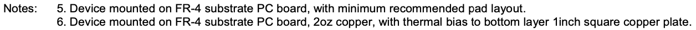
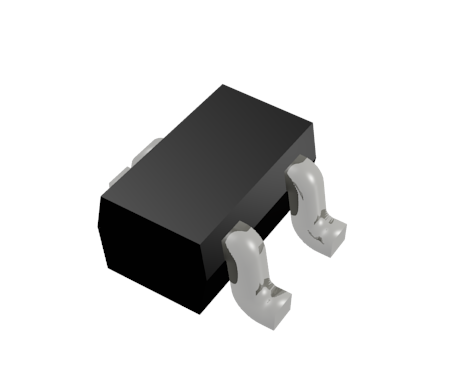

Now that we understand how to use both N-Channel and P-Channel MOSFETs in both Low-Side and High-Side switching circuits from a conceptual perspetive, let's dig into the technical specifications and practical details of MOSFETs that will aid us in finding appropriate parts when designing circuits.

In this section we'll be looking at the [DMN2046UW](https://octopart.com/search?q=DMN2046UW) N-Channel MOSFET, which we use in a lot of our designs. You can find the datasheet [here](../Support_Files/DMN2046UW.pdf).

## MOSFETs Fail Shorted

It's important to select the right MOSFET for the job. Typically, when a MOSFET fails, it fails shorted, meaning that it will no longer switch off and will continuously conduct. This can be extremely dangerous, especially in situations where the MOSFET might control a motor or similar.

## Gate Sensitivity

MOSFETs have notoriously sensitive gates to Electro-Static Discharges (ESD). This means that static buildup that hits the Gate can cause the MOSFET to fail. For this reason, many modern MOSFET designs have built in Transient-Voltage Suppression (TVS) diodes built in to the gate.

For example, if you look at the `DMN2046UW` symbol in its datasheet, it has a built-in TVS _gate protection diode_. 



When sourcing MOSFETs, we generally recommend looking for ones that have gate protection diodes.

You might have also noticed that it has a diode from `Source` to `Drain`. It's called a _body diode_ and is just part of how MOSFETs work. They will conduct backwards if installed or wired incorrectly.

## Important Switching Specifications

There are a number of important parameters and ratings around the switching characteristics when choosing a MOSFET, the main ones are:

 * `Vdss`
 * `Vgs(th)`
 * `Rds(on)`
 * `Id(max)`

These ratings can be found in the MOSFET's datasheet and can also be used when searching for components on Octopart, Digikey, etc. Though, confusingly, they may not always be named exactly as above. 

### Maximum Voltage Ratings

Examining the _Maximum Ratings_ table, we can see the maximum voltages that the device can handle:


#### `V`<sub>`DSS`</sub>

The first is the `Drain` to `Source` voltage. This is the maximum voltage that the MOSFET can carry between its `Drain` and `Source`. This should be greater than the amount of voltage your load needs. For example, if you're expecting to control a `6V` motor, the `Vdss` should be at least `6V`, but better if it were a little higher.

It might also be called `BVdss` which means _Drain-Source Breakdown Voltage_.

#### `V`<sub>`GS`</sub>

Maximum `Voltage` between `Gate` and `Source` that the MOSFET can handle. Make sure this is higher than the logic level you're using to control it. For instance this MOSFET can handle a control signal up to `12V`.

### Switching Behavior/`ON` Characteristics

Now examining the `ON` characteristics, it tells us how the device behaves as a switch:



#### `V`<sub>`GS(TH)`</sub>, `R`<sub>`DS(ON)`</sub>, & `I`<sub>`D`</sub>

* **`Vgs`** - Sometimes abbreviated as `V`<sub>`TH`</sub>, the `Gate` to `Source` threshold voltage is the minimum voltage needed to _begin_ conducting current on the channel between `Gate` and `Source`.
* **`Rds(on)`** - Resistance between `Drain` and `Source` when `ON`.
* **`Id`** - This is the `Drain` current, or the amount of current that can flow through the MOSFET channel.

These three parameters are used in conjunction to describe how the MOSFET conducts. The `Vgs` states that at a given voltage to the `Gate`, the `Rds(on)` will lower enough that the MOSFET will start letting current flow. Usually in a datasheet, the `Rds(on)` will be listed with one or more values because how well it conducts is a function of the `Vgs`. In the image above, we can see that:
* The MOSFET starts to conduct somewhere between `0.4V` and `1.4V` `Vgs`. Note that this wide range is just an artifact of how MOSFETs work.
* At a `Vgs` of `4.5V`, the channel resistance (`Rds(on)`) is typically around `50mΩ`, which is `50` _milli_-ohms, a very small amount of resistance. And at a `Vgs` of `2.5V` it is still _very_ low at `60mΩ`.
* At a `Vgs` of `4.5V`, the channel will typically conduct up to `3.6A`, and at a `Vgs` of `2.5`, it'll typically conduct up to `3.1A`.

This means that this MOSFET is effectively fully on at `2.5V` to the `Gate`. MOSFETs that operate at `5V` or less `Vgs` are referred to as _Logic-Level_ MOSFETs, because you can control them with typical digital logical circuits that nominally run at `5V` or `3.3V`. 

This becomes even more apparent if we look down further in the datasheet and see the graph that tells us what the `Rds(on)` is at varying `Vgs` levels:



As we can see, the MOSFET actually turns fully on at less than `2V`!

## Temperature and Power

You'll notice that the specifications are given at _Ambient Temperature_ (`Ta`) of `25°C`/`77°F`:


This means, that these ratings are good for operations at room temperature, and are the maximum values the device can handle without the need for external cooling such as a heatsink. Many MOSFETs that are meant for switching large loads are designed with a built in plate that can be attached to a copper area on a PCB or a heatsink, and doing so will enable the MOSFET to dissipate more heat and carry a larger load.

## Power Rating and Dissipation

MOSFETs are so efficient that for logic control and the small loads typically found in IoT solutions, you rarely have to worry about their power rating.

With that said, if you're switching large loads, it's good to take a look at the power rating fro your MOSFET and calculate whether it can dissipate enough heat without a heat sink or other cooling to not fail.

### Calculating the Maximum Power it can dissipate

To calculate the amount of power a MOSFET can safely handle, you'll need the following information from the datasheet:

* `P`<sub>`D`</sub> - Maximum it can dissipate without a heatsink.
* `Max`<sub>`TJ`</sub> - Maxmimun junction temperature it can withstand (175°C for example)
* `T`<sub>`A`</sub> - Ambient temperature.
* `R`<sub>`ΘJA`</sub> - Junction to ambient coefficient. Typically specific in `°C` per `Watt`.

These specs are usually found in a **Thermal Characteristics** section:



In the case with the table above, two different sets of ratings are given, depending on the PCB composition that it's mounted on. In this case, if it's on a PCB with a heavy copper pour (`2oz` vs. a typical `1oz` thickness) with a large pad, it can dissipate heat much more efficiently:



#### Thermal Dissipation Equation

The equation to determine power dissipation is as follows:

`P`<sub>`D`</sub> = (`Max`<sub>`TJ`</sub> - `T`<sub>`A`</sub>) / `R`<sub>`ΘJA`</sub>

So for example, given our MOSFET mounted on just a normal PCB with a standard footprint:

Example:
```
Pd = (150°C - 25°C) / (266°C/Watt)
Pd = 125/266
Pd = 0.47Watts or 470mW
```

Therefore, the MOSFET can safely dissipate up to `0.47W` without any special considerations.

#### Calculating Load Power

To calculate how much power your load will use, recall from [Part 4](/Hardware/Tutorials/Electronics/Part4/Resistor_Power_Rating/) that the power law is:

```
P = RI^2
```

In this case, resistance is `R`<sub>`DS(ON)`</sub>, and `I` is the amount of current your load will draw.

So for example, if your `RDS`<sub>`(ON)`</sub> is `50mΩ` and your load draws `1A` of current:

```
P = Rds(on) * I^2
Power = 50mΩ * 1A^2
P = 50mΩ * 1A
P = 50mW
```

In this case, `50mW` is considerably less than `470mW`, therefore, no heat sink or special considerations are needed.

## Packages

The final consideration when choosing MOSFETs is how the component is physically enclosed, also known as the package.

Like most components, MOSFETs come in through-hole (PTH) and surface mount (SMT) designs. However, very few small-signal (logic-level) MOSFETs are actually made in a PTH package.

By far the most common SMT package type that MOSFETs are available in is the [Small Outline Transistor (SOT)](https://en.wikipedia.org/wiki/Small-outline_transistor).



`SOT23` is probably the most common package you'll find them in, but if you need something smaller but still large enough to assemble by hand, the `SOT323` is also a good choice.

# [Next - Depletion Mode MOSFETs.](../Depletion_MOSFETs)