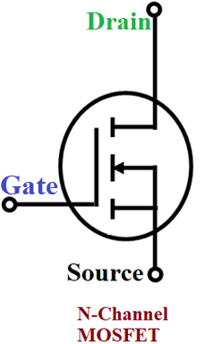

## Components of a MOSFET

In order to understand how MOSFETs work, we need to look at their construction. Consider the following simplified cross-section of one of the most commonly used MOSFETs; an _N-Channel_, _depletion mode_ MOSFET:

In the illustration above, there are two _channels_ of N-type (negatively charged) silicon laid down in a body of P-type (positively charged) silicon. It has three leads; _source_ and _drain_ connect directly to the N-type silicon channels, and the _gate_ almost touches the P-type body, but has an insulator between its metal electrode and the body of the MOSFET.

## Depletion Region

Recall from the last chapter that the P-type and N-type junction creates a [depletion region](/Hardware/Tutorials/Electronics/Part6/P-N_Junctions/) because the nearby holes and electrons combine. Without any free charge carriers, the area between the P and N-type silicon becomes an insulator:

Also recall from the previous chapter, that in the P-type silicon, there are still a small number of of electrons available, known as a _minority charge carriers_.

## Making Current Flow

As the name _Field-Effect Transistor_ implies, MOSFETs work by creating an electric field. If we apply a positive voltage to the gate, it creates an electric field that attracts the minority charge carriers from the surrounding material to the area between the channels and the gate electrode:

Now, with free electrons in that area, current can flow between the gate and source leads.

### Voltage Device

One of the things that makes MOSFETs so power efficient is that because there is an insulator between the gate electrode and the body of the MOSFET, current doesn't flow in or out of the gate, instead, it creates an electromagnetic field via the voltage force alone. If more voltage is appplied, the field gets stronger, attracting more electrons to the gap, and allowing more current to flow:

### Saturation

However, once a certain threshold of charge carriers have been attracted to the area, it becomes _saturated_ and adding more voltage won't enable any more current to flow.

# [Next - Using an N-Channel as a Low-Side switch.](../N-Channel_MOSFET_Low-Side_Usage)