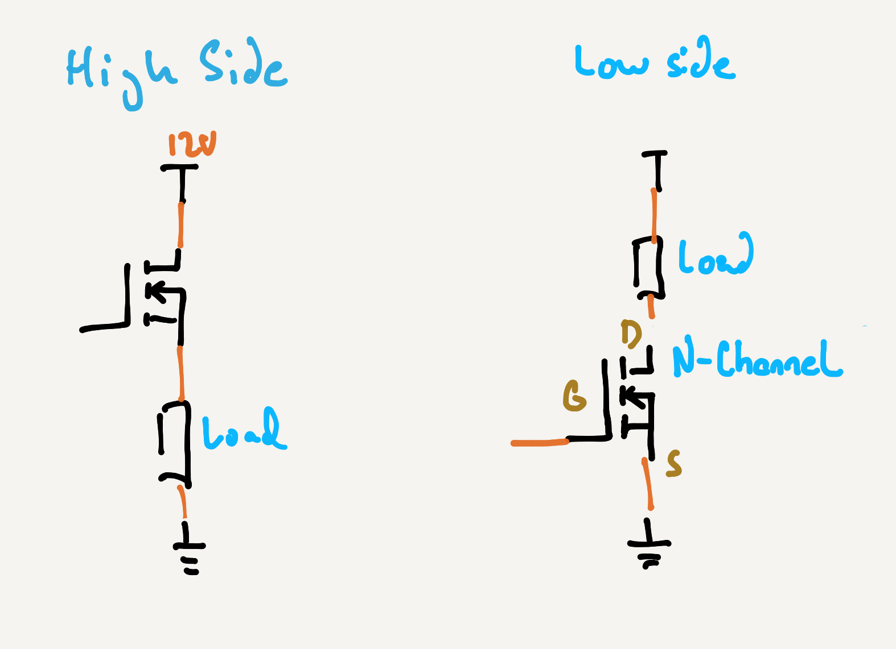
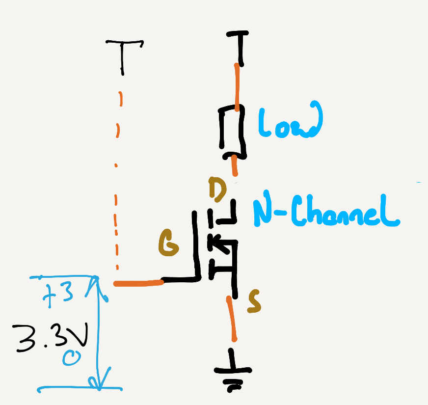

## Low-Side vs. High-Side

When using transistors, they are place on either the `HIGH` side or the `LOW` side of the load they're controlling. If the switch is on side that is closer to the higher voltage, it's said to be on the `HIGH` side, and if it's closer to the lower voltage (typically `GND`), then it's on the `LOW` side:

[**NOTE** - genericize the MOSFET symbol to a switch so we don't complicate. Also get rid of `12V` and put like `+V`]

## Using an N-Channel MOSFET as a Low-Side Switch

Let's say we wanted to control a load such as a DC motor. A very simple and efficient design would be via a low-side, N-Channel MOSFET:

In this case, the voltage between the `Gate` and `Source` is +3.3V. It enables the `Gate` to fill with positively charged holes, which attract the minority charge carriers from the surrounding P-Channel semiconductor, in this case, the negatively charged electrons to create an N-Channel conductor between `Drain` and `Source`:

High-side switching isn't always possible, however. Sometimes we need to use a switch on the high side to provide a component or a circuit with a HIGH signal.

# [Next - Solving the high-side switch.](../MOSFET_High-Side_Usage)