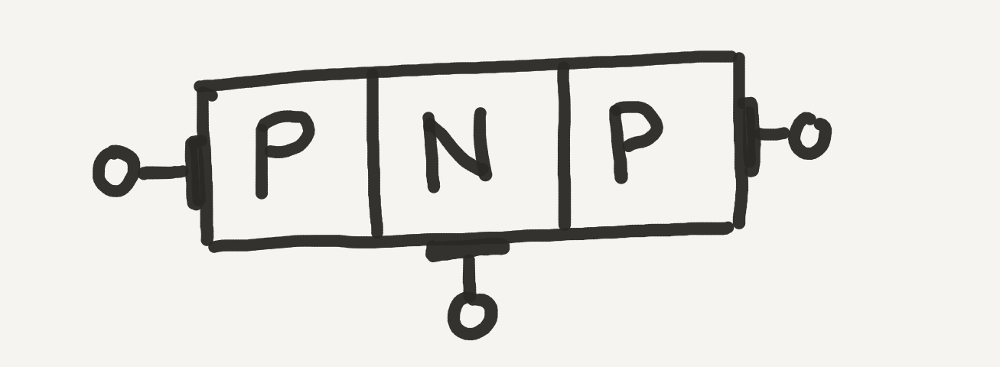

[notes: https://www.elprocus.com/difference-between-bjt-and-mosfet/]

# MOSFETs

# BJTs

Transistors are P-N Junctions with an additional P-Type or N-Type semiconductor sandwiched on the opposite end to make a two pole, P-N-P junction. Their long-form name is _bipolar junction transistors_, but are often referred to as "BJTs" or just transistors. [The origin of the term "transistor" is somewhat ambiguous](https://en.wikipedia.org/wiki/History_of_the_transistor#Origin_of_the_term).

Putting two diodes end to end like this seems a little non-intuitive, as there's no way the electricity can flow through without a reverse breakdown:

However, things become a little clearer when we add a lead to the center, where current can be sent:

In this configuration, 

# [Next - Basics of MOSFET Usage](../MOSFET_Basics)